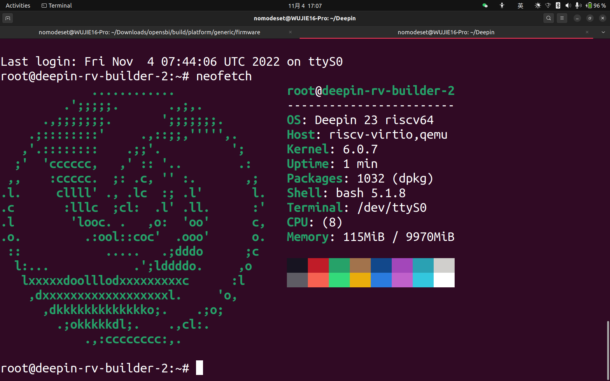
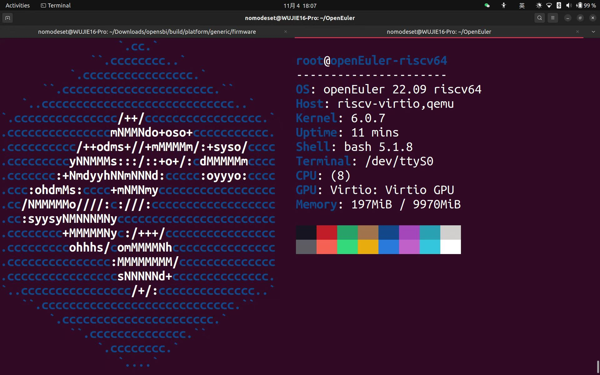

# Deepin RISC-V 安装手册
## 操作步骤
### 第一步：先搭建RISC-V模拟环境
- 以Ubuntu为例，这里我们使用qemu-system-riscv64来做虚拟机（ 包含在```qemu-system-misc```软件包中 ），需要qemu-img来创建镜像（ 包含在```qemu-utils```软件包中 ）

```bash
sudo apt install qemu-system-misc qemu-utils
```

- 其他 GNU/Linux 发行版本，请另行查找资料安装上，确保 ```qemu-system-riscv64```和```qemu-img```可使用。

### 第二步：从中科院软件所镜像站下载rootfs

```bash
wget https://mirror.iscas.ac.cn/deepin-riscv/deepin-stage1/deepin-beige-stage1-dde.tar.gz
```

### 第三步：新建 QEMU 镜像并分区、格式化
- rootfs 并非可启动镜像，故我们应当重新创建一个镜像，将rootfs 的内容全部复制粘贴到上面去。

- 创建镜像（ 这里设定其为8G大小，您可以改为您偏好的镜像大小 ）

```bash
qemu-img create -f raw deepin.raw 8G
```

- 设定变量（ 关闭终端后得重新设定 ）

```bash
LOOP=$(sudo losetup -f)
```

- 下面，挂载镜像并分区、格式化

```bash
sudo losetup -P $LOOP deepin.raw
sudo fdisk $LOOP
sudo mkfs.ext4 "$LOOP"p1
```

当进入fdisk交互界面时，先按g并回车（ 在镜像中建立GPT分区表 ），再按n并不断回车直到回到命令交互界面为止（ 在镜像中新建分区，大小充满整个镜像 ），最后按w并回车（ 将更改写入镜像 ）

- 最后，挂载新分区

```bash
sudo mkdir /mnt/deepin
sudo mount "$LOOP"p1 /mnt/deepin
```

### 第四步：拷贝文件到镜像
- 将rootfs解压到镜像中

```bash
sudo tar zxvf ./deepin-beige-stage1-dde.tar.gz -C /mnt/deepin/
```

- 然后，清除root用户密码

```bash
sudo sed "1c root::19292:0:99999:7:::" /mnt/deepin/etc/shadow
```

- 然后，添加软件源

```bash
echo "deb [trusted=yes] https://mirror.iscas.ac.cn/deepin-riscv/deepin-stage1/ beige main" | sudo tee /mnt/deepin/etc/apt/source.list &> /dev/null
```

- 最后，取消挂载

```bash
sudo umount "$LOOP"p1
sudo umount rootfs.dde.ext4
sudo losetup -D
```

### 第五步：准备内核并启动镜像

- 我们采用OpenEuler的内核

```bash
wget https://repo.openeuler.org/openEuler-preview/RISC-V/Image/fw_payload_oe.elf
```

- 生成脚本

```bash
cat > start_deepin.sh << "EOF"
#!/bin/sh
THREADS=8 # 虚拟机线程数，可自行修改
MEMORY=8G # 虚拟机RAM大小，可自行修改
qemu-system-riscv64 \
  -nographic -machine virt \
  -smp $THREADS -m $MEMORY \
  -device virtio-vga \
  -kernel fw_payload_oe.elf \
  -drive file=deepin.raw,if=none,id=hd0 \
  -object rng-random,filename=/dev/urandom,id=rng0 \
  -device virtio-rng-device,rng=rng0 \
  -device virtio-blk-device,drive=hd0 \
  -device virtio-net-device,netdev=usernet \
  -netdev user,id=usernet \
  -bios none \
  -device qemu-xhci -usb -device usb-kbd -device usb-tablet \
  -append "root=/dev/vda1 rw console=ttyS0"
EOF
sudo chmod +x start_deepin.sh
```

### 第六步：启动并配置虚拟系统

- 使用脚本启动虚拟机

```bash
./start_deepin.sh
```

- 登入时无需输入密码（ 密码被清除 ），建议给root设置密码

```bash
passwd root
```
- 更新本地软件源缓存，安装neofetch

```bash
apt-get update && apt-get install neofetch
```

- 经过漫长的等待（ RISC-V 模拟环境速度很慢，请耐心等待 ），来一个命令庆祝成功！（ 建议nano一下并立即退出，给控制台留下空白，效果更佳 ）

```bash
neofetch
```

- 效果图 :)



- OpenEuler RISC-V亦可用！然而仅限于命令行模式

