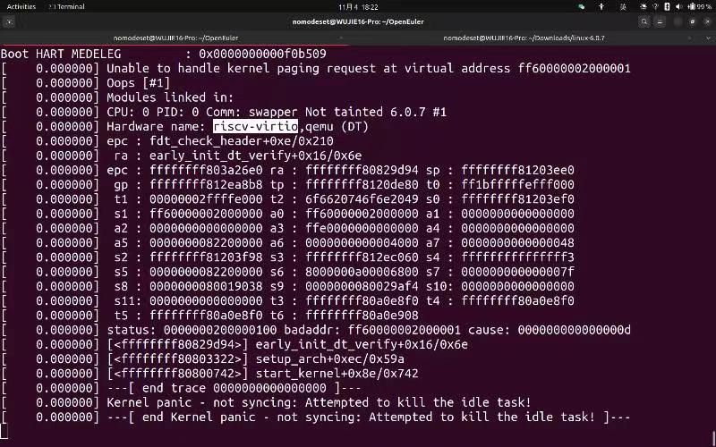

# Deepin RISC-V

## 安装手册

- 戳这里 -> [安装手册链接](./Installation_Guide.md)

## Linux 6.0.7 Kernel

- 戳这里 -> [Kernel构建手册链接](./Kernel_Build_Guide.md)

- 见fw_payload.elf

## Issue

- 使用已构建的6.0.6/6.0.7/5.15.77版本内核的payload，均无法启动 OpenEuler 22.09 Xfce，启动脚本如下。

```bash
qemu-system-riscv64
    -nographic -machine virt
    -smp 20 -m 10G
    -device virtio-vga
    -kernel fw_payload.el
    -drive file=openEuler-22.09-riscv64-qemu-xfce.qcow2,if=none,id=hd0
    -object rng-random,filename=/dev/urandom,id=rng0
    -device virtio-rng-device,rng=rng0
    -device virtio-blk-device,drive=hd0
    -device virtio-net-device,netdev=usernet
    -netdev user,id=usernet
    -bios none
    -device qemu-xhci -usb -device usb-kbd -device usb-tablet
    -append "root=/dev/vda1 rw console=ttyS0"
```

- 在纯命令行模式下正常。Deepin 23 RISC-V亦正常。

- [镜像地址](https://mirror.iscas.ac.cn/openeuler/openEuler-preview/RISC-V/openEuler-22.09-riscv64/QEMU/)

- 启动失败截图



## deepin_setup

- 注意：请保证在脚本同目录下有本文件夹的[fw_payload.elf](./fw_payload.elf)文件！

<!-- - 注意：此脚本为半成品，攻城狮正在加紧赶工中（ -->

- 用法：```bash ./deepin_setup.sh [虚拟机线程数] [虚拟机运行内存大小]```

- 例如，如果指定线程数为8,内存大小为8G，那么使用```bash ./deepin_setup.sh 8 8```

- 功能：启动虚拟机，若有缺失文件可下载并现场构建