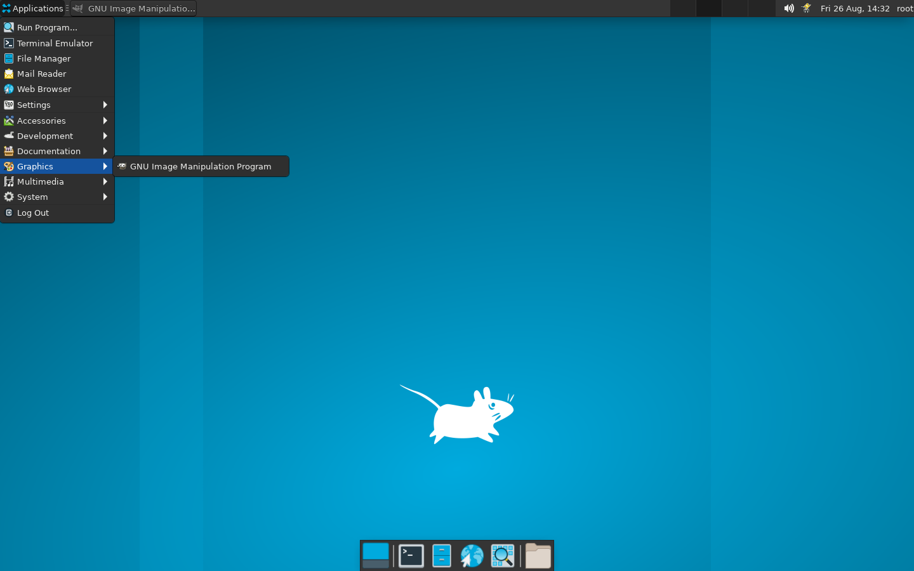
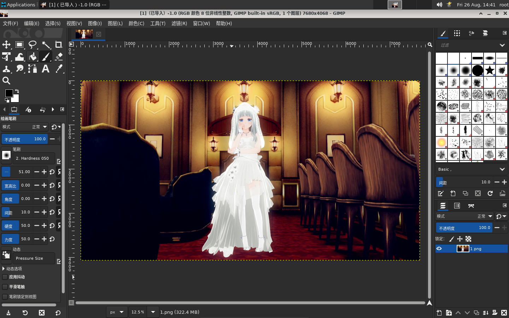

# GNU Image Manipulation Program 测试指南

> 最后修订日期：2022-08-26

## 通过 QEMU 仿真 RISC-V 环境并启动 OpenEuler RISC-V 系统

略。请参阅 [通过 QEMU 仿真 RISC-V 环境并启动 OpenEuler RISC-V 系统](https://github.com/ArielHeleneto/Work-PLCT/blob/master/awesomeqemu/README.md)。

## 测试 GIMP

### 安装 GIMP

- 执行下列指令

```bash
dnf install vlc -y
```

安装日志参见 [此处](./install.log)。

### 启动 GIMP

#### 从终端启动

在桌面下打开终端，输入 `gimp` 启动。

```shell
gimp
```

#### 点击图标启动

点击 Application -> Graphics -> GNU Image Manipulation Program。




## 帮助文档

官方文档请参阅 [GIMP - GNU 图像处理程序用户手册](https://docs.gimp.org/2.10/zh_CN/)。翻译文档请参阅 [help.md](./help.md)。希望大家帮忙写翻译发 Pull Request 。

## 反馈问题

在 [openeuler/RISC-V 仓库](https://gitee.com/openeuler/RISC-V/) 的 [Issue](https://gitee.com/openeuler/RISC-V/issues) 界面 [提交问题](https://gitee.com/openeuler/RISC-V/issues/new?issue%5Bassignee_id%5D=0&issue%5Bmilestone_id%5D=0)。
