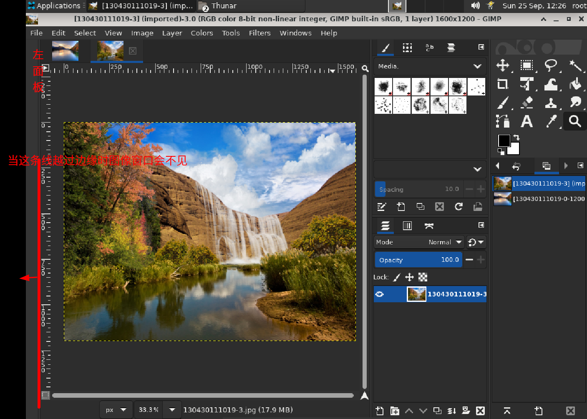
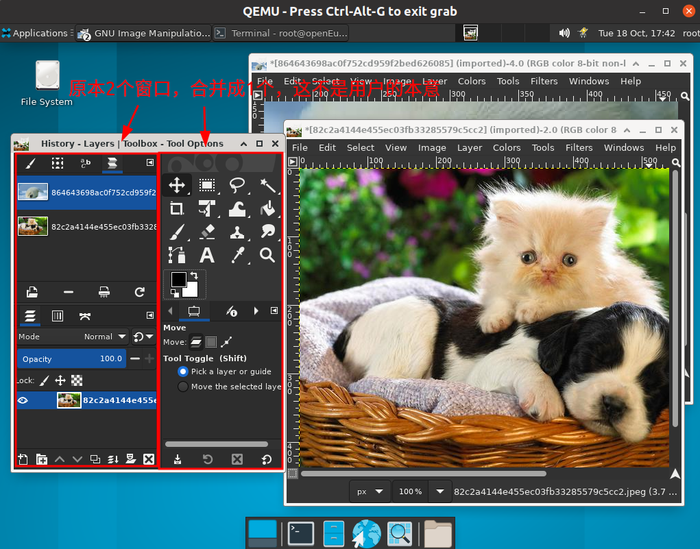
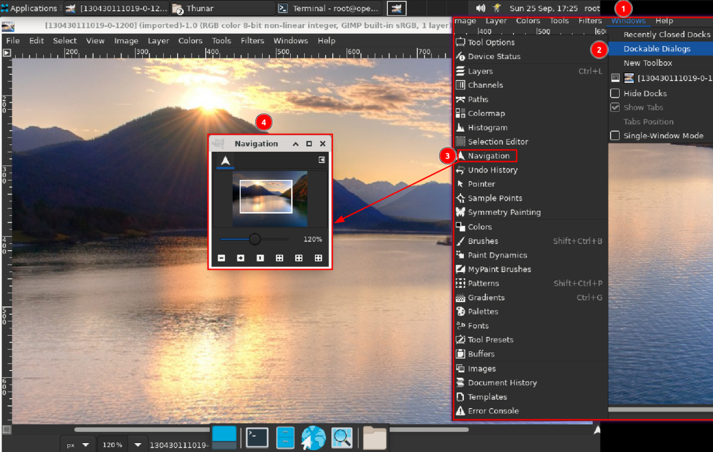
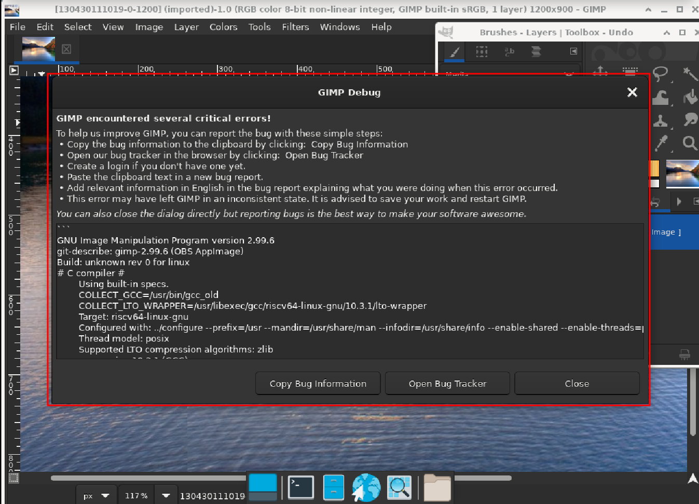

# 更改打印图像的大小

- 测试步骤：图像 – 打印尺寸 – 设置宽、高 – 点击ok
- 预期效果：图像尺寸相应地改变
- 实际效果：未通过，图像尺寸没有改变。

# 压缩图像

- 测试步骤：文件 – 导出为 –设置图片质量
- 预期效果：可设置图片质量
- 实际效果：未通过，窗口缺少“质量选项”

# 一些重要的图标没有正常显示

- 测试步骤：打开GIMP
- 预期效果：显示正常
- 实际效果：一些重要的图标没有正常显示

# 单窗口与多窗口模式存在的一些问题

- 测试步骤：1.在不改变原始布局的情况下，切换单窗口模式 2.当调整窗口位置，切换到单窗口模式 3.再切换成多窗口模式
- 预期效果：一切正常
- 实际效果：第2步后，右边的面板出现在左边。第3步后，原本两个单独的窗口合并成一个窗口，这不是用户操作的本意。关键的地方在于，这样的操作是不可逆的，用户无法撤销，不能回到之前两个窗口分开的状态

# 标签停靠异常

- 测试步骤：减小多标签停靠栏的宽度
- 预期效果：当没有足够的空间容纳所有标签时，出现箭头，允许您滚动选项卡
- 实际效果：当减少左边面板宽度越过边缘，中间图像会消失不见。

# 切换到单窗口模式，出现bug

- 测试步骤：如图

- 预期效果：对话框作为选项卡自动停靠到画笔-文档历史停靠。

- 实际效果：切换到单窗口模式，出现bug

