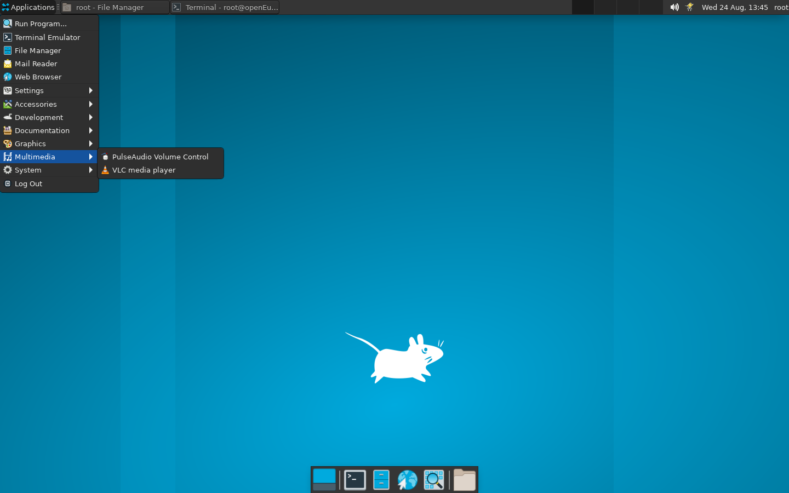
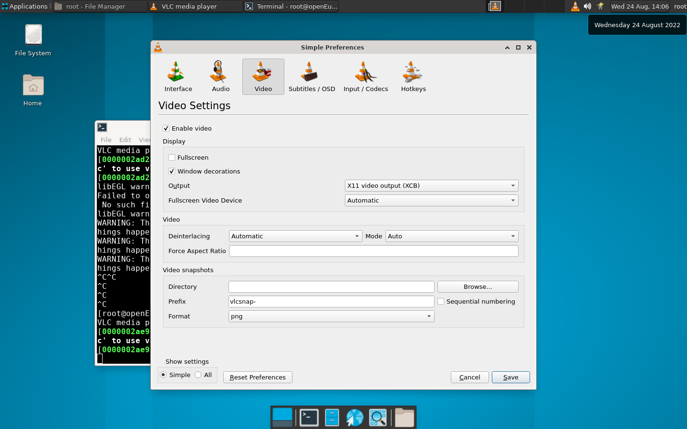

# VLC Media Player 测试指南

> 最后修订日期：2022-08-24

## 通过 QEMU 仿真 RISC-V 环境并启动 OpenEuler RISC-V 系统

略。请参阅 [通过 QEMU 仿真 RISC-V 环境并启动 OpenEuler RISC-V 系统](https://github.com/ArielHeleneto/Work-PLCT/blob/master/awesomeqemu/README.md)。

如果打算测试音频，请更换内核。在有桌面环境的 Linux 下直接模拟的同学请考虑将 `audiobackend` 设定为 `qa`。

## 测试 VLC

### 安装 VLC

- 执行下列指令

```bash
dnf install vlc -y
```

安装日志参见 [此处](./install.log)。

### 启动 VLC

#### 从终端启动

在桌面下打开终端，输入 `vlc` 启动 VLC。

```shell
vlc
```

#### 点击图标启动

点击 Application -> Multimedia -> VLC Media Player。



### 播放文件

点击 Media -> Open File... 或按下 <kbd>Ctrl</kbd> + <kbd>O</kbd> 打开文件选择器并选择文件播放。

### 修改输出

如终端输出下列警告或无法显示图像，请考虑更换输出。

```bash
WARNING: This target JIT is not designed for the host you are running.  If bad things happen, please choose a different -march switch.
```

选择 Tools -> Prefermences 或按下 <kbd>Ctrl</kbd> + <kbd>P</kbd> 打开偏好设置窗口。将 Video -> Output 调整为其他选项测试。目前已知的可用的是 `X11 Video Output`，该解码器系软件解码器，流畅度不作保证。



## 反馈问题

在 [VLC 仓库](https://gitee.com/openeuler-risc-v/vlc) 的 [Issue](https://gitee.com/openeuler-risc-v/vlc/issues) 界面 [提交问题](https://gitee.com/openeuler-risc-v/vlc/issues/new?issue%5Bassignee_id%5D=0&issue%5Bmilestone_id%5D=0)。
