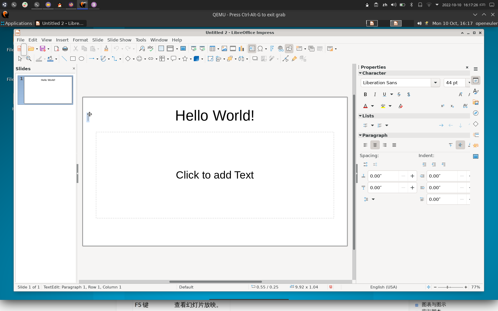
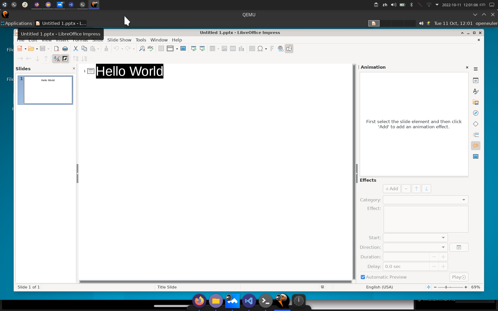
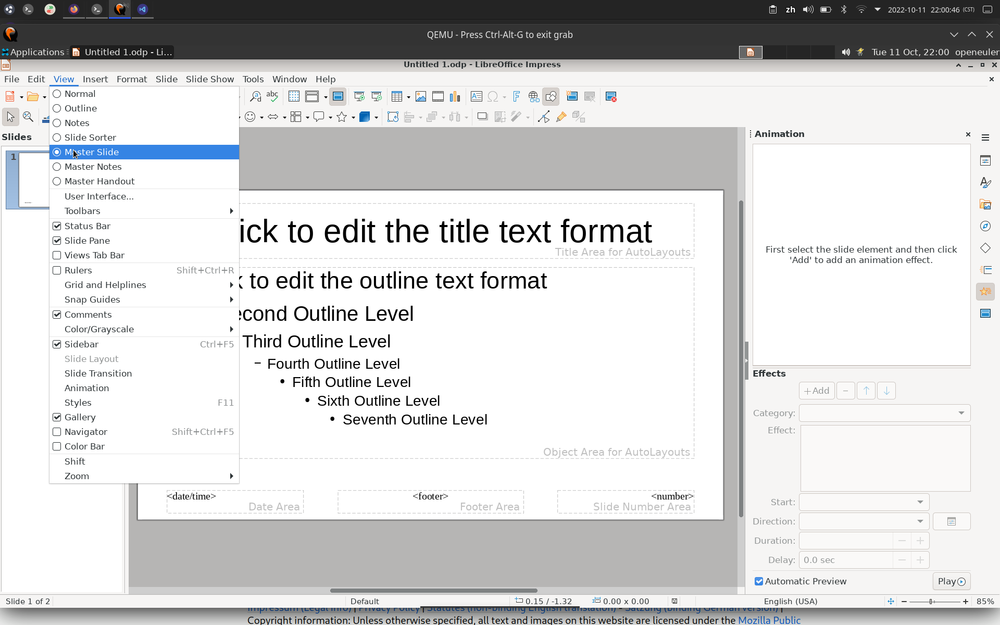
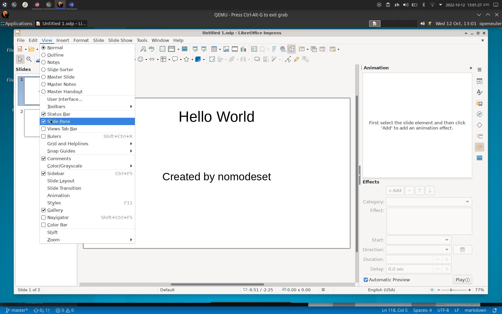
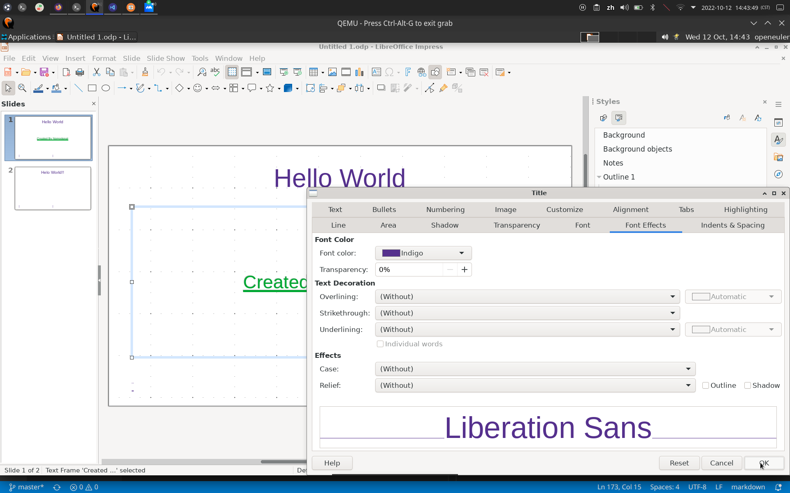
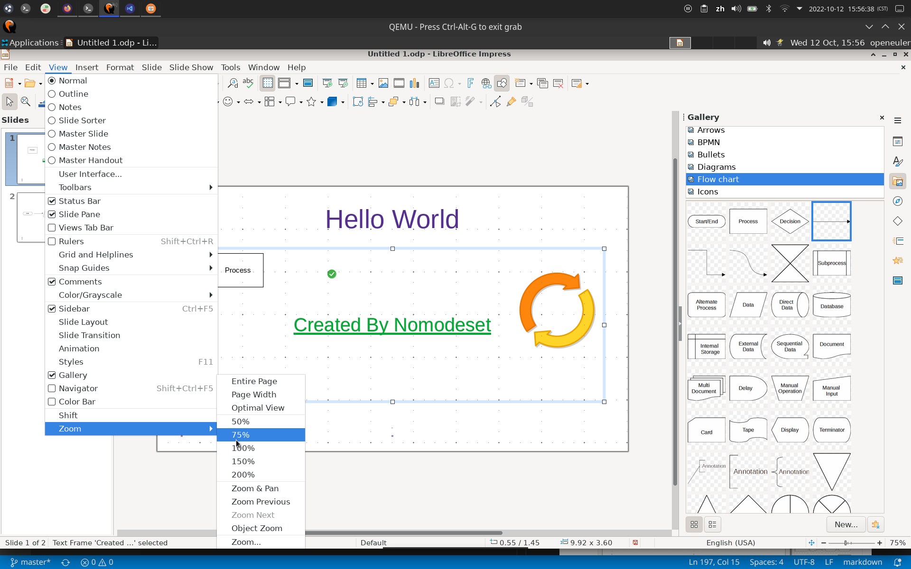

# OpenEuler libreOffice Impress测试

## 测试环境

- OS: openEuler 22.03 LTS riscv64
- VERSION: libreOffice 7.3.5.2 30(build:2)
- TIME: 2022/10/10

## 说明

- 此软件所有功能，本人均与x86_64平台的Arch Linux下的同版本软件进行对比测试。
- 缺陷参见[缺陷报告](./Bug%20Report.md)
- 使用手册戳[这里](./Impress_UserGuide.md)

## 测试用例及结果

### 使用命令行打开libreOffice

- 预期效果：正常打开
- 实际效果：正常打开，但控制台有报错

### 使用快捷键

- [用例地址](https://help.libreoffice.org/latest/zh-CN/text/simpress/04/01020000.html?DbPAR=IMPRESS)
- 预期效果：所有快捷键均正常使用
- 实际效果：Ctrl-F3退出应用，F7拼写检查卡顿（最后一张图片），Ctrl-F7无响应，其他正常（并不属于缺陷，Arch Linux版亦如此）

### 大纲视图

- [用例地址](https://help.libreoffice.org/latest/zh-CN/text/simpress/01/03090000.html?&DbPAR=IMPRESS&System=UNIX)
- 预期效果：显示PPT的大纲显示
- 实际效果：同预期

### 注解视图

- [用例地址](https://help.libreoffice.org/latest/zh-CN/text/simpress/01/03110000.html?&DbPAR=IMPRESS&System=UNIX)
- 预期效果：可以给PPT增加注解
- 实际效果：同预期

### 讲义视图

- [用例地址](https://help.libreoffice.org/latest/zh-CN/text/simpress/01/03120000.html?&DbPAR=IMPRESS&System=UNIX)
- 预期效果：切换到「讲义」页面视图，在其中可以将多张幻灯片缩放到适合打印到一张纸上
- 实际效果：同预期

### 幻灯片浏览

- [用例地址](https://help.libreoffice.org/latest/zh-CN/text/simpress/01/03100000.html?&DbPAR=IMPRESS&System=UNIX)
- 预期结果：最小化显示所有幻灯片
- 实际效果：同预期

### 母板幻灯片模式

- [用例地址](https://help.libreoffice.org/latest/zh-CN/text/simpress/01/03150100.html?&DbPAR=IMPRESS&System=UNIX)
- 预期效果：显示幻灯片母板
- 实际效果：同预期

### 母板注解模式

- [用例地址](https://help.libreoffice.org/latest/zh-CN/text/simpress/01/03150300.html?&DbPAR=IMPRESS&System=UNIX)
- 预期效果：显示幻灯片母板、可添加注解
- 实际效果：同预期

### 工具栏设置选项

- [用例地址](https://help.libreoffice.org/latest/zh-CN/text/shared/01/03990000.html?&DbPAR=IMPRESS&System=UNIX)
- 预期效果：工具栏所有按钮均可增删，可自定义按钮，也可重置工具栏至默认状态
- 实际效果：同预期

### 显示或隐藏状态栏

- [用例地址](https://help.libreoffice.org/latest/zh-CN/text/shared/01/03060000.html?&DbPAR=IMPRESS&System=UNIX)
- 预期效果：可以正常显示或隐藏状态栏
- 实际效果：同预期

### 显示或隐藏标尺

- [用例地址](https://help.libreoffice.org/latest/zh-CN/text/simpress/01/03060000.html?&DbPAR=IMPRESS&System=UNIX)
- 预期效果：可以正常显示或隐藏标尺
- 实际效果：同预期

### 显示或隐藏窗格

- [用例地址](https://help.libreoffice.org/latest/zh-CN/text/simpress/01/slidesorter.html?&DbPAR=IMPRESS&System=UNIX)
- 预期效果：可以正常显示或隐藏窗格
- 实际效果：同预期

### 网格

- [用例地址](https://help.libreoffice.org/latest/zh-CN/text/shared/01/grid.html?&DbPAR=IMPRESS&System=UNIX)
- 预期效果：所有功能正常使用
- 实际效果：同预期

### Snap

- [用例地址](https://help.libreoffice.org/latest/zh-CN/text/shared/01/guides.html?&DbPAR=IMPRESS&System=UNIX)
- 预期效果：所有功能正常使用
- 实际效果：同预期

### 辅助线

- 预期效果：移动对象时出现辅助线
- 实际效果：同预期

### 颜色/灰度显示模式

- [用例地址](https://help.libreoffice.org/latest/zh-CN/text/simpress/01/03180000.html?&DbPAR=IMPRESS&System=UNIX)
- 预期效果：所有效果均有效
- 实际效果：同预期

### 母板元素

- [用例地址](https://help.libreoffice.org/latest/zh-CN/text/simpress/01/03151000.html?&DbPAR=IMPRESS&System=UNIX)
- 预期效果：功能有效
- 实际效果：同预期

### 侧边栏

- [用例地址](https://help.libreoffice.org/latest/zh-CN/text/shared/01/menu_view_sidebar.html?&DbPAR=IMPRESS&System=UNIX)
- 预期效果：功能有效
- 实际效果：同预期

### 样式

- [用例地址](https://help.libreoffice.org/latest/zh-CN/text/simpress/01/05100000.html?&DbPAR=IMPRESS&System=UNIX)
- 预期效果：所有功能正常使用
- 实际效果：同预期

### 图库

- [用例地址](https://help.libreoffice.org/latest/zh-CN/text/shared/01/gallery.html?&DbPAR=IMPRESS&System=UNIX)
- 预期效果：所有功能正常使用
- 实际效果：同预期

### 导航

- [用例地址](https://help.libreoffice.org/latest/zh-CN/text/simpress/01/02110000.html?&DbPAR=IMPRESS&System=UNIX)
- 预期效果：所有功能正常使用
- 实际效果：同预期

### 缩放

- [用例地址](https://help.libreoffice.org/latest/zh-CN/text/shared/01/03010000.html?&DbPAR=IMPRESS&System=UNIX)
- 预期效果：所有功能正常使用
- 实际效果：同预期

### 插入图片

- [用例地址](https://help.libreoffice.org/latest/zh-CN/text/shared/01/04140000.html?&DbPAR=IMPRESS&System=UNIX)
- 预期效果：所有功能正常使用
- 实际效果：同预期

### 插入视频与音频文件

- [用例地址](https://help.libreoffice.org/latest/zh-CN/text/shared/01/moviesound.html?&DbPAR=IMPRESS&System=UNIX)
- 预期效果：所有功能正常使用
- 实际效果：幻灯片放映时，无法播放webm格式视频

### 插入图表

- [用例地址](https://help.libreoffice.org/latest/zh-CN/text/schart/01/wiz_chart_type.html?&DbPAR=IMPRESS&System=UNIX)
- 预期效果：所有功能正常使用
- 实际效果：未弹出配置向导，功能异常