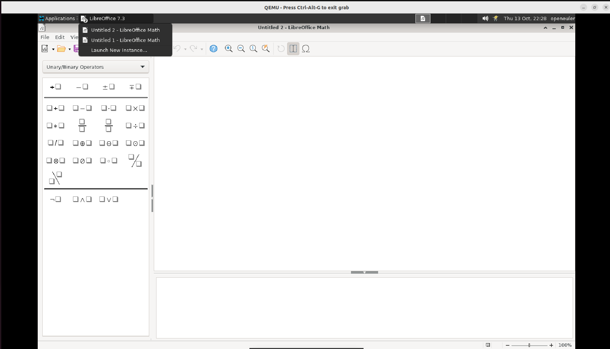
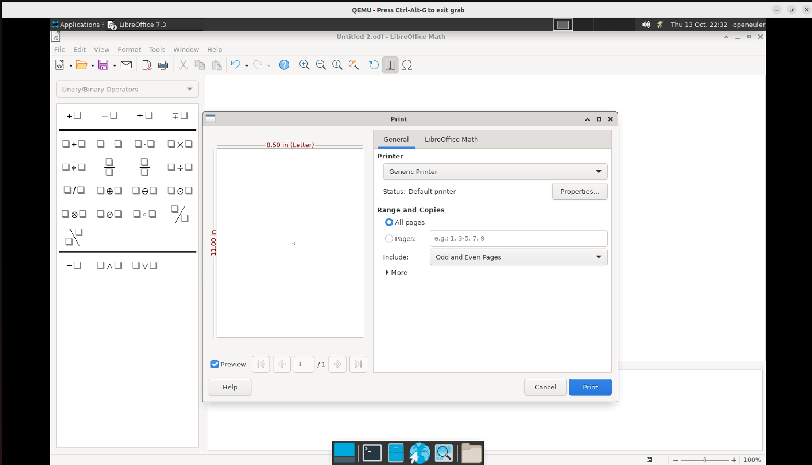
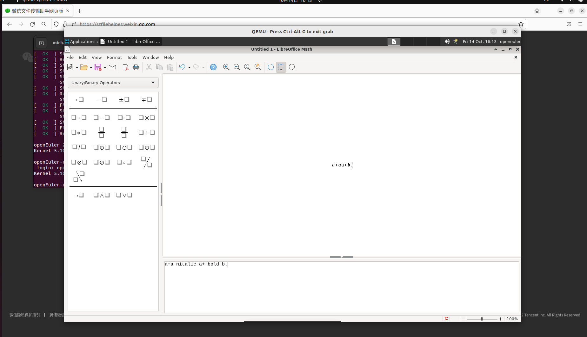
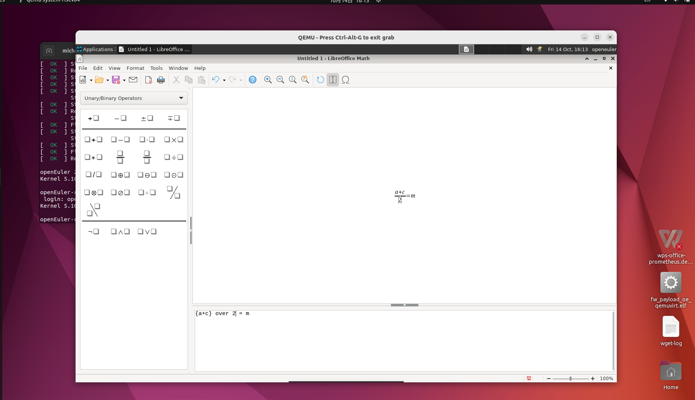
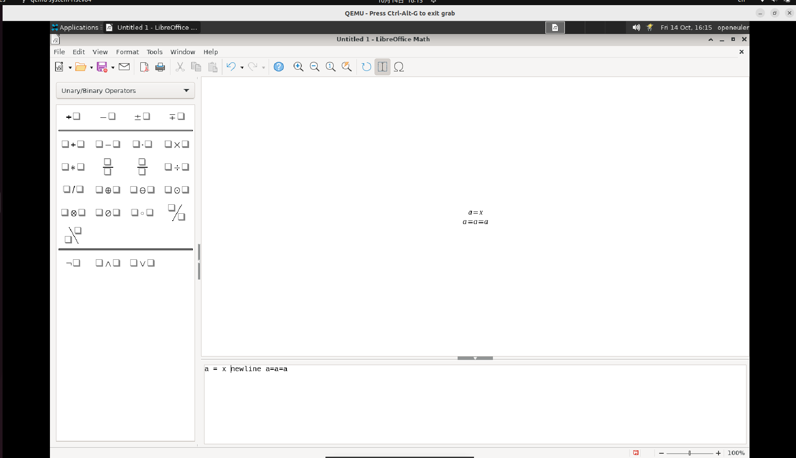
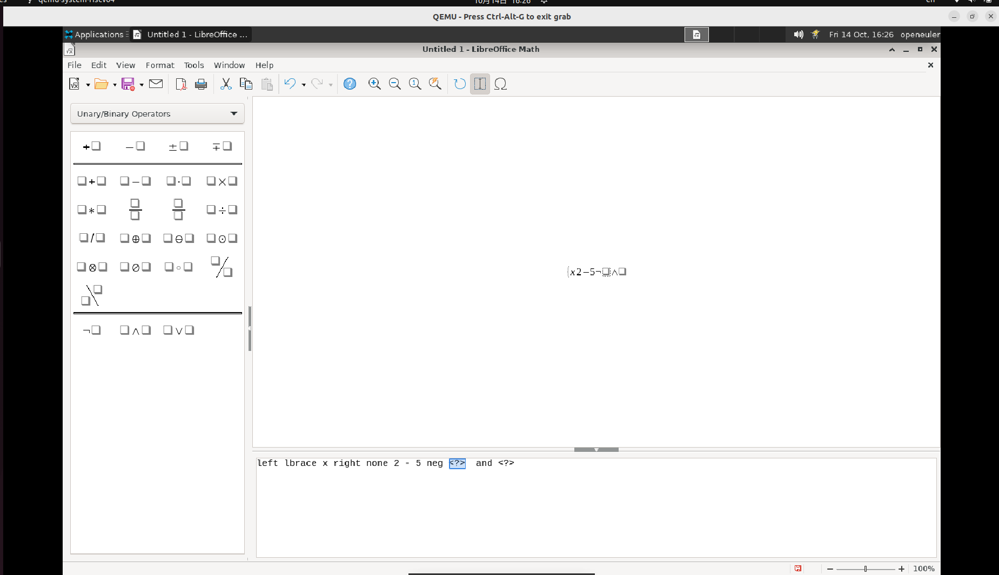

# 测试报告

## 一菜单
### 1.1文件-新建
说明：创建新的 LibreOffice 文档。

截图：

### 1.2文件-另保存
说明：将当前文档保存到其他位置，或者以不同的文件名或文件类型保存当前文档。

截图：

### 1.3文件-打印
说明：打印当前文档、所选内容或指定的页面。您还可以设置当前文档的打印选项。打印选项可能因打印机和您使用的操作系统而异。

截图：

### 1.4工具-外部公式文件导入公式
说明：使用此菜单，您可以打开和编辑符号分类，或者从外部公式文件和剪贴板中导入公式。

截图：

### 1.5工具-插入公式
说明：使用菜单中的工具插入特殊数学符号

截图：

## 二使用公式
### 2.1 手动对齐公式部分
说明：您能够借助空字符组和字符串来获得对齐效果。它们虽然不占位置，却包含执行对齐的信息。

要创建空组，请在「命令」窗口中输入花括号「{}」。下例显示了进行换行以使加号垂直对齐 (尽管在上一行中少输入一个字符):

a+a+a+{} newline {}{}{}{}{}a+a+a+a

空字符串是确保文字和公式左对齐的简单方法，可使用双反向逗号 "" 进行定义。请确保未使用任何印刷上的反向逗号。示例:

"A further example." newline a+b newline ""c-d

截图：

### 2.2 修改默认属性
说明：默认情况下，公式的某些部分始终保持粗体或斜体。

您可以使用 "nbold" 和 "nitalic" 删除这些属性。示例:

a + b

nitalic a + bold b.

在第二个公式中，a 不是斜体。b 是粗体。不能使用此方法修改加号。

截图：

### 2.3 合并括号中的公式部分
说明：若分子或分母由乘积与总和组成，往往必须用括号来说明计算程序。

请使用以下语法:

{a + c} over 2 = m

或

m = {a + c} over 2

截图：

### 2.4 输入注释
说明：批注以双百分号「%%」开头，并且延续到下一个行尾字符 (Enter 键)。其间的所有内容都将被忽略并且不会打印输出。如果文本中存在百分号，则会将其视为文本的一部分。

示例:

a^2+b^2=c^2 %% Pythagorean theorem。

截图：

###2.5 输入换行符
说明：使用 "newline" 命令创建一个换行符。在换行符之后输入的内容将显示在下一行中。

截图：

### 2.6 插入括号
说明：您可以使用「左」和「右」设置单个括号，但是括号之间的间隔将不固定，因为它们取决于变量。但是，有一种方法可以使括号之间的间隔为固定值，即在标准括号之前加一个「\」 (反斜杠)。此时，可以像处理其他符号一样处理这些括号，并且括号的对齐方式也与其他符号相同:

left lbrace x right none

size *2 langle x rangle

size *2 { \langle x \rangle }

截图：

### 2.7 插入公式
说明：您可以点击左边公式区，插入+、-等常见数学符号

截图：