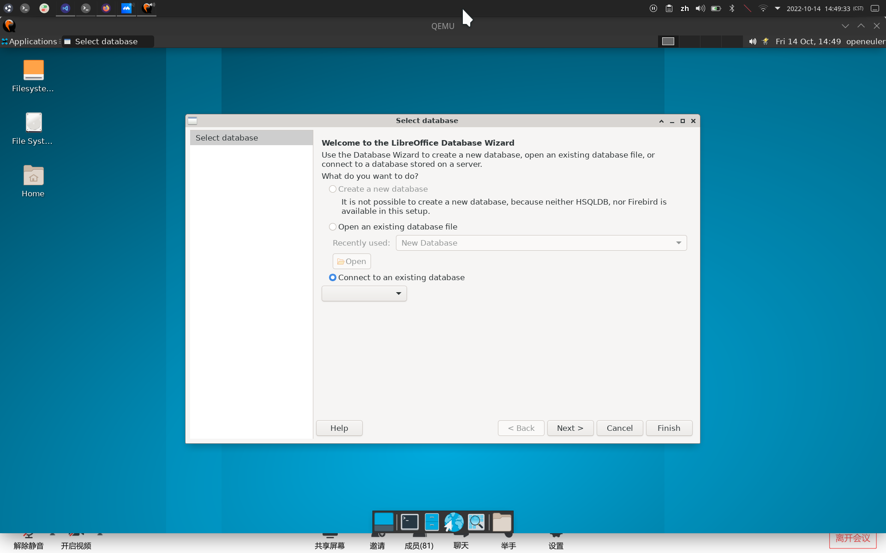
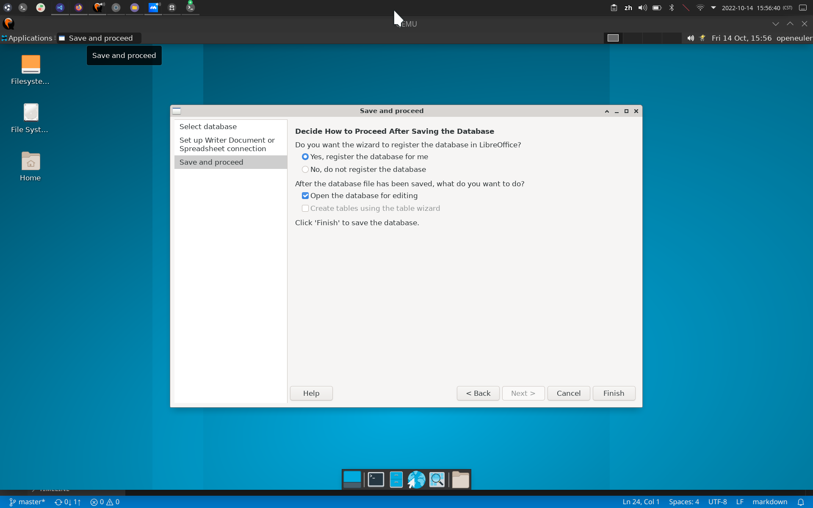
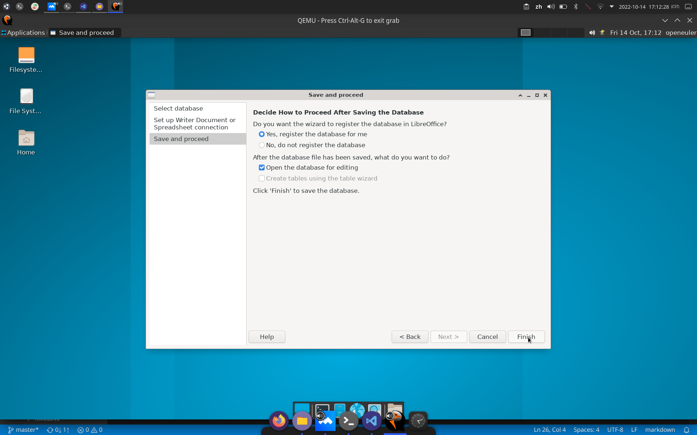
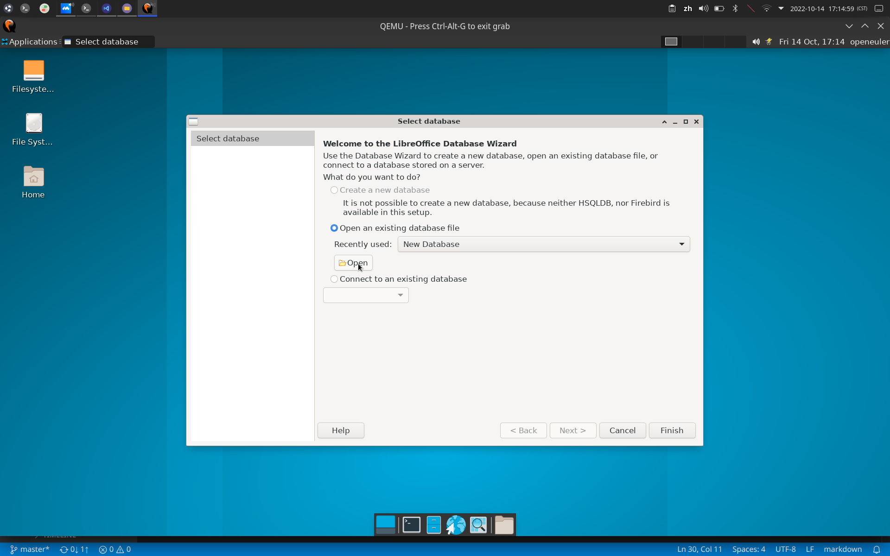

# 测试环境

- OS: openEuler 22.03 LTS riscv64
- VERSION: libreOffice 7.3.5.2 30(build:2)

# 功能点

## 创建数据库

- 打开Base弹出向导：创建数据库、打开数据库文件、导入数据库
- BUG：创建数据库功能不可用

## 导入数据库

- 可以从CSV、Spreadsheet（表格）等地方导入数据库

## 选择要导入的文件

## 向导最后设置

## 打开已创建数据库

- 点击OPEN打开odb文件后即结束向导

## 以表格形式打开数据库表

- 点击Tables，在Tables选择一个表打开

## 将通讯库作为数据源

- [帮助链接](https://help.libreoffice.org/latest/zh-CN/text/shared/guide/data_addressbook.html?&DbPAR=SHARED&System=UNIX)

## 查看数据源内容

- [帮助链接](https://help.libreoffice.org/latest/zh-CN/text/shared/01/04180100.html?&DbPAR=SHARED&System=UNIX)
