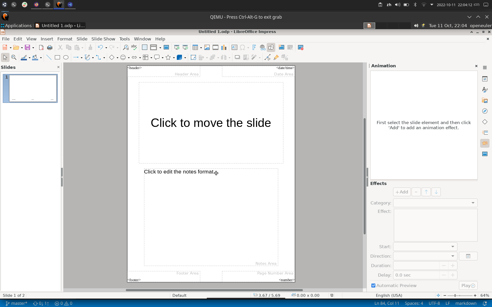
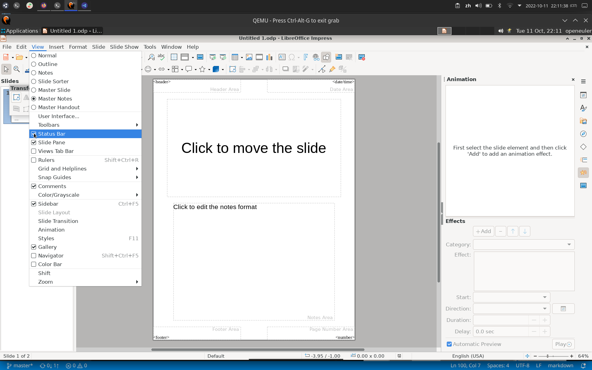
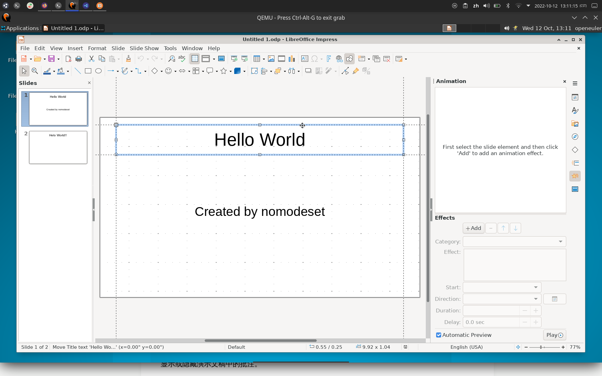
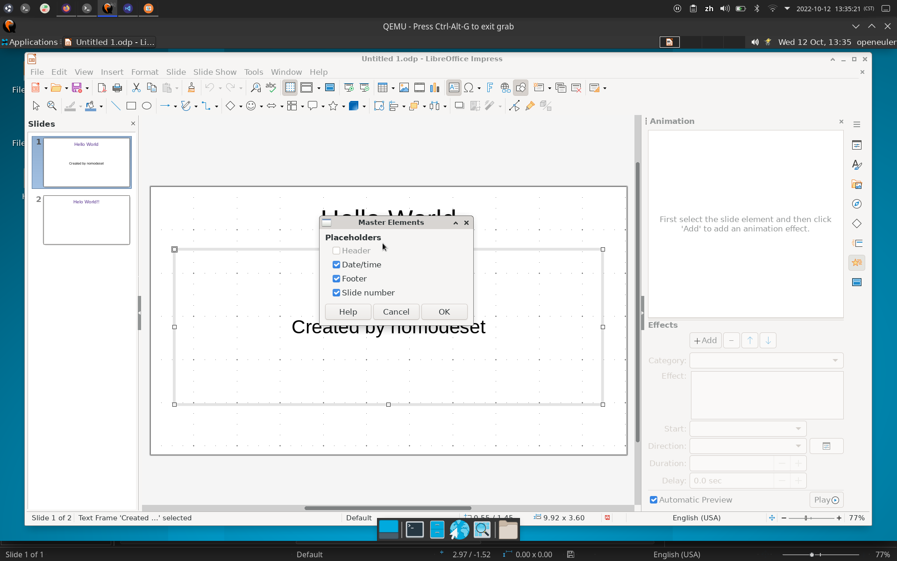
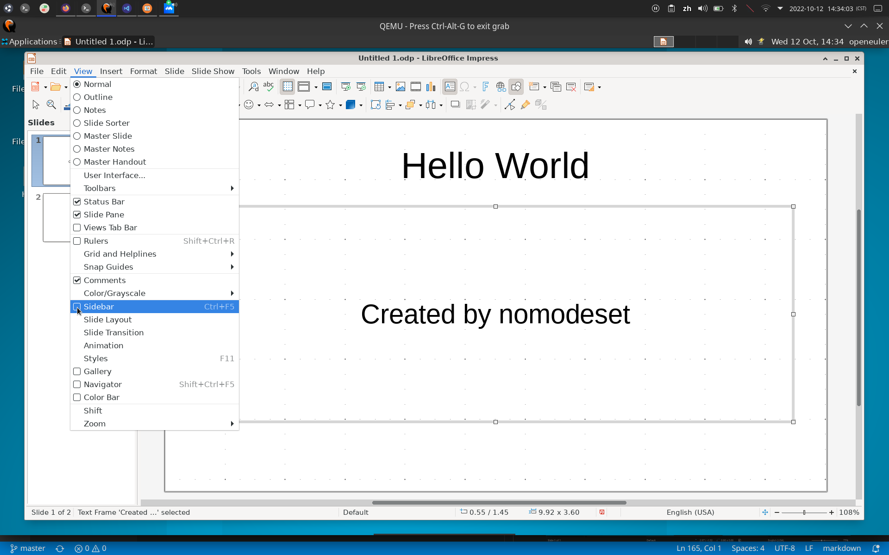
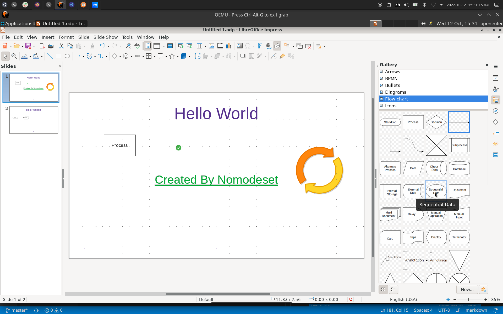
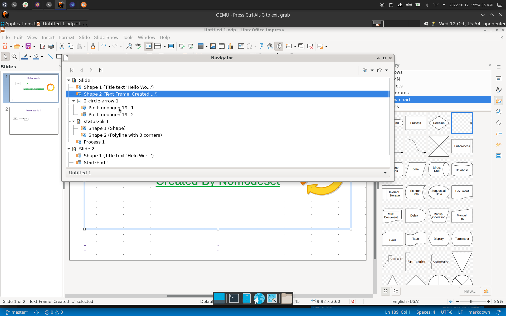
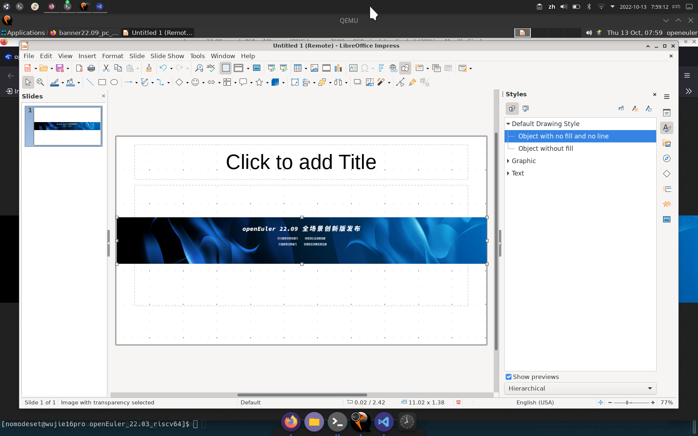

# 测试环境

- OS: openEuler 22.03 LTS riscv64
- VERSION: libreOffice 7.3.5.2 30(build:2)

# 功能点

## 使用快捷键

- [帮助链接](https://help.libreoffice.org/latest/zh-CN/text/simpress/04/01020000.html?DbPAR=IMPRESS)

## 大纲视图

- [帮助链接](https://help.libreoffice.org/latest/zh-CN/text/simpress/01/03090000.html?&DbPAR=IMPRESS&System=UNIX)

## 注解视图

- [帮助链接](https://help.libreoffice.org/latest/zh-CN/text/simpress/01/03110000.html?&DbPAR=IMPRESS&System=UNIX)

## 讲义视图

- [帮助链接](https://help.libreoffice.org/latest/zh-CN/text/simpress/01/03120000.html?&DbPAR=IMPRESS&System=UNIX)

## 幻灯片浏览

- [帮助链接](https://help.libreoffice.org/latest/zh-CN/text/simpress/01/03100000.html?&DbPAR=IMPRESS&System=UNIX)

## 母板幻灯片模式

- [帮助链接](https://help.libreoffice.org/latest/zh-CN/text/simpress/01/03150100.html?&DbPAR=IMPRESS&System=UNIX)

## 母板注解模式

- [帮助链接](https://help.libreoffice.org/latest/zh-CN/text/simpress/01/03150300.html?&DbPAR=IMPRESS&System=UNIX)

## 工具栏设置选项

- [帮助链接](https://help.libreoffice.org/latest/zh-CN/text/shared/01/03990000.html?&DbPAR=IMPRESS&System=UNIX)

## 显示或隐藏状态栏

- [帮助链接](https://help.libreoffice.org/latest/zh-CN/text/shared/01/03060000.html?&DbPAR=IMPRESS&System=UNIX)

## 显示或隐藏标尺

- [帮助链接](https://help.libreoffice.org/latest/zh-CN/text/simpress/01/03060000.html?&DbPAR=IMPRESS&System=UNIX)

## 显示或隐藏窗格

- [帮助链接](https://help.libreoffice.org/latest/zh-CN/text/simpress/01/slidesorter.html?&DbPAR=IMPRESS&System=UNIX)

## 网格

- [帮助链接](https://help.libreoffice.org/latest/zh-CN/text/shared/01/grid.html?&DbPAR=IMPRESS&System=UNIX)

## Snap

- [帮助链接](https://help.libreoffice.org/latest/zh-CN/text/shared/01/guides.html?&DbPAR=IMPRESS&System=UNIX)
- 预期效果：所有功能正常使用
- 实际效果：同预期

## 辅助线

- 移动对象时出现辅助线

## 颜色/灰度显示模式

- [帮助链接](https://help.libreoffice.org/latest/zh-CN/text/simpress/01/03180000.html?&DbPAR=IMPRESS&System=UNIX)

## 母板元素

- [帮助链接](https://help.libreoffice.org/latest/zh-CN/text/simpress/01/03151000.html?&DbPAR=IMPRESS&System=UNIX)

## 侧边栏

- [帮助链接](https://help.libreoffice.org/latest/zh-CN/text/shared/01/menu_view_sidebar.html?&DbPAR=IMPRESS&System=UNIX)

## 样式

- [帮助链接](https://help.libreoffice.org/latest/zh-CN/text/simpress/01/05100000.html?&DbPAR=IMPRESS&System=UNIX)

## 图库

- [帮助链接](https://help.libreoffice.org/latest/zh-CN/text/shared/01/gallery.html?&DbPAR=IMPRESS&System=UNIX)

## 导航

- [帮助链接](https://help.libreoffice.org/latest/zh-CN/text/simpress/01/02110000.html?&DbPAR=IMPRESS&System=UNIX)

## 缩放

- [帮助链接](https://help.libreoffice.org/latest/zh-CN/text/shared/01/03010000.html?&DbPAR=IMPRESS&System=UNIX)

## 插入图片

- [帮助链接](https://help.libreoffice.org/latest/zh-CN/text/shared/01/04140000.html?&DbPAR=IMPRESS&System=UNIX)

## 插入视频与音频文件

- [帮助链接](https://help.libreoffice.org/latest/zh-CN/text/shared/01/moviesound.html?&DbPAR=IMPRESS&System=UNIX)

## 插入图表

- BUG：无设置向导
- [帮助链接](https://help.libreoffice.org/latest/zh-CN/text/schart/01/wiz_chart_type.html?&DbPAR=IMPRESS&System=UNIX)

## 插入表格

- [帮助链接](https://help.libreoffice.org/latest/zh-CN/text/simpress/01/04080100.html?&DbPAR=IMPRESS&System=UNIX)

## 媒体

- [帮助链接](https://help.libreoffice.org/latest/zh-CN/text/shared/01/04990000.html?&DbPAR=IMPRESS&System=UNIX)

## OLE对象

- [帮助链接](https://help.libreoffice.org/latest/zh-CN/text/shared/01/04150000.html?&DbPAR=IMPRESS&System=UNIX)

## 形状

- [帮助链接](https://help.libreoffice.org/latest/zh-CN/text/shared/menu/insert_shape.html?&DbPAR=IMPRESS&System=UNIX)

## 批注

- [帮助链接](https://help.libreoffice.org/latest/zh-CN/text/shared/01/04050000.html?&DbPAR=IMPRESS&System=UNIX)

## 艺术字

- [帮助链接](https://help.libreoffice.org/latest/zh-CN/text/shared/02/fontwork.html?&DbPAR=IMPRESS&System=UNIX)

## 超链接

- [帮助链接](https://help.libreoffice.org/latest/zh-CN/text/shared/02/09070000.html?&DbPAR=IMPRESS&System=UNIX)

## 字段

- [帮助链接](https://help.libreoffice.org/latest/zh-CN/text/simpress/01/04990000.html?&DbPAR=IMPRESS&System=UNIX)

## 页眉页脚

- [帮助链接](https://help.libreoffice.org/latest/zh-CN/text/simpress/01/03152000.html?&DbPAR=IMPRESS&System=UNIX)

## 表单对象

- [帮助链接](https://help.libreoffice.org/latest/zh-CN/text/shared/menu/insert_form_control.html?&DbPAR=IMPRESS&System=UNIX)

## 文本设置项

- [帮助链接](https://help.libreoffice.org/latest/zh-CN/text/shared/submenu_text.html?&DbPAR=IMPRESS&System=UNIX)

## 间距设置项

- [帮助链接](https://help.libreoffice.org/latest/zh-CN/text/shared/submenu_spacing.html?&DbPAR=IMPRESS&System=UNIX)

## 清除直接格式

- [帮助链接](https://help.libreoffice.org/latest/zh-CN/text/shared/01/05010000.html?&DbPAR=IMPRESS&System=UNIX)

## 字符设置项

- [帮助链接](https://help.libreoffice.org/latest/zh-CN/text/shared/01/05020000.html?&DbPAR=IMPRESS&System=UNIX)

## 段落设置项

- [帮助链接](https://help.libreoffice.org/latest/zh-CN/text/shared/01/05030000.html?&DbPAR=IMPRESS&System=UNIX)

## 文本框与形状设置项

- [帮助链接](https://help.libreoffice.org/latest/zh-CN/text/simpress/submenu_object_shape.html?&DbPAR=IMPRESS&System=UNIX)

## 阴影设置项

- [帮助链接](https://help.libreoffice.org/latest/zh-CN/text/shared/01/05210600.html?&DbPAR=IMPRESS&System=UNIX)

## 旋转

- [帮助链接](https://help.libreoffice.org/latest/zh-CN/text/shared/02/05090000.html?&DbPAR=IMPRESS&System=UNIX)

## 翻转

- [帮助链接](https://help.libreoffice.org/latest/zh-CN/text/shared/01/05240000.html?&DbPAR=IMPRESS&System=UNIX)

## 转换

- [帮助链接](https://help.libreoffice.org/latest/zh-CN/text/simpress/01/13050000.html?&DbPAR=IMPRESS&System=UNIX)

## 排列

- [帮助链接](https://help.libreoffice.org/latest/zh-CN/text/simpress/01/05250000.html?&DbPAR=IMPRESS&System=UNIX)

## 组合

- [帮助链接](https://help.libreoffice.org/latest/zh-CN/text/shared/01/05290000.html?&DbPAR=IMPRESS&System=UNIX)

## 新建幻灯片

- [帮助链接](https://help.libreoffice.org/latest/zh-CN/text/simpress/01/new_slide.html?&DbPAR=IMPRESS&System=UNIX)

## 复制幻灯片

## 将其他演示文稿的幻灯片插入当前幻灯片后的位置

- [帮助链接](https://help.libreoffice.org/latest/zh-CN/text/simpress/guide/page_copy.html?&DbPAR=IMPRESS&System=UNIX)

## 删除幻灯片

## 保存与设置背景图片

## 幻灯片摘要

- [帮助链接](https://help.libreoffice.org/latest/zh-CN/text/simpress/01/04140000.html?&DbPAR=IMPRESS&System=UNIX)

## 幻灯片展开

- [帮助链接](https://help.libreoffice.org/latest/zh-CN/text/simpress/01/04130000.html?&DbPAR=IMPRESS&System=UNIX)

## 幻灯片过渡

- [帮助链接](https://help.libreoffice.org/latest/zh-CN/text/simpress/01/06040000.html?&DbPAR=IMPRESS&System=UNIX)

## 显示、隐藏、重命名幻灯片

- [帮助链接](https://help.libreoffice.org/latest/zh-CN/text/simpress/main_slide.html?DbPAR=IMPRESS)

## 幻灯片放映

- [帮助链接](https://help.libreoffice.org/latest/zh-CN/text/simpress/01/03130000.html?&DbPAR=IMPRESS&System=UNIX)

## 幻灯片放映设置

- [帮助链接](https://help.libreoffice.org/latest/zh-CN/text/simpress/01/06080000.html?&DbPAR=IMPRESS&System=UNIX)

## 计时器

- [帮助链接](https://help.libreoffice.org/latest/zh-CN/text/simpress/02/04070000.html?&DbPAR=IMPRESS&System=UNIX)

- 放映时在左下角显示计时器

## 交互设置

- [帮助链接](https://help.libreoffice.org/latest/zh-CN/text/simpress/01/06070000.html?&DbPAR=IMPRESS&System=UNIX)

## 动画

- 右边栏设置动画

- 可以设置动画类型、方向、时长、延时、触发条件等，可以演示动画效果。

## 属性

- 右边栏设置属性

- 可以设置文字的加粗、斜体、划线、删除线、字体颜色、填充颜色、上下标、字间距，段落的对齐、间距、缩进，列表的有序与无序，等等

## 新建窗口

- [帮助链接](https://help.libreoffice.org/latest/zh-CN/text/shared/01/07010000.html?&DbPAR=IMPRESS&System=UNIX)

## 关闭窗口

- [帮助链接](https://help.libreoffice.org/latest/zh-CN/text/shared/02/10100000.html?&DbPAR=IMPRESS&System=UNIX)

## 文档列表

- [帮助链接](https://help.libreoffice.org/latest/zh-CN/text/shared/01/07080000.html?&DbPAR=IMPRESS&System=UNIX)

- 在窗口菜单里，可以查看并切换到当前打开的其他文档。

