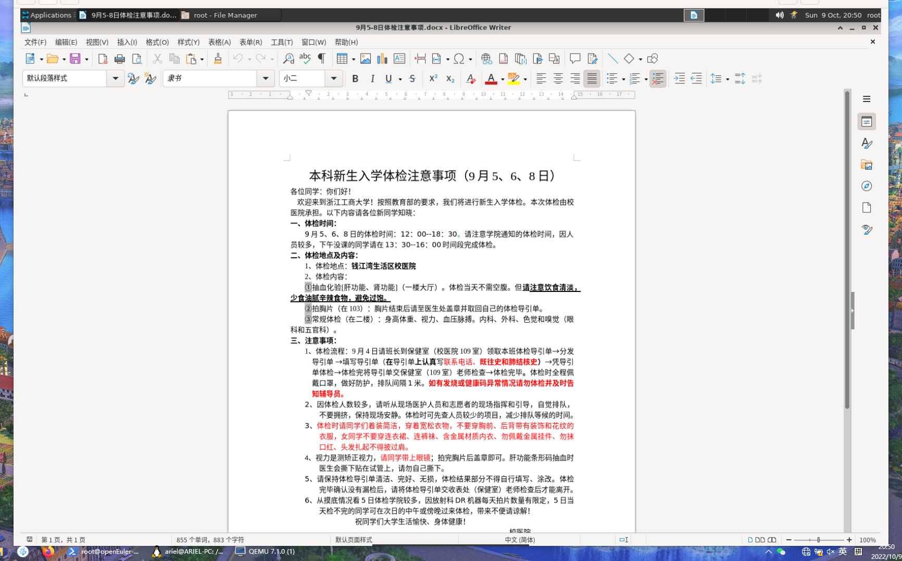
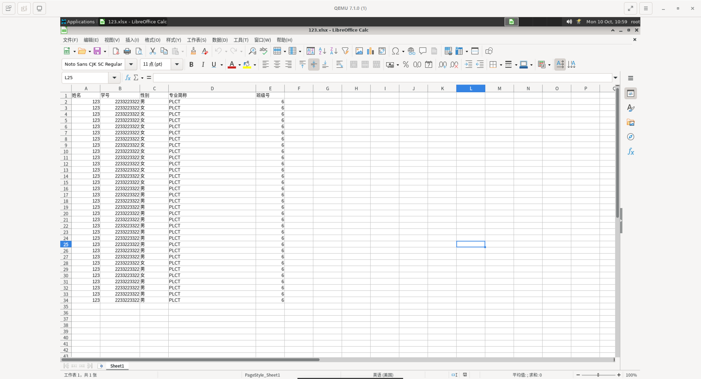

# 使用 Microsoft Office 和 LibreOffice

LibreOffice 可以打开和保存 Microsoft Office 文件格式的文档，包括 Microsoft Office Open XML 格式。

> 查看对应的 [帮助文档](https://help.libreoffice.org/7.3/zh-CN/text/shared/guide/ms_user.html?DbPAR=SHARED)。

打开并编辑了word和excel创建的文档，没有发现异常。

