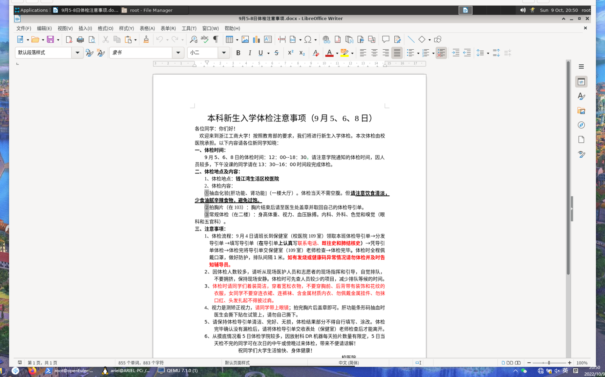

# 使用 Microsoft Office 和 LibreOffice

> 查看对应的 [帮助文档](https://help.libreoffice.org/7.3/zh-CN/text/shared/guide/ms_user.html?DbPAR=SHARED)。

LibreOffice 可以打开和保存 Microsoft Office 文件格式的文档，包括 Microsoft Office Open XML 格式。
打开 Microsoft Office 文件

    选择「文件 - 打开」。在 LibreOffice 的文件打开对话框中，选择 Microsoft Office 文件。

MS Office 文件...
	

...将在 LibreOffice 模块中打开

Microsoft Word, *.doc, *.docx
	

LibreOffice Writer

Microsoft Excel, *.xls, *.xlsx
	

LibreOffice Calc

Microsoft PowerPoint, *.ppt, *.pps, *.pptx
	

LibreOffice Impress

另存为 Microsoft Office 文件

    选择「文件 - 另存为」。

    在「文件类型」框中，选择 Microsoft Office 文件格式。

以默认 Microsoft Office 格式保存文档

    选择「工具 - 选项 - 加载/保存 - 常规」。

    在「默认文件格式和 ODF 设置」区域中，首先选择文档类型，然后选择要保存的文件类型。

当以后保存文档时，「文件类型」将被设置到此处选择的类型。当然，仍可以在文件类型对话框中选择其他的文件类型。
以默认方式打开 Microsoft Office 文件

    在 Windows 资源管理器中，右击一个文件 (您想要使用另一个应用程序打开该类型的文件)。

    在右键菜单中，选择「打开方式 - 选择其他程序」。

    在应用程序列表中，选择要用于打开当前文件类型的程序。请确保选中了「始终使用选择的程序打开这种文件」。

    如果上述步骤不适用于您的 Microsoft Windows，请搜索 Microsoft Windows 帮助文档说明书以确定如何更改文件的打开方式。

将多个 Microsoft Office 文件转换成 OpenDocument 格式

通过「文档转换器向导」，可以将文件夹中的所有 Microsoft Office 文件复制和转换成 OpenDocument 文件格式的 LibreOffice 文档。您可以指定要读取的文件夹，以及用于保存转换文件的文件夹。

    选择文件 - 向导- 文档转换器以启动向导。

Microsoft Office 和 LibreOffice 中的宏

有一些例外，Microsoft Office 和 LibreOffice 不能运行相同的宏代码。Microsoft Office 使用 VBA (Visual Basic for Applications) 代码，而 LibreOffice 使用基于 LibreOffice API (Application Program Interface，应用程序接口) 环境的 Basic 代码。虽然编程语言相同，但其中的对象和方法不同。
批注图标

最新版的 LibreOffice 可运行一些 Excel Visual Basic 脚本，只需在「工具 - 选项 - 加载/保存 - VBA 属性」启用该功能。

如果在某个应用程序中使用宏，并要在另一个应用程序中使用相同的功能，则必须对这些宏进行编辑。LibreOffice 可以加载 Microsoft Office 文件中包含的宏，然后可以通过 LibreOffice Basic IDE 编辑器来查看和编辑宏代码。
可以选择保留或删除 VBA 宏

打开包含 VBA 宏代码的 Microsoft Office 文档。仅修改常规内容 (文字、单元格、图形) 而不编辑宏。将文档保存为 Microsoft Office 文件类型。在 Microsoft Office 中打开该文件，VBA 宏将像以前一样执行。

可以在加载或保存 Microsoft Office 文件时删除其中的 VBA 宏。

    点击「工具 - 选项 - 加载/保存 - VBA 属性」可设置 LibreOffice 对 VBA 宏的处理。

打开并编辑了word和excel创建的文档，没有发现异常。

