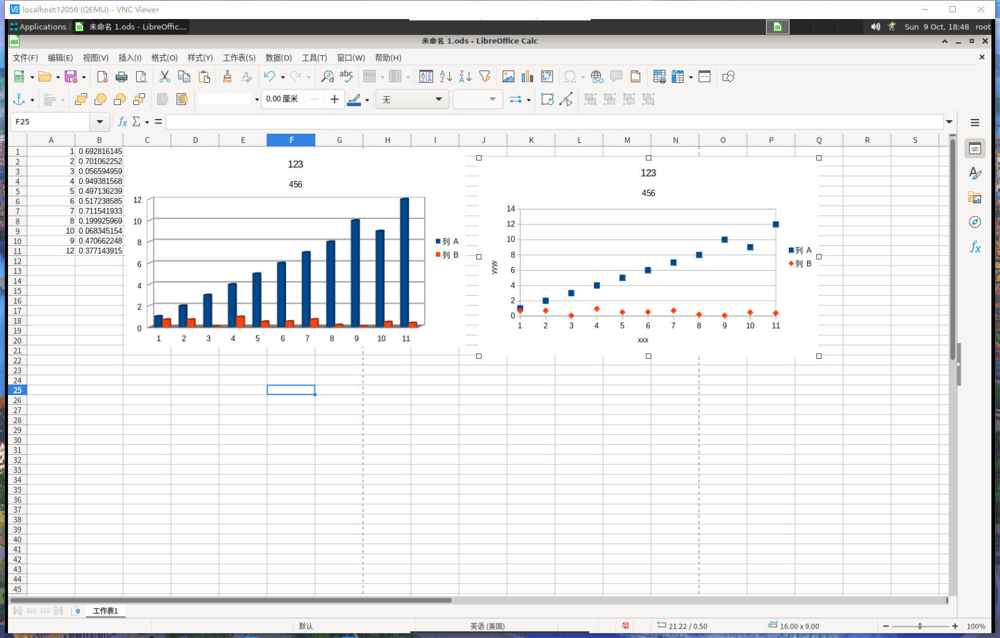
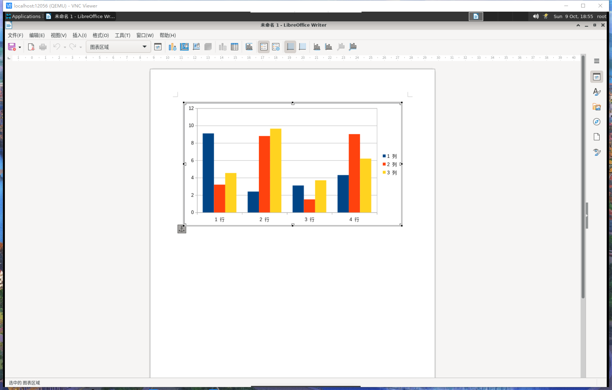
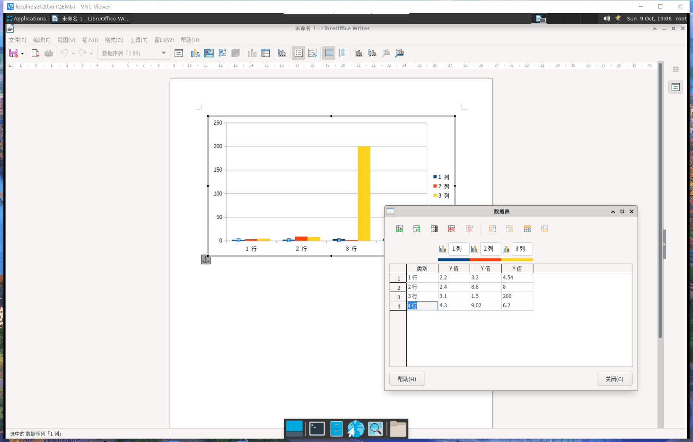

# 在 LibreOffice 中使用图表

> 查看对应的 [帮助文档](https://help.libreoffice.org/7.3/zh-CN/text/schart/main0000.html?DbPAR=CHART)。

## 插入图表

> 在单元格区域中，点击想要显示在图表中的数据。点击「标准」工具栏上的「插入图表」图标。您看到的是图表预览和「图表向导」。按照图表向导中的说明创建图表。
>
> 查看对应的 [帮助文档](https://help.libreoffice.org/7.3/zh-CN/text/shared/guide/chart_insert.html)。

## 基于自身数值的图表

> 在 Writer、Draw 或 Impress 中，选择「插入 - 图表」可插入默认数据构成的图表。通过双击图表，然后选择视图 - 图表数据表，您可以修改默认数据值。

错误：应该单击图表，然后选择视图 - 图表数据表。

## 修改图表

点击某个图表以编辑对象属性:
当前页面上的大小与位置。
对齐方式、文字环绕、外部边框等等。
双击某个图表以进入图表编辑模式:
图表数据值 (带自身数据的图表)。
图表类型、轴、标题、背景墙、网格等等。
在图表编辑模式中双击某个图表元素:
双击某个轴以编辑缩放比例、类型、颜色等等。
双击某个数据点，选择并编辑该数据点属于的数据序列。
选中一个数据序列，点击，然后双击单个数据点以编辑该数据点的属性 (例如，在条形图中的单个条形)。
双击该图例以选择并编辑。点击，然后双击选中图例中的符号，编辑关联的数据序列。
双击其他任一图表元素，或点击该元素并打开「格式」菜单，以编辑属性。
点击图表外部以退出当前的编辑模式。

