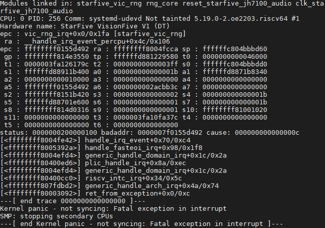
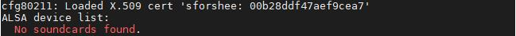
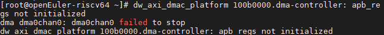

# openeuler riscv 2203V1 on visionfive测试报告

---

## 1. 测试环境的按照

- 下载安装镜像

参考：https://gitee.com/openeuler/RISC-V/blob/master/release/openEuler-22.03/visionfive/README.md

在host主机中下载镜像包

```bash
wget https://mirror.iscas.ac.cn/openeuler-sig-riscv/openEuler-RISC-V/preview/openEuler-22.03-V1-riscv64/Visionfive/openEuler-22.03-V1-riscv64-visionfive-xfce.img.tar.zst 
```

- 解压

```bash
sudo apt install zstd -y
tar -I zstdmt -xvf ./openEuler-22.03-V1-riscv64-visionfive-xfce.img.tar.zst 
```

- 使用dd命令刷写镜像（在全新未分区的64G micro sd卡上安装）

```bash
sudo dd if=./openEuler-22.03-V1-riscv64-visionfive-xfce.img of=/dev/sdb bs=1M iflag=fullblock oflag=direct conv=fsync status=progress
```

## 2. 缺陷

- 缺陷1、2203V1镜像和0926镜像一样会出现死机的情况，这是由于sifive errata没有打开的缘故。



- 缺陷2、2203V1镜像和0926镜像一样会出现声卡找不到的情况，且声音中电流噪声过大，这是由于sound wire没有设置的缘故。



正常情况这里应显示

```bash
ALSA device list:
  #0: Starfive-Multi-Sound-Card
```

- 缺陷3、systemd[1]: Condition check resulted in Arbitrary Executable File Formats File System Automount Point being skipped.

正常情况这里应显示

```bash
systemd[1]: Set up automount Arbitrary Executable File Formats File System Automount Point.
[  OK  ] Set up automount Arbitrary…s File System Automount Point.
```

- 缺陷4、systemd-rc-local-generator[206]: /etc/rc.d/rc.local is not marked executable, skipping.


- 缺陷5、进入xfce终端报错



- 缺陷6、其他警告

```bash
Initramfs unpacking failed: invalid magic at start of compressed archive
L2CACHE: No. of Banks in the cache: 2
L2CACHE: No. of ways per bank: 16
riscv-pmu-sbi: Perf sampling/filtering is not supported as sscof extension is not available
dw_spi_mmio 12410000.spi: DMA init failed
```

- 缺陷7、sldquake  - NG：SDL: Unable to open mouse

- 缺陷8、dosbox  - NG：SDL: Unable to open mouse

- 缺陷9、 eclipse - passed：不能打开项目，不能配置tomcat

- 缺陷10、chromium and vlc -passed：要设置X11 output

