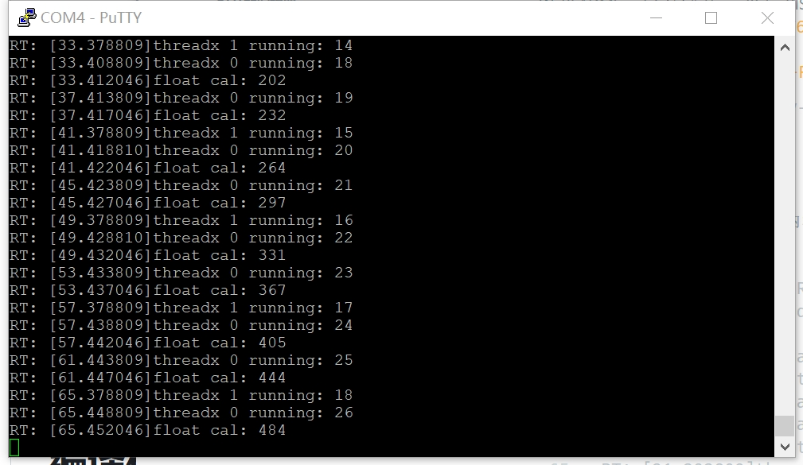

# ThreadX-to-RISC-V64 测试报告

## 构建过程

### 安装依赖

```bash
sudo apt install -y pkg-config build-essential ninja-build automake autoconf libtool wget curl git gcc libssl-dev bc slib squashfs-tools android-sdk-libsparse-utils jq python3-distutils scons parallel tree python3-dev python3-pip device-tree-compiler ssh cpio fakeroot libncurses5 flex bison libncurses5-dev genext2fs rsync unzip dosfstools mtools tcl openssh-client cmake expect -y
```

### 下载和构建

```bash
git clone https://github.com/milkv-duo/duo-buildroot-sdk.git --depth=1
cd duo-buildroot-sdk/
./build.sh milkv-duo -j${nproc}
```

此时会产生 `out/milkv-duo-????????-????.img` 的镜像文件。该文件为镜像。

如此过程不正常，请参考 [项目简介](https://github.com/milkv-duo/duo-buildroot-sdk/blob/develop/README-zh.md) 排除故障。

### 展开 ThreadX-to-RISC-V64

在 `duo-buildroot-sdk` 中运行。

```bash
git clone https://github.com/saicogn/ThreadX-to-RISC-V64.git --depth=1
```

然后修改 `build/milkvsetup.sh`。大约为 455 行。

```text
  FREERTOS_PATH="$TOP_DIR"/freertos
```

修改为

```text
  #FREERTOS_PATH="$TOP_DIR"/freertos # 修改此项
  FREERTOS_PATH="$TOP_DIR"/ThreadX-to-RISC-V64
```

然后构建。

```bash
./build.sh milkv-duo -j${nproc}
```

此时会产生 `out/milkv-duo-????????-????.img` 的镜像文件。该文件为镜像。刷写到 SD 卡即可。

## 测试结果

启动完成后串口输出如下内容。

```text
[root@milkv-duo]~# RT: [9.378810]threadx 1 running: 11
RT: [9.381959]threadx 0 running: 12
RT: [9.385273]float cal: 54
RT: [13.383809]threadx 0 running: 13
RT: [13.387046]float cal: 75
RT: [17.378809]threadx 1 running: 12
RT: [17.388810]threadx 0 running: 14
RT: [17.392046]float cal: 97
RT: [21.393809]threadx 0 running: 15
RT: [21.397046]float cal: 121
RT: [25.378809]threadx 1 running: 13
RT: [25.398810]threadx 0 running: 16
RT: [25.402046]float cal: 147
RT: [29.403809]threadx 0 running: 17
RT: [29.407046]float cal: 174
RT: [33.378809]threadx 1 running: 14
RT: [33.408809]threadx 0 running: 18
RT: [33.412046]float cal: 202
RT: [37.413809]threadx 0 running: 19
RT: [37.417046]float cal: 232
```

如图所示。



