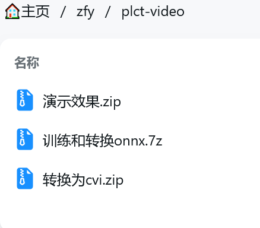

# 2024-M11

## 产出

### 视频

- [WiringX for Milk-V Duo入门教程 I2C驱动SSD1603](https://www.bilibili.com/video/BV1i1U3YQE3Z)
- [Milk-V Duo256m 部署运行 Caddy 服务器](https://www.bilibili.com/video/BV1poBzYQEoC)
- [WiringX for Milk-V Duo ADC测试](https://www.bilibili.com/video/BV1u2zwYZEAc)
- [Wiringx for Milk-V Duo LED闪烁](https://www.bilibili.com/video/BV1dQzvYaE6G)

## Demo

- [Yolo V11 model self-train guide](https://github.com/Arielfoever/milkv-duo-yolo11)
  - [测试数据集](https://github.com/Arielfoever/milkv-duo-yolo11/tree/master/data)
  - [大数据](https://disk.ariels.xyz/ai)
  - [子视频字幕](https://github.com/Arielfoever/milkv-duo-yolo11/tree/master/docs)
  - [TPU 驱动代码和 openCV](https://github.com/Arielfoever/milkv-duo-yolo11/blob/master/duocode/v11.cpp)
  - [成果演示](https://github.com/Arielfoever/milkv-duo-yolo11/tree/master/result)
  - [权重](https://github.com/Arielfoever/milkv-duo-yolo11/blob/master/train/best.pt)
  - [标注用辅助道具](https://github.com/Arielfoever/milkv-duo-yolo11/tree/master/x-label)
- [yolo11目标检测](https://milkv.io/zh/docs/duo/application-development/tdl-sdk/tdl-sdk-yolo11)

### 视频素材

[Link](https://disk.ariels.xyz/zfy/plct-video)

- YOLO简介、基础和成果展示
  - YOLO环境准备
  - 介绍 Duo 和 RISC-V

- 数据集准备
  - 录制素材和分类方法
  - FFmpeg的安装与使用
  - X-AnyLabeling的安装与使用

- 训练模型
  - 设置模型参数
  - 模型训练教学
  - 导出 ONNX 模型

- 模型部署和展示
  - 配置 TPU-MLIR 工作环境，转 MLIR
  - 使用校准表生成 INT8 对称模型
  - 运行模型展示成果
