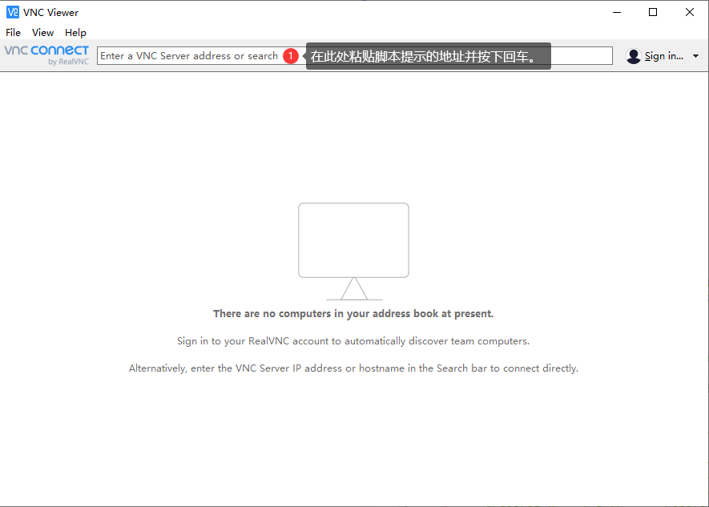

# 通过 QEMU 仿真 RISC-V 环境并启动 OpenEuler RISC-V 系统

> 修订日期 2023-08-16

## 安装 QEMU

### 系统环境

目前该方案测试过的环境包括 WSL1(Ubuntu 20.04.4 LTS and Ubuntu 22.04.1 LTS) 和 Ubuntu 22.04.1 live-server LTS。

## 安装支持 RISC-V 架构的 QEMU 模拟器

### 使用发行版提供的预编译软件包

以 Ubuntu 22.04 为例。

```bash
sudo apt install qemu-system-misc
qemu-system-riscv64 --version
QEMU emulator version 6.2.0 (Debian 1:6.2+dfsg-2ubuntu6.3)
Copyright (c) 2003-2021 Fabrice Bellard and the QEMU Project developers
```

### 手动编译安装

手动编译参见 [Qemu 编译](./build-qemu.md)。因不推荐自行编译 Qemu，本文不再赘述。

## 准备 openEuler RISC-V 磁盘映像

### 下载磁盘映像

需要下载启动内核(`fw_payload_oe_qemuvirt.elf`)，桌面或非桌面的磁盘映像。

### 下载目录

Develop Build 相较于 Test Build 更为激进，更新也更加积极。

- [Test Build](https://mirror.iscas.ac.cn/openeuler-sig-riscv/openEuler-RISC-V/testing/)
- [Develop Build](https://mirror.iscas.ac.cn/openeuler-sig-riscv/openEuler-RISC-V/devel/)

### 版本说明

构建日期 `DATE` 形如 `20220822` (即 2022-08-23)，当日构建版本 `VER` 形如 `v0.3`

e.g. 20220822 的 v0.3 版本 QEMU 的 Tesing Build 映像文件位于 [openEuler-RISC-V/testing/20220822/v0.3/QEMU/](https://mirror.iscas.ac.cn/openeuler-sig-riscv/openEuler-RISC-V/testing/20220822/v0.3/QEMU/)

### 内容说明

- `fw_payload_oe_qemuvirt.elf`: 利用 openSBI 将 kernel-5.10 的 image 作为 payload 所制作的 QEMU 的启动内核
- `openeuler-qemu-xfce.raw.tar.zst`: openEuler RISC-V QEMU 桌面环境虚拟机磁盘映像压缩包
- `openeuler-qemu.raw.tar.zst`: openEuler RISC-V QEMU 无桌面环境虚拟机磁盘映像压缩包
- `start_vm_xfce.sh`: 官方桌面环境虚拟机启动脚本
- `start_vm.sh`: 官方无桌面环境虚拟机启动脚本

### [可选] 配置 copy-on-write（COW）磁盘

> 写时复制（copy-on-write，缩写COW）技术不会对原始的映像文件做更改，变化的部分写在另外的映像文件中，这种特性在 QEMU 中只有 QCOW 格式支持，多个磁盘映像可以指向同一映像同时测试多个配置, 而不会破坏原映像。

#### 创建新映像

使用如下的命令创建新的映像，并在下方启动虚拟机时使用新映像。假设原映像为 `openeuler-qemu-xfce.qcow2`，新映像为 `test.qcow2`。

```bash
qemu-img create -o backing_file=openeuler-qemu-xfce.qcow2,backing_fmt=qcow2 -f qcow2 test.qcow2
```

#### 查看映像信息

```bash
qemu-img info --backing-chain test.qcow2
```

#### 修改基础映像位置

使用如下的命令修改基础映像位置。假设新的基础映像为 `another.qcow2`，欲修改映像为 `test.qcow2`。

```bash
qemu-img rebase -b another.qcow2 test.qcow2
```

#### 合并映像

将修改后的镜像合并到原来的镜像。假设新映像为 `test.qcow2`。

```bash
qemu-img commit test.qcow2
```

#### 扩容根分区

为了扩大根分区以获得更大的可使用空间，按照如下操作进行。

扩大磁盘镜像。

```bash
qemu-img resize test.qcow2 +100G
```

启动虚拟机，使用下列指令检查磁盘大小。

```bash
lsblk
```

列出分区情况。

```bash
fdisk -l
```

修改根分区。

```bash
fdisk /dev/vda
Welcome to fdisk (util-linux 2.35.2).
Changes will remain in memory only, until you decide to write them.
Be careful before using the write command.


Command (m for help): p # 输出分区情况
Disk /dev/vda: 70 GiB, 75161927680 bytes, 146800640 sectors
Units: sectors of 1 * 512 = 512 bytes
Sector size (logical/physical): 512 bytes / 512 bytes
I/O size (minimum/optimal): 512 bytes / 512 bytes
Disklabel type: dos
Disk identifier: 0x247032e6

Device     Boot   Start      End  Sectors Size Id Type
/dev/vda1          2048  4194303  4192256   2G  e W95 FAT16 (LBA)
/dev/vda2       4194304 83886079 79691776  38G 83 Linux

Command (m for help): d # 删除原有分区
Partition number (1,2, default 2): 2

Partition 2 has been deleted.

Command (m for help): n # 新建分区
Partition type
   p   primary (1 primary, 0 extended, 3 free)
   e   extended (container for logical partitions)
Select (default p): p # 选择主分区
Partition number (2-4, default 2): 2
First sector (4194304-146800639, default 4194304): # 此处和上文的 /dev/vda2 的起始块应当一致
Last sector, +/-sectors or +/-size{K,M,G,T,P} (4194304-146800639, default 146800639): #保持默认直接分配到最尾端

Created a new partition 2 of type 'Linux' and of size 68 GiB.
Partition #2 contains a ext4 signature.Do you want to remove the signature? [Y]es/[N]o: n

Command (m for help): p #再次检查

Disk /dev/vda: 70 GiB, 75161927680 bytes, 146800640 sectors
Units: sectors of 1 * 512 = 512 bytes
Sector size (logical/physical): 512 bytes / 512 bytes
I/O size (minimum/optimal): 512 bytes / 512 bytes
Disklabel type: dos
Disk identifier: 0x247032e6

Device     Boot   Start       End   Sectors Size Id Type
/dev/vda1          2048   4194303   4192256   2G  e W95 FAT16 (LBA)
/dev/vda2       4194304 146800639 142606336  68G 83 Linux

Command (m for help): w # 写入到磁盘
The partition table has been altered.
Syncing disks.
```

更新磁盘信息。

```bash
resize2fs /dev/vda2
```

## 启动 openEuler RISC-V 虚拟机

### 启动虚拟机

- 确认当前目录内包含 `fw_payload_oe_qemuvirt.elf`, 磁盘映像压缩包。
- 从 [本项目](https://github.com/ArielHeleneto/Work-PLCT) 下载 [启动脚本](https://github.com/ArielHeleneto/Work-PLCT/blob/master/awesomeqemu/start_vm.sh)
- 解压映像压缩包 `$ tar -I 'zstdmt' -xvf ./openeuler-qemu.raw.tar.zst` 或使用解压工具解压磁盘映像。
- 调整启动参数
- 执行启动脚本 `$ bash start_vm.sh`

### [可选] 启动参数调整

- `vcpu` 为 qemu 运行线程数，与 CPU 核数没有严格对应。目前有实质性证据表明，当设定的 vcpu 值大于宿主机核心值时，可能导致运行阻塞和速度严重降低。
- `memory` 为虚拟机内存大小，可随需要调整
- `drive` 为虚拟磁盘路径，如果在上文中配置了 COW 映像，此处填写创建的新映像。
- `fw` 为启动内核
- `ssh_port` 为转发的 SSH 端口，默认为 12055。设定为空以关闭该功能。
- `vnc_port` 为 VNC 服务端端口，默认为 12056。设定为空以关闭该功能。
- `spice_port` 为 SPICE 服务端端口，默认为 12057。设定为空以关闭该功能。
- `localip` 为指定本机 IP 地址，默认为 localhost。该地址用于自动生成连接地址。

## 登录虚拟机

脚本提供了三种登录方式的支持。

如果这是暴露在外网的虚拟机，请在登录成功之后立即修改 root 用户密码。

### SSH 登录

这是个人人都能轻松搞定的，无需任何工具的方式，不需要模拟显示适配器，但是受客户系统行为影响。

> Secure Shell（安全外壳协议，简称SSH）是一种加密的网络传输协议，可在不安全的网络中为网络服务提供安全的传输环境。SSH通过在网络中创建安全隧道来实现SSH客户端与服务器之间的连接。SSH最常见的用途是远程登录系统，人们通常利用SSH来传输命令行界面和远程执行命令。SSH使用频率最高的场合是类Unix系统，但是Windows操作系统也能有限度地使用SSH。2015年，微软宣布将在未来的操作系统中提供原生SSH协议支持，Windows 10 1803版本已提供OpenSSH工具。

- 用户名: `root`
- 默认密码: `openEuler12#$`
- 登录方式: 参见脚本提示 (或使用您偏好的 ssh 客户端)

登录成功之后，可以看到如下的信息：

```bash
Last login: Tue Aug 23 00:56:31 2022 from 10.0.2.2


Welcome to 5.10.0

System information as of time:  Tue Aug 23 01:59:12 PM CST 2022

System load:    0.43
Processes:      115
Memory used:    .7%
Swap used:      0.0%
Usage On:       13%
IP address:     10.0.2.15
Users online:   1


[root@openEuler-riscv64 ~]#
```

### VNC 登录

这是一个类似于远程操作真机的方式，但是没有声音，受 QEMU 原生支持。

> VNC（Virtual Network Computing），为一种使用RFB协议的屏幕画面分享及远程操作软件。此软件借由网络，可发送键盘与鼠标的动作及即时的屏幕画面。
>
> VNC与操作系统无关，因此可跨平台使用，例如可用Windows连线到某Linux的电脑，反之亦同。甚至在没有安装客户端程序的电脑中，只要有支持JAVA的浏览器，也可使用。

#### 安装 VNC Viewer

点击 [此处](https://www.realvnc.com/en/connect/download/viewer/) 前往下载地址。如果速度较慢请考虑科学上网。该软件只有英文，请勿惊慌。

#### 连接到 VNC

粘贴地址按下回车即可。操作界面和真机类似。



### SPICE 登录

这是一个类似于远程桌面的方式，有声音、共享文件夹、共享剪贴板、共享 USB 设备，受 QEMU 支持。

> 在计算机科学中，独立计算环境简单协议（Simple Protocol for Independent Computing Environments，简称SPICE）是一款为虚拟环境打造的远程显示系统，支持诸多机器架构，旨在让用户查看计算虚拟环境的“桌面”环境——除了服务器实体机上查看外，还允许用户从互联网的每个角落进行连接。

#### 安装 Virt-Viewer

点击 [此处](https://virt-manager.org/download/) 前往下载地址，下载 virt-viewer 11.0 。如果速度较慢请考虑科学上网。

#### 连接到 SPICE

粘贴地址点击连接即可。操作界面和远程桌面类似。

## 参考文献

- [通过 QEMU 仿真 RISC-V 环境并启动 OpenEuler RISC-V 系统](https://github.com/openeuler-mirror/RISC-V/blob/master/doc/tutorials/vm-qemu-oErv.md)
