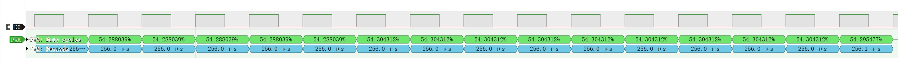
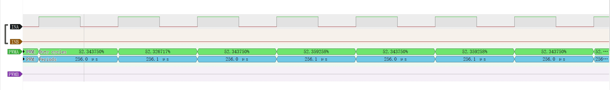
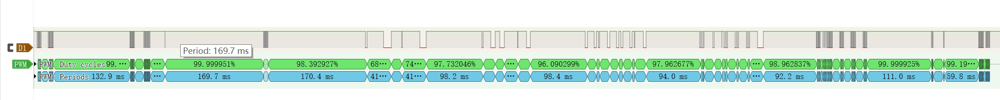
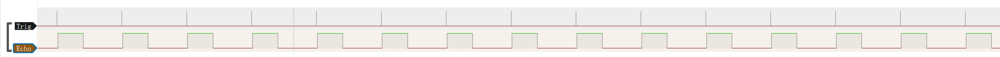
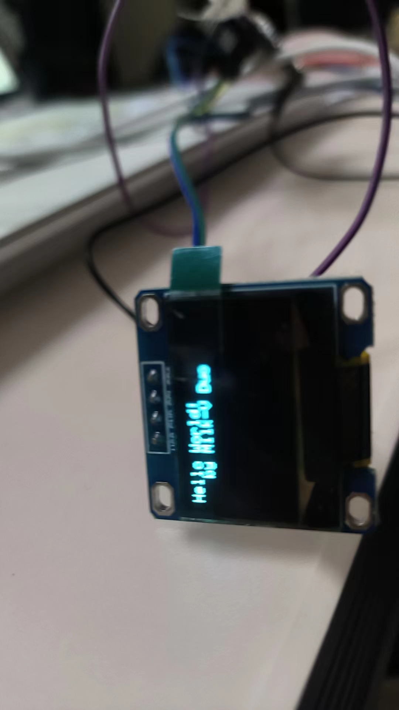
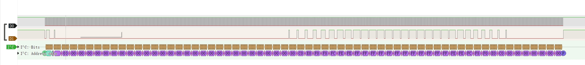
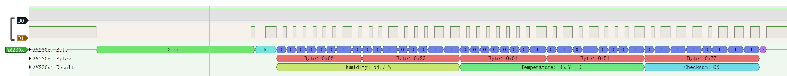

# Arduino for Milk-V Duo

## 简介

Arduino 是一个很流行的开源硬件平台，具有简洁性、易用性和开放性等优点。它提供了丰富的库函数和示例代码，使得即使对于没有编程经验的人来说，也能够快速上手。同时，Arduino 社区非常活跃，您可以轻松地获取到各种项目教程、文档和支持。

Milk-V Duo 系列已经支持 Arduino 开发，您可以直接使用 Arduino IDE，进行简单的配置后即可使用。

Duo 系列 CPU 采用大小核设计，Arduino 固件运行在小核中，大核负责与 Arduino IDE 通讯，接收 Arduino 固件并将其加载到小核中运行。同时，大核中的 Linux 系统也是正常运行的。

## 环境配置

### 安装 Arduino IDE

在 [Software | Arduino](https://www.arduino.cc/en/software) 下载。本实例使用 `Windows Win 10 and newer, 64 bits` 版本。安装之。

见 [安装录像](./anzhuang.mkv)

### 安装固件

为 TF 卡刷写 [Release](https://github.com/milkv-duo/duo-buildroot-sdk/releases) 的固件中下载前缀为 `arduino` 的固件。本实例使用 [Duo-V1.0.9](https://github.com/milkv-duo/duo-buildroot-sdk/releases/tag/Duo-V1.0.9) 版本。刷写可使用 [Rufus](https://rufus.ie/zh/)

见 [刷写录像](./shuaxie.mkv)

### Arduino IDE 中添加 Duo 开发板

打开 Arduino IDE，打开 `File - Perferences` （*文件 - 首选项*），在 `Settings`（*设置*） 标签中的 `Additional boards manager URLs:`（*其他开发板管理器地址*） 内添加 Milk-V Duo 的配置文件地址 `https://github.com/milkv-duo/duo-arduino/releases/download/config/package_sg200x_index.json`。亦可在此页面将语言调整为中文。

配置好之后在左侧边栏中选择 `Boards Manager`（*开发板管理器*），搜索 `SG200X`，点击安装。本实例中安装了 `0.2.4` 版本。

见 [环境录像](./huanjing.mkv)

### 关闭 LED 闪烁

将刷写好的 TF 卡插入 Milk-V Duo。使用电缆连接电脑和 Milk-V Duo。此时电脑上出现 RNDIS 设备和串口设备。安装驱动方法见 [设置工作环境 | Milk-V](https://milkv.io/zh/docs/duo/getting-started/setup)。

[安装驱动录像](./drivers.mkv)

Duo 的默认固件大核 Linux 系统会控制板载 LED 闪烁，这个是通过开机脚本实现的，我们现在要用小核 Arduino 来点亮 LED，需要将大核 Linux 中 LED 闪烁的脚本禁用，在 Duo 的终端中执行 `mv /mnt/system/blink.sh /mnt/system/blink.sh_backup && sync && reboot`。

[移除闪烁](./remove.mkv)

### 闪烁 LED 灯

在 Arduino IDE 的 文件 菜单中依次打开 示例 > 01.Basics > Blink 测试程序，该程序功能实现的是 Arduino 设备板载 LED 闪烁，Duo 中也是支持的，你也许需要安装 pyserial （**不是 serial**） 来支持上传功能，之后我们直接点 上传 按钮进行测试。

[上传](./pyserial.mkv)

[闪烁](./record.mp4)

## 代码示例

### GPIO 测试

#### 高低电平测试

在 Arduino IDE 写入下列测试程序，该程序功能实现的是设备 GPIO 20 脚位每秒钟变换一次电平（从高电平变换为低电平）来支持上传功能，之后点上传按钮进行测试。

```cpp
#define TEST_PIN 20  //0,1,2,14,15,19,20,21,22,24,25,26,27

// the setup function runs once when you press reset or power the board
void setup() {
  pinMode(TEST_PIN, OUTPUT);
}

// the loop function runs over and over again forever
void loop() {
  digitalWrite(TEST_PIN, HIGH); // turn the TEST_PIN on (HIGH is the voltage level)
  delay(1000);                  // wait for a second
  digitalWrite(TEST_PIN, LOW);  // turn the TEST_PIN off by making the voltage LOW
  delay(1000);                  // wait for a second
}
```

将万用表正极连接到 GPIO 20 号（即板上 GP15），负极连接到 GND 脚，并调整为直流电压挡。观察现象。

观察到万用表电压在 3.3V 和 0.1V 之间跳动，电压为一折线。

[操作](./GPIO.mkv)

[万用表](./GPIOrecord.mp4)

#### LED 测试

在 Arduino IDE 写入下列测试程序，该程序功能实现的是设备 GPIO 20 脚位每秒钟变换一次电平（从高电平变换为低电平）来支持上传功能，之后点上传按钮进行测试。

```cpp
#define TEST_PIN 20  //0,1,2,14,15,19,20,21,22,24,25,26,27

// the setup function runs once when you press reset or power the board
void setup() {
  pinMode(TEST_PIN, OUTPUT);
}

// the loop function runs over and over again forever
void loop() {
  digitalWrite(TEST_PIN, HIGH); // turn the TEST_PIN on (HIGH is the voltage level)
  delay(100);                  // wait for a second
  digitalWrite(TEST_PIN, LOW);  // turn the TEST_PIN off by making the voltage LOW
  delay(100);                  // wait for a second
}
```

将 LED 灯正极连接到 GPIO 20 号（即板上 GP15），负极连接到 GND 脚。观察现象。

观察到 LED 灯闪烁。

[操作](./GPIO.mkv)

[LED](./GPIO-LED.mp4)

### UART 测试

在 Arduino IDE 写入下列测试程序，该程序功能实现的是设备 UART 每秒钟输出字符串。之后点上传按钮进行测试。

```cpp
void setup() {
  Serial.begin(150);
}

void loop() {
  Serial.printf("Hullo Milk-V Duo!\r\n");
  delay(100);
}
```

将 GP4 和 RX、GP5 和 TX、GND 和 G 相连，打开 UART 并设置波特率为 150 观察现象。

观察到串口输出 `Hullo Milk-V Duo!`。

波特率较高可能会产生乱码。

[操作](./UART.mkv)

### I2C 测试

在 Arduino IDE 写入下列测试程序，该程序功能实现的是设备 I2C 接收到的字符串输出到 UART。之后点上传按钮进行测试。

```cpp
#include <Wire.h>

void receive(int a) {
  Serial.printf("receive %d bytes\n\r", a);
  while(a--) {
    Serial.printf("%d \n\r", Wire1.read());
  }
}

void setup() {
  Serial.begin(38400);

  Wire1.begin(0x50);
  Wire1.onReceive(receive);

  Wire.begin();
  Serial.printf("test slave\n\r");
  Wire1.print();
}

byte val = 0;

void loop() {
  Wire.beginTransmission(0x50);         // Transmit to device number 0x50
  Serial.printf("send %d \n\r", ++val);
  Wire.write(val);                      // Sends value byte
  Wire.endTransmission();               // Stop transmitting
  Wire1.onService();
  delay(1000);
}
```

将 GP0 和 GP9、GP1 和 GP8、GP4 和 RX、GP5 和 TX、GND 和 G 相连，打开 UART 并设置波特率为 38400 观察现象。

观察到串口输出下列内容。

```
test slave
Wire1: 1
[iic_dump_register]: ===dump start
IC_CON = 0x22
IC_TAR = 0x55
IC_SAR = 0x50
IC_SS_SCL_HCNT = 0x1ab
IC_SS_SCL_LCNT = 0x1f3
IC_ENABLE = 0x1
IC_STATUS = 0x6
IC_INTR_MASK = 0x224
IC_INTR_STAT = 0
IC_RAW_INTR_STAT = 0x10
[iic_dump_register]: ===dump end
send 1 
receive 1 bytes
1 
send 2 
receive 1 bytes
2 
send 3 
receive 1 bytes
3 
send 4 
receive 1 bytes
4 
send 5 
receive 1 bytes
5 
send 6 
receive 1 bytes
6 
send 7 
receive 1 bytes
7 
send 8 
receive 1 bytes
8 
send 9 
receive 1 bytes
9 
send 10 
receive 1 bytes
10 
send 11 
receive 1 bytes
11 
send 12 
receive 1 bytes
12 
send 13 
receive 1 bytes
13 
send 14 
receive 1 bytes
14 
send 15 
receive 1 bytes
15 
send 16 
receive 1 bytes
16 
send 17 
receive 1 bytes
17 
send 18 
receive 1 bytes
18 
send 19 
receive 1 bytes
19 
send 20 
receive 1 bytes
20 
send 21 
receive 1 bytes
21 
send 22 
receive 1 bytes
22 
send 23 
receive 1 bytes
23 
send 24 
receive 1 bytes
24 
send 25 
receive 1 bytes
25 
send 26 
receive 1 bytes
26 
send 27 
receive 1 bytes
27 
send 28 
receive 1 bytes
28 
send 29 
receive 1 bytes
29 
send 30 
receive 1 bytes
30 
```

波特率较高可能会产生乱码。

[操作](./I2C.mkv)

### SPI 测试

在 Arduino IDE 写入下列测试程序，该程序功能实现的是 SPI 环回测试。之后点上传按钮进行测试。

```cpp
#include <SPI.h>

char str[]="hello world\n";
void setup() {
  // put your setup code here, to run once:
  Serial.begin(115200);
  SPI.begin();
}

byte i = 0;

void loop() {
  // put your main code here, to run repeatedly:
  // digitalWrite(12, 1);
  SPI.beginTransaction(SPISettings());
  Serial.printf("transfer %c\n\r", str[i]);
  char out = SPI.transfer(str[i++]);        // spi loop back
  SPI.endTransaction();
  Serial.printf("receive %x \n\r", out);
  i %= 12;
}
```

将 GP7 和 GP8、GP4 和 RX、GP5 和 TX、GND 和 G 相连，打开 UART 并设置波特率为 38400 观察现象。

观察到串口输出下列内容。

```
receive a 
transfer h
receive 68 
transfer e
receive 65 
transfer l
receive 6c 
transfer l
receive 6c 
transfer o
receive 6f 
transfer  
receive 20 
transfer w
receive 77 
transfer o
receive 6f 
transfer r
receive 72 
transfer l
receive 6c 
transfer d
receive 64 
transfer
```

波特率较高可能会产生乱码。

[操作](./SPI.mkv)

### PWM 测试

#### PWM 调压测试

在 Arduino IDE 写入下列测试程序，该程序功能实现的是 PWM 调整电压。之后点上传按钮进行测试。

```cpp
void setup() {
  pinMode(9, OUTPUT);
  Serial.begin(38400);
}

void loop() {
  for(int i = 128; i < 255; i++)
  {
    analogWrite(9,i);
    Serial.printf("i = %d \n\r", i);
    delay(100);
  }
  for(int i = 255; i > 128; i--)
  {
    analogWrite(9,i);
    Serial.printf("i = %d \n\r", i);
    delay(100);
  }
}
```

将 GP6 和 万用表正极、GP4 和 RX、GP5 和 TX、GND 和 G 相连、GND 和万用表负极相连，打开 UART 并设置波特率为 38400 观察现象。设置万用表为直流电压模式。

观察到串口输出下列内容。

```
i = 128 
i = 129 
i = 130 
i = 131 
i = 132 
i = 133 
i = 134 
i = 135 
i = 136 
i = 137 
i = 138 
i = 139 
i = 140 
i = 141 
i = 142 
i = 143 
i = 144 
i = 145 
i = 146 
i = 147 
i = 148 
i = 149 
i = 150 
i = 151 
i = 152 
i = 153 
i = 154 
i = 155 
i = 156 
i = 157 
i = 158 
i = 159 
i = 160 
i = 161 
i = 162 
i = 163 
i = 164 
i = 165 
i = 166 
i = 167 
i = 168 
i = 169 
i = 170 
i = 171 
i = 172 
i = 173 
i = 174 
i = 175 
i = 176 
i = 177 
i = 178 
i = 179 
i = 180 
i = 181 
i = 182 
i = 183 
i = 184 
i = 185 
i = 186 
i = 187 
i = 188 
i = 189 
i = 190 
i = 191 
i = 192 
i = 193 
i = 194 
i = 195 
i = 196 
i = 197 
i = 198 
i = 199 
i = 200 
i = 201 
i = 202 
i = 203 
i = 204 
i = 205 
i = 206 
i = 207 
i = 208 
i = 209 
i = 210 
i = 211 
i = 212 
i = 213 
i = 214 
i = 215 
i = 216 
i = 217 
i = 218 
i = 219 
i = 220 
i = 221 
i = 222 
i = 223 
i = 224 
i = 225 
i = 226 
i = 227 
i = 228 
i = 229 
i = 230 
i = 231 
i = 232 
i = 233 
i = 234 
i = 235 
i = 236 
i = 237 
i = 238 
i = 239 
i = 240 
i = 241 
i = 242 
i = 243 
i = 244 
i = 245 
i = 246 
i = 247 
i = 248 
i = 249 
i = 250 
i = 251 
i = 252 
i = 253 
i = 254 
i = 255 
i = 254 
i = 253 
i = 252 
i = 251 
i = 250 
i = 249 
i = 248 
i = 247 
i = 246 
i = 245 
i = 244 
i = 243 
i = 242 
i = 241 
i = 240 
i = 239 
i = 238 
i = 237 
i = 236 
i = 235 
i = 234 
i = 233 
i = 232 
i = 231 
i = 230 
i = 229 
i = 228 
i = 227 
i = 226 
i = 225 
i = 224 
i = 223 
i = 222 
i = 221 
i = 220 
i = 219 
i = 218 
i = 217 
i = 216 
i = 215 
i = 214 
i = 213 
i = 212 
i = 211 
i = 210 
i = 209 
i = 208 
i = 207 
i = 206 
i = 205 
i = 204 
i = 203 
i = 202 
i = 201 
i = 200 
i = 199 
i = 198 
i = 197 
i = 196 
i = 195 
i = 194 
i = 193 
i = 192 
i = 191 
i = 190 
i = 189 
i = 188 
i = 187 
i = 186 
i = 185 
i = 184 
i = 183 
i = 182 
i = 181 
i = 180 
i = 179 
i = 178 
i = 177 
i = 176 
i = 175 
i = 174 
i = 173 
i = 172 
i = 171 
i = 170 
i = 169 
i = 168 
i = 167 
i = 166 
i = 165 
i = 164 
i = 163 
i = 162 
i = 161 
i = 160 
i = 159 
i = 158 
i = 157 
i = 156 
i = 155 
i = 154 
i = 153 
i = 152 
i = 151 
i = 150 
i = 149 
i = 148 
i = 147 
i = 146 
i = 145 
i = 144 
i = 143 
i = 142 
i = 141 
i = 140 
i = 139 
i = 138 
i = 137 
i = 136 
i = 135 
i = 134 
i = 133 
i = 132 
i = 131 
i = 130 
i = 129 
i = 128 
i = 129 
i = 130 
i = 131 
i = 132 
i = 133 
i = 134 
i = 135 
i = 136 
i = 137 
i = 138 
i = 139 
i = 140 
i = 141 
i = 142 
i = 143 
i = 144 
i = 145 
i = 146 
i = 147 
i = 148 
i = 149 
i = 150 
i = 151 
i = 152 
i = 153 
i = 154 
i = 155 
i = 156 
i = 157 
i = 158 
i = 159 
i = 160 
i = 161 
i = 162 
i = 163 
i = 164 
i = 165 
i = 166 
i = 167 
i = 168 
i = 169 
i = 170 
i = 171 
i = 172 
i = 173 
i = 174 
i = 175 
i = 176 
i = 177 
i = 178 
i = 179 
i = 180 
i = 181 
i = 182 
i = 183 
i = 184 
i = 185 
i = 186 
i = 187 
i = 188 
i = 189 
i = 190 
i = 191 
i = 192 
i = 193 
i = 194 
i = 195 
i = 196 
i = 197 
i = 198 
i = 199 
i = 200 
i = 201 
i = 202 
i = 203 
i = 204 
i = 205 
i = 206 
i = 207 
i = 208 
i = 209 
i = 210 
i = 211 
i = 212 
i = 213 
i = 214 
i = 215 
i = 216 
i = 217 
i = 218 
i = 219 
i = 220 
i = 221 
i = 222 
i = 223 
i = 224 
i = 225 
i = 226 
i = 227 
i = 228 
i = 229 
i = 230 
i = 231 
i = 232 
i = 233 
i = 234 
i = 235 
i = 236 
i = 237 
i = 238 
i = 239 
i = 240 
i = 241 
i = 242 
i = 243 
i = 244 
i = 245 
i = 246 
i = 247 
i = 248 
i = 249 
i = 250 
i = 251 
i = 252 
i = 253 
i = 254 
i = 255 
i = 254 
i = 253 
i = 252 
i = 251 
i = 250 
i = 249 
i = 248 
i = 247 
i = 246 
i = 245 
i = 244 
i = 243 
i = 242 
i = 241 
i = 240 
i = 239 
i = 238 
i = 237 
i = 236 
i = 235 
i = 234 
i = 233 
i = 232 
i = 231 
i = 230 
i = 229 
i = 228 
i = 227 
i = 226 
i = 225 
i = 224 
i = 223 
i = 222 
i = 221 
i = 220 
i = 219 
i = 218 
i = 217 
i = 216 
i = 215 
i = 214 
i = 213 
i = 212 
i = 211 
i = 210 
i = 209 
i = 208 
i = 207 
i = 206 
i = 205 
i = 204 
i = 203 
i = 202 
i = 201 
i = 200 
i = 199 
i = 198 
i = 197 
i = 196 
i = 195 
i = 194 
i = 193 
i = 192 
i = 191 
i = 190 
i = 189 
i = 188 
i = 187 
i = 186 
i = 185 
i = 184 
i = 183 
i = 182 
i = 181 
i = 180 
i = 179 
i = 178 
i = 177 
i = 176 
i = 175 
i = 174 
i = 173 
i = 172 
i = 171 
i = 170 
i = 169 
i = 168 
i = 167 
i = 166 
i = 165 
i = 164 
i = 163 
i = 162 
i = 161 
i = 160 
i = 159 
i = 158 
i = 157 
i = 156 
i = 155 
i = 154 
i = 153 
i = 152 
i = 151 
i = 150 
i = 149 
i = 148 
i = 147 
i = 146 
i = 145 
i = 144 
i = 143 
i = 142 
i = 141 
i = 140 
i = 139 
i = 138 
i = 137 
i = 136 
i = 135 
i = 134 
i = 133 
i = 132 
i = 131 
i = 130 
i = 129 
i = 128 
i = 129 
i = 130 
i = 131 
i = 132 
i = 133 
i = 134 
i = 135 
i = 136 
i = 137 
i = 138 
i = 139 
i = 140 
i = 141
```

观察到 `i` 和电压的关系约为 $3.3*i/256=V$ 即电压和 `i` 成正比，实现了 PWM 调压功能。 

波特率较高可能会产生乱码。

[操作](./PWM.mkv)



#### PWM 控制 LED 测试

在 Arduino IDE 写入下列测试程序，该程序功能实现的是 PWM 调整电压。之后点上传按钮进行测试。

```cpp
void setup() {
  pinMode(9, OUTPUT);
}

void loop() {
  for(int i = 1; i < 255; i++)
  {
    analogWrite(9,i);
    delay(10);
  }
  for(int i = 255; i > 1; i--)
  {
    analogWrite(9,i);
    delay(10);
  }
}
```

将 GP6 和 LED 正极，GND 和 LED 负极相连，设置万用表为直流电压模式。

观察 LED 灯如呼吸灯闪烁。

### ADC 测试

#### ADC 测试电阻

在 Arduino IDE 写入下列测试程序，该程序功能实现的是 PWM 调整电压。之后点上传按钮进行测试。

```cpp
int adc_get_val = 0;

void setup() {
  Serial.begin(38400);
}

void loop() {
  adc_get_val = analogRead(31);
  Serial.printf("adc_get_val = %d \n\r", adc_get_val);
  delay(100);
}
```

将 GP26 和电位器信号脚（即中间的脚），两端和 3.3V GND 分别相连、GP4 和 RX、GP5 和 TX、GND 和 G 相连，打开 UART 并设置波特率为 38400 观察现象。

观察到串口输出下列内容。

```
adc_get_val = 1023 
adc_get_val = 1000 
adc_get_val = 976 
adc_get_val = 948 
adc_get_val = 952 
adc_get_val = 918 
adc_get_val = 900 
adc_get_val = 896 
adc_get_val = 880 
adc_get_val = 864 
adc_get_val = 809 
adc_get_val = 784 
adc_get_val = 779 
adc_get_val = 780 
adc_get_val = 786 
adc_get_val = 786 
adc_get_val = 776 
adc_get_val = 776 
adc_get_val = 778 
adc_get_val = 784 
adc_get_val = 786 
adc_get_val = 780 
adc_get_val = 778 
adc_get_val = 780 
adc_get_val = 754 
adc_get_val = 741 
adc_get_val = 744 
adc_get_val = 746 
adc_get_val = 742 
adc_get_val = 744 
adc_get_val = 749 
adc_get_val = 741 
adc_get_val = 752 
adc_get_val = 748 
adc_get_val = 742 
adc_get_val = 738 
adc_get_val = 740 
adc_get_val = 746 
adc_get_val = 741 
adc_get_val = 744 
adc_get_val = 748 
adc_get_val = 741 
adc_get_val = 736 
adc_get_val = 749 
adc_get_val = 746 
adc_get_val = 740 
adc_get_val = 744 
adc_get_val = 741 
adc_get_val = 740 
adc_get_val = 744 
adc_get_val = 742 
adc_get_val = 738 
```

观察到旋转电位器可以使数值变化，电压越高（阻值越高）则数值越高。

#### ADC 控制 LED

在 Arduino IDE 写入下列测试程序，该程序功能实现的是 PWM 调整电压。之后点上传按钮进行测试。

```cpp
int adc_get_val = 0;

void setup() {
  Serial.begin(38400);
  pinMode(9, OUTPUT);
}

void loop() {
  adc_get_val = analogRead(31);
  Serial.printf("adc_get_val = %d, max(1,min(255, adc_get_val / 4)) = %d \n\r", adc_get_val, max(1,min(255, adc_get_val / 4)));
  analogWrite(9, max(1,min(255, adc_get_val / 4)));
}
```

将 GP26 和电位器信号脚（即中间的脚），两端和 3.3V GND 分别相连、GP4 和 RX、GP5 和 TX、GND 和 G 相连，GP6 和 LED 正极、GND 和 LED 负极相连，打开 UART 并设置波特率为 38400 观察现象。

观察到串口输出下列内容。

```
adc_get_val = 1023, max(1,min(255, adc_get_val / 4)) = 255 
adc_get_val = 1023, max(1,min(255, adc_get_val / 4)) = 255 
adc_get_val = 1023, max(1,min(255, adc_get_val / 4)) = 255 
adc_get_val = 1010, max(1,min(255, adc_get_val / 4)) = 252 
adc_get_val = 964, max(1,min(255, adc_get_val / 4)) = 241 
adc_get_val = 934, max(1,min(255, adc_get_val / 4)) = 233 
adc_get_val = 896, max(1,min(255, adc_get_val / 4)) = 224 
adc_get_val = 864, max(1,min(255, adc_get_val / 4)) = 216 
adc_get_val = 816, max(1,min(255, adc_get_val / 4)) = 204 
adc_get_val = 760, max(1,min(255, adc_get_val / 4)) = 190 
adc_get_val = 704, max(1,min(255, adc_get_val / 4)) = 176 
adc_get_val = 640, max(1,min(255, adc_get_val / 4)) = 160 
adc_get_val = 576, max(1,min(255, adc_get_val / 4)) = 144 
adc_get_val = 512, max(1,min(255, adc_get_val / 4)) = 128 
adc_get_val = 462, max(1,min(255, adc_get_val / 4)) = 115 
adc_get_val = 410, max(1,min(255, adc_get_val / 4)) = 102 
adc_get_val = 360, max(1,min(255, adc_get_val / 4)) = 90 
adc_get_val = 316, max(1,min(255, adc_get_val / 4)) = 79 
adc_get_val = 256, max(1,min(255, adc_get_val / 4)) = 64 
adc_get_val = 192, max(1,min(255, adc_get_val / 4)) = 48 
adc_get_val = 116, max(1,min(255, adc_get_val / 4)) = 29 
adc_get_val = 35, max(1,min(255, adc_get_val / 4)) = 8 
adc_get_val = 0, max(1,min(255, adc_get_val / 4)) = 1 
adc_get_val = 0, max(1,min(255, adc_get_val / 4)) = 1 
adc_get_val = 0, max(1,min(255, adc_get_val / 4)) = 1 
```

旋转电位器，随着数值变大，灯越亮，反之亦然。


## 传感器和外接组件

### L9110H

该实验具有危险性，请注意转动的电机可能伤人。

#### 简介

L9110H电机驱动模块是一种常用的直流电机驱动模块，它可以用于控制直流电机的转动方向和速度。 该模块具有四个引脚，分别是VCC、GND、IN1和IN2。 VCC和GND分别是供电引脚，用于连接外部电源，提供工作电压。 IN1和IN2是控制引脚，用于控制电机的转动方向和速度。

向 INA 提供 PWM 调压，INB 设置为低电平可控制电机正转。向 INB 提供 PWM 调压，INA 设置为低电平可控制电机反转。转速和 PWM 的 duty cycle 有关。

#### 接线

- PIN4 接 INA
- PIN5 接 INB
- PIN40 接 VCC
- GND 接 GND

#### 代码

```cpp
#define INA_PIN   4
#define INB_PIN   5

void setup() {
  pinMode(4,OUTPUT);
  pinMode(5,OUTPUT);
}

void loop() {
  // 正向加速
  for(int i = 1;i < 255;i++)
  {
    digitalWrite(INB_PIN,LOW);
    analogWrite(INA_PIN,i);
    delay(20);
  }
  // 正向减速
  for(int i = 255;i > 1;i--)
  {
    digitalWrite(INB_PIN,LOW);
    analogWrite(INA_PIN,i);
    delay(20);
  }
  // 反向加速
  for(int i = 1;i < 255;i++)
  {
    digitalWrite(INA_PIN,LOW);
    analogWrite(INB_PIN,i);
    delay(20);
  }
  // 反向加速
  for(int i = 255;i > 1;i--)
  {
    digitalWrite(INA_PIN,LOW);
    analogWrite(INB_PIN,i);
    delay(20);
  }
}
```

#### 效果

波形可用 PWM 解码器。如图所示。




### LCD1602

#### 简介

LCD1602即1602字符型液晶显示器，是一种用于显示字母、数字和字符等的点阵模块。

该实验需要 `LiquidCrystal I2C` 库。

#### 接线

- PIN1 接 SCL
- PIN2 接 SDA
- PIN40 接 VCC
- GND 接 GND

#### 代码

```cpp
#include <Wire.h>
#include <LiquidCrystal_I2C.h>

LiquidCrystal_I2C lcd(0x3F, 16, 2); //请根据实际情况修改 I2C 地址，必要时使用扫描器

void setup() {
  lcd.init();
  lcd.backlight();

  lcd.print("Hello MilkV Duo!");
  lcd.setCursor(0,1);
  lcd.print("Have a Nice Day!");
}

void loop() {
  delay(1000);
}
```

#### 效果

波形可用 I2C 解码器。如图所示。


### 无源蜂鸣器

#### 简介

无源蜂鸣器利用电磁感应现象，为音圈接入交变电流后形成的电磁铁与永磁铁相吸或相斥而推动振膜发声，接入直流电只能持续推动振膜而无法产生声音，只能在接通或断开时产生声音。

#### 接线

- PIN4 接 IO。
- PIN36 接 VCC 
- GND 接 GND

#### 代码

下列代码用于发出简谱 C 大调的 1-7.

```cpp
#define BUZZER_PIN 4

const unsigned heigh[]={32,65,130,261,523,1046,2093};

void setup() {
  pinMode(BUZZER_PIN, OUTPUT);
}
void loop() {
  for(unsigned int i = 0; i < 7; i++)
  {
    tone(BUZZER_PIN, heigh[i]);
    delay(100);
    noTone(BUZZER_PIN);
    delay(100);
  }
}
```

下列代码用于演奏《两只老虎》.

```cpp
#define BUZZER_PIN 4

const unsigned heigh[]={0,532,587,659,698,783,880,987};
const unsigned wave[]={1,2,3,1,1,2,3,1,3,4,5,3,4,5,5,6,5,4,3,1,5,6,5,4,3,1,1,5,1,1,5,1};
const unsigned length[]={1000,1000,1000,1000,1000,1000,1000,1000,1000,1000,2000,1000,1000,2000,750,250,750,250,1000,1000,750,250,750,250,1000,1000,1000,1000,2000,1000,1000,2000};
void setup() {
  pinMode(BUZZER_PIN, OUTPUT);
  Serial.begin(38400);
}
void loop() {
  Serial.println("Start play.");
  for(unsigned int i = 0; i <= 31; i++)
  {
    Serial.printf("i=%d,wave[i]=%d,heigh[wave[i]]=%d,length[i]=%d\n\r",i,wave[i],heigh[wave[i]],length[i]);
    tone(BUZZER_PIN, heigh[wave[i]]);
    delay(length[i]/2);
    noTone(BUZZER_PIN);
  }
  delay(2000);
  Serial.println("Stop play.");
}
```

#### 效果

波形可用 PWM 解码器。如图所示。




串口输出下列内容。

```
Start play.
i=0,wave[i]=1,heigh[wave[i]]=532,length[i]=1000
i=1,wave[i]=2,heigh[wave[i]]=587,length[i]=1000
i=2,wave[i]=3,heigh[wave[i]]=659,length[i]=1000
i=3,wave[i]=1,heigh[wave[i]]=532,length[i]=1000
i=4,wave[i]=1,heigh[wave[i]]=532,length[i]=1000
i=5,wave[i]=2,heigh[wave[i]]=587,length[i]=1000
i=6,wave[i]=3,heigh[wave[i]]=659,length[i]=1000
i=7,wave[i]=1,heigh[wave[i]]=532,length[i]=1000
i=8,wave[i]=3,heigh[wave[i]]=659,length[i]=1000
i=9,wave[i]=4,heigh[wave[i]]=698,length[i]=1000
i=10,wave[i]=5,heigh[wave[i]]=783,length[i]=2000
i=11,wave[i]=3,heigh[wave[i]]=659,length[i]=1000
i=12,wave[i]=4,heigh[wave[i]]=698,length[i]=1000
i=13,wave[i]=5,heigh[wave[i]]=783,length[i]=2000
i=14,wave[i]=5,heigh[wave[i]]=783,length[i]=750
i=15,wave[i]=6,heigh[wave[i]]=880,length[i]=250
i=16,wave[i]=5,heigh[wave[i]]=783,length[i]=750
i=17,wave[i]=4,heigh[wave[i]]=698,length[i]=250
i=18,wave[i]=3,heigh[wave[i]]=659,length[i]=1000
i=19,wave[i]=1,heigh[wave[i]]=532,length[i]=1000
i=20,wave[i]=5,heigh[wave[i]]=783,length[i]=750
i=21,wave[i]=6,heigh[wave[i]]=880,length[i]=250
i=22,wave[i]=5,heigh[wave[i]]=783,length[i]=750
i=23,wave[i]=4,heigh[wave[i]]=698,length[i]=250
i=24,wave[i]=3,heigh[wave[i]]=659,length[i]=1000
i=25,wave[i]=1,heigh[wave[i]]=532,length[i]=1000
i=26,wave[i]=1,heigh[wave[i]]=532,length[i]=1000
i=27,wave[i]=5,heigh[wave[i]]=783,length[i]=1000
i=28,wave[i]=1,heigh[wave[i]]=532,length[i]=2000
i=29,wave[i]=1,heigh[wave[i]]=532,length[i]=1000
i=30,wave[i]=5,heigh[wave[i]]=783,length[i]=1000
i=31,wave[i]=1,heigh[wave[i]]=532,length[i]=2000
Stop play.
```

### HC-SR05

#### 简介

HC-SR05 是一种超声波传感器。

HC-SR05 初始均为低电平，向 Trig 脚位输出 10us 的高电平信号，在 Echo 口输出的高电平的时长是超声波返回的时间。此时距离为高电平时长*声速/2。

#### 接线

- PIN1 接 trig 
- PIN2 接 echo
- PIN40 接 VCC
- GND 接 GND

#### 代码

```cpp
const int trigPin = 1;
const int echoPin = 2;

float duration, distance;

void setup() {
  pinMode(trigPin, OUTPUT);
  pinMode(echoPin, INPUT);
  Serial.begin(115200);
}

void loop() {
  digitalWrite(trigPin, LOW);
  delayMicroseconds(2);
  digitalWrite(trigPin, HIGH);
  delayMicroseconds(10);
  digitalWrite(trigPin, LOW);

  duration = pulseIn(echoPin, HIGH);//unit:us

  distance = (duration*.346)/2;//speed of sound at 25C 0.346mm/us
  Serial.print("Distance: ");
  Serial.print(distance);
  Serial.println(" mm");
  delay(100);
}
```

```
Distance: 43.94 mm
Distance: 37.71 mm
Distance: 43.94 mm
Distance: 43.94 mm
Distance: 37.71 mm
Distance: 43.94 mm
Distance: 43.94 mm
Distance: 37.71 mm
Distance: 37.54 mm
Distance: 37.71 mm
Distance: 43.94 mm
Distance: 43.94 mm
Distance: 43.94 mm
Distance: 43.94 mm
Distance: 43.94 mm
```

#### 效果



### RC522

TODO: 脚位不正确而无法验证

#### 简介

RC522 是采用的一种先进的RFID（Radio Fequency Identification,中文为无线射频识别）通信技术。 其工作原理其实很简单：ID 磁卡进入到磁场后，接受读写器发出的射频信号， 凭借感应电流所获得的能量发送出存储在芯片中的产品信息，读写器读取到信息并解码后，送至处理单元进行数据处理。

#### 接线

SPI2_CLK -> SCK on RC522 Moudle SPI2_SCK(PIN9) 接 SCK
    SPI2_MISO -> MISO on RC522 Moudle PIN11
    SPI2_MOSI -> MOSI on RC522 Moudle PIN10
    19 -> NSS on RC522 Moudle PIN19
    20 -> RST on RC522 Moudle PIN20
    3.3v -> VCC on RC522 Moudle 36
    GND -> GND on RC522 Moudle

    ----
3.3v -> VCC on RC522 Moudle 36
RST - PIN19 CH0
GND-GND
IRQ-PIN20 CH1
MISO-11 CH2
MOSI-10 CH3
SCK- PIN9 CH4
SDA-17 CH5


#### 代码

```cpp
 /* RC522（RFID读写模块）的示例代码。
    Example code to RC522 ，RFID module.

    注意：确保设备在3.3伏而不是5伏的电压下使用。Duo GPIO（以及SPI）不能在5伏电平下使用。
    NOTE: Ensure the device is capable of being driven at 3.3v NOT 5v. The Duo
    GPIO (and therefore SPI) cannot be used at 5v.

    如果你想在5伏的电压下使用该模块，需要额外加装电平转换器转换SPI电平。
    You will need to use a level shifter on the SPI lines if you want to run the
    board at 5v.

    请按下面的注释接线，运行程序前请确保引脚复用在正确的功能上。
    Please wire according to the notes below and make sure 
    the pins are set for the correct function before running the program.

    SPI2_CLK -> SCK on RC522 Moudle
    SPI2_MISO -> MISO on RC522 Moudle
    SPI2_MOSI -> MOSI on RC522 Moudle
    19 -> NSS on RC522 Moudle
    20 -> RST on RC522 Moudle
    3.3v -> VCC on RC522 Moudle
    GND -> GND on RC522 Moudle

    UART3_TX -> RX on UART Moudle
    UART3_RX -> TX on UART Moudle
    GND -> GND on UART Moudle
 */

#include <SPI.h>

#define uchar unsigned char
#define uint unsigned int
 
//data array maxium length
#define MAX_LEN 16
 
/////////////////////////////////////////////////////////////////////
//set the pin
/////////////////////////////////////////////////////////////////////
const int chipSelectPin = 19;
const int NRSTPD = 20;
 
 
 
//MF522 command bits
#define PCD_IDLE 0x00 //NO action; cancel current commands
#define PCD_AUTHENT 0x0E //verify password key
#define PCD_RECEIVE 0x08 //receive data
#define PCD_TRANSMIT 0x04 //send data
#define PCD_TRANSCEIVE 0x0C //send and receive data
#define PCD_RESETPHASE 0x0F //reset
#define PCD_CALCCRC 0x03 //CRC check and caculation
 
//Mifare_One card command bits
#define PICC_REQIDL 0x26 //Search the cards that not into sleep mode in the antenna area 
#define PICC_REQALL 0x52 //Search all the cards in the antenna area
#define PICC_ANTICOLL 0x93 //prevent conflict
#define PICC_SElECTTAG 0x93 //select card
#define PICC_AUTHENT1A 0x60 //verify A password key
#define PICC_AUTHENT1B 0x61 //verify B password key
#define PICC_READ 0x30 //read 
#define PICC_WRITE 0xA0 //write
#define PICC_DECREMENT 0xC0 //deduct value
#define PICC_INCREMENT 0xC1 //charge up value
#define PICC_RESTORE 0xC2 //Restore data into buffer
#define PICC_TRANSFER 0xB0 //Save data into buffer
#define PICC_HALT 0x50 //sleep mode
 
 
//THe mistake code that return when communicate with MF522
#define MI_OK 0
#define MI_NOTAGERR 1
#define MI_ERR 2
 
 
//------------------MFRC522 register ---------------
//Page 0:Command and Status
#define Reserved00 0x00 
#define CommandReg 0x01 
#define CommIEnReg 0x02 
#define DivlEnReg 0x03 
#define CommIrqReg 0x04 
#define DivIrqReg 0x05
#define ErrorReg 0x06 
#define Status1Reg 0x07 
#define Status2Reg 0x08 
#define FIFODataReg 0x09
#define FIFOLevelReg 0x0A
#define WaterLevelReg 0x0B
#define ControlReg 0x0C
#define BitFramingReg 0x0D
#define CollReg 0x0E
#define Reserved01 0x0F
//Page 1:Command 
#define Reserved10 0x10
#define ModeReg 0x11
#define TxModeReg 0x12
#define RxModeReg 0x13
#define TxControlReg 0x14
#define TxAutoReg 0x15
#define TxSelReg 0x16
#define RxSelReg 0x17
#define RxThresholdReg 0x18
#define DemodReg 0x19
#define Reserved11 0x1A
#define Reserved12 0x1B
#define MifareReg 0x1C
#define Reserved13 0x1D
#define Reserved14 0x1E
#define SerialSpeedReg 0x1F
//Page 2:CFG 
#define Reserved20 0x20 
#define CRCResultRegM 0x21
#define CRCResultRegL 0x22
#define Reserved21 0x23
#define ModWidthReg 0x24
#define Reserved22 0x25
#define RFCfgReg 0x26
#define GsNReg 0x27
#define CWGsPReg 0x28
#define ModGsPReg 0x29
#define TModeReg 0x2A
#define TPrescalerReg 0x2B
#define TReloadRegH 0x2C
#define TReloadRegL 0x2D
#define TCounterValueRegH 0x2E
#define TCounterValueRegL 0x2F
//Page 3:TestRegister 
#define Reserved30 0x30
#define TestSel1Reg 0x31
#define TestSel2Reg 0x32
#define TestPinEnReg 0x33
#define TestPinValueReg 0x34
#define TestBusReg 0x35
#define AutoTestReg 0x36
#define VersionReg 0x37
#define AnalogTestReg 0x38
#define TestDAC1Reg 0x39 
#define TestDAC2Reg 0x3A 
#define TestADCReg 0x3B 
#define Reserved31 0x3C 
#define Reserved32 0x3D 
#define Reserved33 0x3E 
#define Reserved34 0x3F
//-----------------------------------------------

uchar serNum[5];
 
 
void setup() 
{ 
    Serial.begin(115200); 
     
    SPI.begin();
     
    pinMode(chipSelectPin,OUTPUT); // Set digital pin 10 as OUTPUT to connect it to the RFID /ENABLE pin 
    digitalWrite(chipSelectPin, LOW); // Activate the RFID reader
    pinMode(NRSTPD,OUTPUT); // Set digital pin 5 , Not Reset and Power-down
    MFRC522_Init(); 
}
 
 
void loop()
{
    uchar status;
    uchar str[MAX_LEN];
 
     
    // Search card, return card types
    status = MFRC522_Request(PICC_REQIDL, str); 
    if (status != MI_OK)
    {
        return;
    }
     
     
    // Show card type
    ShowCardType(str);
     
    //Prevent conflict, return the 4 bytes Serial number of the card
    status = MFRC522_Anticoll(str);
     
    if (status == MI_OK)
    {
        Serial.print("The card's number is: ");
        memcpy(serNum, str, 5);
        ShowCardID(serNum);
    }
 
    MFRC522_Halt(); //command the card into sleep mode 
 
    delay(200);
}
 
/*
 * Function：ShowCardID
 * Description：Show Card ID
 * Input parameter：ID string
 * Return：Null
 */
void ShowCardID(uchar *id)
{
    int IDlen=4;
    for(int i=0; i<IDlen; i++){
        Serial.print(0x0F & (id[i]>>4), HEX);
        Serial.print(0x0F & id[i],HEX);
    }
    Serial.println("");
}
 
/*
 * Function：ShowCardType
 * Description：Show Card type
 * Input parameter：Type string
 * Return：Null
 */
void ShowCardType(uchar* type)
{
    Serial.print("Card type: ");
    if(type[0]==0x04&&type[1]==0x00) 
        Serial.println("MFOne-S50");
    else if(type[0]==0x02&&type[1]==0x00)
        Serial.println("MFOne-S70");
    else if(type[0]==0x44&&type[1]==0x00)
        Serial.println("MF-UltraLight");
    else if(type[0]==0x08&&type[1]==0x00)
        Serial.println("MF-Pro");
    else if(type[0]==0x44&&type[1]==0x03)
        Serial.println("MF Desire");
    else
        Serial.println("Unknown");
}
 
/*
 * Function：Write_MFRC5200
 * Description：write a byte data into one register of MR RC522
 * Input parameter：addr--register address；val--the value that need to write in
 * Return：Null
 */
void Write_MFRC522(uchar addr, uchar val)
{
    digitalWrite(chipSelectPin, LOW);
 
    //address format：0XXXXXX0
    SPI.transfer((addr<<1)&0x7E); 
    SPI.transfer(val);
     
    digitalWrite(chipSelectPin, HIGH);
}
 
 
/*
 * Function：Read_MFRC522
 * Description：read a byte data into one register of MR RC522
 * Input parameter：addr--register address
 * Return：return the read value
 */
uchar Read_MFRC522(uchar addr)
{
    uchar val;
 
    digitalWrite(chipSelectPin, LOW);
 
    //address format：1XXXXXX0
    SPI.transfer(((addr<<1)&0x7E) | 0x80); 
    val =SPI.transfer(0x00);
     
    digitalWrite(chipSelectPin, HIGH);
     
    return val; 
}
 
/*
 * Function：SetBitMask
 * Description：set RC522 register bit
 * Input parameter：reg--register address;mask--value
 * Return：null
 */
void SetBitMask(uchar reg, uchar mask) 
{
    uchar tmp;
    tmp = Read_MFRC522(reg);
    Write_MFRC522(reg, tmp | mask); // set bit mask
}
 
 
/*
 * Function：ClearBitMask
 * Description：clear RC522 register bit
 * Input parameter：reg--register address;mask--value
 * Return：null
 */
void ClearBitMask(uchar reg, uchar mask) 
{
    uchar tmp;
    tmp = Read_MFRC522(reg);
    Write_MFRC522(reg, tmp & (~mask)); // clear bit mask
} 
 
 
/*
 * Function：AntennaOn
 * Description：Turn on antenna, every time turn on or shut down antenna need at least 1ms delay
 * Input parameter：null
 * Return：null
 */
void AntennaOn(void)
{
    uchar temp;
 
    temp = Read_MFRC522(TxControlReg);
    if (!(temp & 0x03))
    {
        SetBitMask(TxControlReg, 0x03);
    }
}
 
 
/*
 * Function：AntennaOff
 * Description：Turn off antenna, every time turn on or shut down antenna need at least 1ms delay
 * Input parameter：null
 * Return：null
 */
void AntennaOff(void)
{
    ClearBitMask(TxControlReg, 0x03);
}
 
 
/*
 * Function：ResetMFRC522
 * Description： reset RC522
 * Input parameter：null
 * Return：null
 */
void MFRC522_Reset(void)
{
    Write_MFRC522(CommandReg, PCD_RESETPHASE);
}
 
 
/*
 * Function：InitMFRC522
 * Description：initilize RC522
 * Input parameter：null
 * Return：null
 */
void MFRC522_Init(void)
{
    digitalWrite(NRSTPD,HIGH);
 
    MFRC522_Reset();
          
    //Timer: TPrescaler*TreloadVal/6.78MHz = 24ms
    Write_MFRC522(TModeReg, 0x8D); //Tauto=1; f(Timer) = 6.78MHz/TPreScaler
    Write_MFRC522(TPrescalerReg, 0x3E); //TModeReg[3..0] + TPrescalerReg
    Write_MFRC522(TReloadRegL, 30); 
    Write_MFRC522(TReloadRegH, 0);
     
    Write_MFRC522(TxAutoReg, 0x40); //100%ASK
    Write_MFRC522(ModeReg, 0x3D); //CRC initilizate value 0x6363 ???
 
    //ClearBitMask(Status2Reg, 0x08); //MFCrypto1On=0
    //Write_MFRC522(RxSelReg, 0x86); //RxWait = RxSelReg[5..0]
    //Write_MFRC522(RFCfgReg, 0x7F); //RxGain = 48dB
 
    AntennaOn(); //turn on antenna
}
 
 
/*
 * Function：MFRC522_Request
 * Description：Searching card, read card type
 * Input parameter：reqMode--search methods，
 * TagType--return card types
 * 0x4400 = Mifare_UltraLight
 * 0x0400 = Mifare_One(S50)
 * 0x0200 = Mifare_One(S70)
 * 0x0800 = Mifare_Pro(X)
 * 0x4403 = Mifare_DESFire
 * return：return MI_OK if successed
 */
uchar MFRC522_Request(uchar reqMode, uchar *TagType)
{
    uchar status; 
    uint backBits; //the data bits that received
 
    Write_MFRC522(BitFramingReg, 0x07); //TxLastBists = BitFramingReg[2..0] ???
     
    TagType[0] = reqMode;
    status = MFRC522_ToCard(PCD_TRANSCEIVE, TagType, 1, TagType, &backBits);
 
    if ((status != MI_OK) || (backBits != 0x10))
    { 
        status = MI_ERR;
    }
    
    return status;
}
 
 
/*
 * Function：MFRC522_ToCard
 * Description：communicate between RC522 and ISO14443
 * Input parameter：command--MF522 command bits
 * sendData--send data to card via rc522
 * sendLen--send data length 
 * backData--the return data from card
 * backLen--the length of return data
 * return：return MI_OK if successed
 */
uchar MFRC522_ToCard(uchar command, uchar *sendData, uchar sendLen, uchar *backData, uint *backLen)
{
    uchar status = MI_ERR;
    uchar irqEn = 0x00;
    uchar waitIRq = 0x00;
    uchar lastBits;
    uchar n;
    uint i;
 
    switch (command)
    {
        case PCD_AUTHENT: //verify card password
        {
            irqEn = 0x12;
            waitIRq = 0x10;
            break;
        }
        case PCD_TRANSCEIVE: //send data in the FIFO
        {
            irqEn = 0x77;
            waitIRq = 0x30;
            break;
        }
        default:
            break;
    }
    
    Write_MFRC522(CommIEnReg, irqEn|0x80); //Allow interruption
    ClearBitMask(CommIrqReg, 0x80); //Clear all the interrupt bits
    SetBitMask(FIFOLevelReg, 0x80); //FlushBuffer=1, FIFO initilizate
     
    Write_MFRC522(CommandReg, PCD_IDLE); //NO action;cancel current command ???
 
    //write data into FIFO
    for (i=0; i<sendLen; i++)
    { 
        Write_MFRC522(FIFODataReg, sendData[i]); 
    }
 
    //procceed it
    Write_MFRC522(CommandReg, command);
    if (command == PCD_TRANSCEIVE)
    { 
        SetBitMask(BitFramingReg, 0x80); //StartSend=1,transmission of data starts 
    } 
     
    //waite receive data is finished
    i = 2000; //i should adjust according the clock, the maxium the waiting time should be 25 ms???
    do
    {
        //CommIrqReg[7..0]
        //Set1 TxIRq RxIRq IdleIRq HiAlerIRq LoAlertIRq ErrIRq TimerIRq
        n = Read_MFRC522(CommIrqReg);
        i--;
    }
    while ((i!=0) && !(n&0x01) && !(n&waitIRq));
 
    ClearBitMask(BitFramingReg, 0x80); //StartSend=0
     
    if (i != 0)
    { 
        if(!(Read_MFRC522(ErrorReg) & 0x1B)) //BufferOvfl Collerr CRCErr ProtecolErr
        {
            status = MI_OK;
            if (n & irqEn & 0x01)
            { 
                status = MI_NOTAGERR; //?? 
            }
             
            if (command == PCD_TRANSCEIVE)
            {
                n = Read_MFRC522(FIFOLevelReg);
                lastBits = Read_MFRC522(ControlReg) & 0x07;
                if (lastBits)
                { 
                    *backLen = (n-1)*8 + lastBits; 
                }
                else
                { 
                    *backLen = n*8; 
                }
                 
                if (n == 0)
                { 
                    n = 1; 
                }
                if (n > MAX_LEN)
                { 
                    n = MAX_LEN; 
                }
                 
                //read the data from FIFO
                for (i=0; i<n; i++)
                { 
                    backData[i] = Read_MFRC522(FIFODataReg); 
                }
            }
        }
        else
        { 
            status = MI_ERR; 
        }
         
    }
     
    //SetBitMask(ControlReg,0x80); //timer stops
    //Write_MFRC522(CommandReg, PCD_IDLE); 
 
    return status;
}
 
 
/*
 * Function：MFRC522_Anticoll
 * Description：Prevent conflict, read the card serial number 
 * Input parameter：serNum--return the 4 bytes card serial number, the 5th byte is recheck byte
 * return：return MI_OK if successed
 */
uchar MFRC522_Anticoll(uchar *serNum)
{
    uchar status;
    uchar i;
    uchar serNumCheck=0;
    uint unLen;
     
    //ClearBitMask(Status2Reg, 0x08); //strSensclear
    //ClearBitMask(CollReg,0x80); //ValuesAfterColl
    Write_MFRC522(BitFramingReg, 0x00); //TxLastBists = BitFramingReg[2..0]
  
    serNum[0] = PICC_ANTICOLL;
    serNum[1] = 0x20;
    status = MFRC522_ToCard(PCD_TRANSCEIVE, serNum, 2, serNum, &unLen);
 
    if (status == MI_OK)
    {
        //Verify card serial number
        for (i=0; i<4; i++)
        { 
            serNumCheck ^= serNum[i];
        }
        if (serNumCheck != serNum[i])
        { 
            status = MI_ERR; 
        }
    }
 
    //SetBitMask(CollReg, 0x80); //ValuesAfterColl=1
 
    return status;
} 
 
 
/*
 * Function：CalulateCRC
 * Description：Use MF522 to caculate CRC
 * Input parameter：pIndata--the CRC data need to be read，len--data length，pOutData-- the caculated result of CRC
 * return：Null
 */
void CalulateCRC(uchar *pIndata, uchar len, uchar *pOutData)
{
    uchar i, n;
 
    ClearBitMask(DivIrqReg, 0x04); //CRCIrq = 0
    SetBitMask(FIFOLevelReg, 0x80); //Clear FIFO pointer
    //Write_MFRC522(CommandReg, PCD_IDLE);
 
    //Write data into FIFO 
    for (i=0; i<len; i++)
    { 
        Write_MFRC522(FIFODataReg, *(pIndata+i)); 
    }
    Write_MFRC522(CommandReg, PCD_CALCCRC);
 
    //waite CRC caculation to finish
    i = 0xFF;
    do
    {
        n = Read_MFRC522(DivIrqReg);
        i--;
    }
    while ((i!=0) && !(n&0x04)); //CRCIrq = 1
 
    //read CRC caculation result
    pOutData[0] = Read_MFRC522(CRCResultRegL);
    pOutData[1] = Read_MFRC522(CRCResultRegM);
}
 
 
 
/*
 * Function：MFRC522_Write
 * Description：write block data
 * Input parameters：blockAddr--block address;writeData--Write 16 bytes data into block
 * return：return MI_OK if successed
 */
uchar MFRC522_Write(uchar blockAddr, uchar *writeData)
{
    uchar status;
    uint recvBits;
    uchar i;
    uchar buff[18]; 
     
    buff[0] = PICC_WRITE;
    buff[1] = blockAddr;
    CalulateCRC(buff, 2, &buff[2]);
    status = MFRC522_ToCard(PCD_TRANSCEIVE, buff, 4, buff, &recvBits);
 
    if ((status != MI_OK) || (recvBits != 4) || ((buff[0] & 0x0F) != 0x0A))
    { 
        status = MI_ERR; 
    }
         
    if (status == MI_OK)
    {
        for (i=0; i<16; i++) //Write 16 bytes data into FIFO
        { 
            buff[i] = *(writeData+i); 
        }
        CalulateCRC(buff, 16, &buff[16]);
        status = MFRC522_ToCard(PCD_TRANSCEIVE, buff, 18, buff, &recvBits);
         
        if ((status != MI_OK) || (recvBits != 4) || ((buff[0] & 0x0F) != 0x0A))
        { 
            status = MI_ERR; 
        }
    }
     
    return status;
}
 
 
/*
 * Function：MFRC522_Halt
 * Description：Command the cards into sleep mode
 * Input parameters：null
 * return：null
 */
void MFRC522_Halt(void)
{
    uchar status;
    uint unLen;
    uchar buff[4]; 
 
    buff[0] = PICC_HALT;
    buff[1] = 0;
    CalulateCRC(buff, 2, &buff[2]);
  
    status = MFRC522_ToCard(PCD_TRANSCEIVE, buff, 4, buff,&unLen);
}
```

#### 效果

### SSD1306

该程序需要安装来自 [ssd1306_test](https://github.com/milkv-duo/duo-arduino-examples/tree/master/ssd1306_test) 的 `Adafruit_BusIO.zip` `Adafruit_GFX_Library.zip` `Adafruit_SSD1306.zip` 三个库。

#### 简介

SSD1306 是一款带控制器的用于OLED点阵图形显示系统的单片CMOS OLED/PLED驱动器。 它由128个SEG（列输出）和64个COM（行输出）组成。 该芯片专为共阴极OLED面板设计。 SSD1306内置对比度控制器、显示RAM（GDDRAM）和振荡器，以此减少了外部元件的数量和功耗。

#### 接线

- PIN1 接 SCL
- PIN2 接 SDA
- PIN36 接 VCC
- GND 接 GND

#### 代码

显示 `Hello World!`。

```cpp
#include <SPI.h> // 加载SPI库
#include <Wire.h> // 加载Wire库
#include <Adafruit_GFX.h> // 加载Adafruit_GFX库
#include <Adafruit_SSD1306.h> // 加载Adafruit_SSD1306库

// 定义 OLED屏幕的分辨率
Adafruit_SSD1306 display = Adafruit_SSD1306(128, 64, &Wire);

void setup() {
  Serial.begin(9600); // 设置串口波特率

  Serial.println("OLED FeatherWing test"); // 串口输出
  display.begin(SSD1306_SWITCHCAPVCC, 0x3C); // 设置OLED的I2C地址

  display.clearDisplay(); // 清空屏幕

  display.setTextSize(1); // 设置字体大小
  display.setTextColor(SSD1306_WHITE); // 设置字体颜色
  display.setCursor(0,0); // 设置开始显示文字的坐标
  display.println("Hello World!"); // 输出的字符
  display.println("   by Milk-V Duo");
  display.display(); // 使更改的显示生效
}

void loop() {

}
```

显示眼睛动画。

```cpp
#include <Wire.h>
#include <Adafruit_GFX.h>
#include <Adafruit_SSD1306.h>

#define SCREEN_WIDTH 128
#define SCREEN_HEIGHT 64

// TwoWire Wire(0, 2, 1);
Adafruit_SSD1306 display(SCREEN_WIDTH, SCREEN_HEIGHT, &Wire, -1);

static const unsigned char PROGMEM image_data_DISTRESSED_EYESarray[] = { 
  // ARRAY for DISTRESSED_EYES
  0x00, 0x00, 0x00, 0x00, 0x00, 0x00, 0x00, 0x00, 0x00, 0x00, 0x00, 0x00, 0x00, 0x00, 0x00, 0x00, 
  0x00, 0x00, 0x00, 0x00, 0x00, 0x00, 0x00, 0x00, 0x00, 0x00, 0x00, 0x00, 0x00, 0x00, 0x00, 0x00, 
  0x00, 0x00, 0x00, 0x00, 0x00, 0x00, 0x00, 0x00, 0x00, 0x00, 0x00, 0x00, 0x00, 0x00, 0x00, 0x00, 
  0x00, 0x00, 0x00, 0x00, 0x00, 0x00, 0x00, 0x00, 0x00, 0x00, 0x00, 0x00, 0x00, 0x00, 0x00, 0x00, 
  0x00, 0x00, 0x00, 0x00, 0x00, 0x00, 0x00, 0x00, 0x00, 0x00, 0x00, 0x00, 0x00, 0x00, 0x00, 0x00, 
  0x00, 0x00, 0x00, 0x00, 0x00, 0x00, 0x00, 0x00, 0x00, 0x00, 0x00, 0x00, 0x00, 0x00, 0x00, 0x00, 
  0x00, 0x00, 0x00, 0x00, 0x00, 0x00, 0x00, 0x00, 0x00, 0x00, 0x00, 0x00, 0x00, 0x00, 0x00, 0x00, 
  0x00, 0x00, 0x00, 0x00, 0x00, 0x00, 0x00, 0x00, 0x00, 0x00, 0x00, 0x00, 0x00, 0x00, 0x00, 0x00, 
  0x00, 0x00, 0x00, 0x00, 0x00, 0x00, 0x00, 0x00, 0x00, 0x00, 0x00, 0x00, 0x00, 0x00, 0x00, 0x00, 
  0x00, 0x00, 0x00, 0x00, 0x00, 0x00, 0x00, 0x00, 0x00, 0x00, 0x00, 0x00, 0x00, 0x00, 0x00, 0x00, 
  0x00, 0x00, 0x00, 0x00, 0x00, 0x00, 0x00, 0x00, 0x00, 0x00, 0x00, 0x00, 0x00, 0x00, 0x00, 0x00, 
  0x00, 0x00, 0x00, 0x00, 0x00, 0x00, 0x00, 0x00, 0x00, 0x00, 0x00, 0x00, 0x00, 0x00, 0x00, 0x00, 
  0x00, 0x00, 0x00, 0x00, 0x00, 0x00, 0x00, 0x00, 0x00, 0x00, 0x00, 0x00, 0x00, 0x00, 0x00, 0x00, 
  0x00, 0x00, 0x00, 0x00, 0x00, 0x00, 0x00, 0x00, 0x00, 0x00, 0x00, 0x00, 0x00, 0x00, 0x00, 0x00, 
  0x00, 0x00, 0x00, 0x00, 0x00, 0x00, 0x00, 0x00, 0x00, 0x00, 0x00, 0x00, 0x00, 0x00, 0x00, 0x00, 
  0x00, 0x00, 0x00, 0x00, 0x00, 0x00, 0x00, 0x00, 0x00, 0x07, 0xe0, 0x00, 0x00, 0x00, 0x00, 0x00, 
  0x00, 0x00, 0x00, 0x00, 0x00, 0x00, 0x00, 0x00, 0x00, 0x07, 0xf0, 0x00, 0x00, 0x00, 0x00, 0x00, 
  0x00, 0x00, 0x00, 0x00, 0x00, 0x00, 0x38, 0x00, 0x00, 0x0f, 0xfc, 0x00, 0x00, 0x00, 0x00, 0x00, 
  0x00, 0x00, 0x00, 0x00, 0x00, 0x07, 0xf8, 0x00, 0x00, 0x0f, 0xff, 0x00, 0x00, 0x00, 0x00, 0x00, 
  0x00, 0x00, 0x00, 0x00, 0x00, 0x3f, 0xfc, 0x00, 0x00, 0x1f, 0xff, 0x80, 0x00, 0x00, 0x00, 0x00, 
  0x00, 0x00, 0x00, 0x00, 0x00, 0xff, 0xfc, 0x00, 0x00, 0x1f, 0xff, 0x80, 0x00, 0x00, 0x00, 0x00, 
  0x00, 0x00, 0x00, 0x00, 0x01, 0xff, 0xfe, 0x00, 0x00, 0x3f, 0xff, 0xf8, 0x00, 0x00, 0x00, 0x00, 
  0x00, 0x00, 0x00, 0x00, 0x03, 0xff, 0xfe, 0x00, 0x00, 0x3f, 0xff, 0xfc, 0x00, 0x00, 0x00, 0x00, 
  0x00, 0x00, 0x00, 0x00, 0x3f, 0xff, 0xfe, 0x00, 0x00, 0x3f, 0xff, 0xff, 0x00, 0x00, 0x00, 0x00, 
  0x00, 0x00, 0x01, 0xff, 0xff, 0xff, 0xff, 0x00, 0x00, 0x7f, 0xff, 0xff, 0xc0, 0x00, 0x00, 0x00, 
  0x00, 0x00, 0x0f, 0xff, 0xff, 0xff, 0xff, 0x00, 0x00, 0x7f, 0xff, 0xff, 0xf8, 0x00, 0x00, 0x00, 
  0x00, 0x00, 0x0f, 0xff, 0xff, 0xff, 0xff, 0x00, 0x00, 0x7f, 0xff, 0xff, 0xff, 0xe0, 0x00, 0x00, 
  0x00, 0x00, 0x0f, 0xff, 0xff, 0xff, 0xff, 0x00, 0x00, 0x7f, 0xff, 0xff, 0xff, 0xf8, 0x00, 0x00, 
  0x00, 0x00, 0x0f, 0xff, 0xff, 0xff, 0xff, 0x00, 0x00, 0x7f, 0xff, 0xff, 0xff, 0xf8, 0x00, 0x00, 
  0x00, 0x00, 0x0f, 0xff, 0xff, 0x8f, 0xff, 0x00, 0x00, 0x7f, 0xf1, 0xff, 0xff, 0xf8, 0x00, 0x00, 
  0x00, 0x00, 0x0f, 0xff, 0xff, 0x07, 0xff, 0x00, 0x00, 0x7f, 0xe0, 0xff, 0xff, 0xf8, 0x00, 0x00, 
  0x00, 0x00, 0x0f, 0xff, 0xff, 0x07, 0xff, 0x00, 0x00, 0x7f, 0xe0, 0xff, 0xff, 0xf8, 0x00, 0x00, 
  0x00, 0x00, 0x0f, 0xff, 0xfe, 0x03, 0xff, 0x00, 0x00, 0x7f, 0xc0, 0x7f, 0xff, 0xf8, 0x00, 0x00, 
  0x00, 0x00, 0x0f, 0xff, 0xfe, 0x03, 0xff, 0x00, 0x00, 0x7f, 0xc0, 0x7f, 0xff, 0xf8, 0x00, 0x00, 
  0x00, 0x00, 0x0f, 0xff, 0xfe, 0x03, 0xff, 0x00, 0x00, 0x7f, 0xc0, 0x7f, 0xff, 0xf8, 0x00, 0x00, 
  0x00, 0x00, 0x0f, 0xff, 0xfe, 0x03, 0xff, 0x00, 0x00, 0x7f, 0xc0, 0x7f, 0xff, 0xf8, 0x00, 0x00, 
  0x00, 0x00, 0x0f, 0xff, 0xfe, 0x03, 0xff, 0x00, 0x00, 0x7f, 0xc0, 0x7f, 0xff, 0xf8, 0x00, 0x00, 
  0x00, 0x00, 0x0f, 0xff, 0xff, 0x07, 0xff, 0x00, 0x00, 0x7f, 0xe0, 0xff, 0xff, 0xf8, 0x00, 0x00, 
  0x00, 0x00, 0x0f, 0xff, 0xff, 0x07, 0xff, 0x00, 0x00, 0x7f, 0xe0, 0xff, 0xff, 0xf8, 0x00, 0x00, 
  0x00, 0x00, 0x0f, 0xff, 0xff, 0x8f, 0xff, 0x00, 0x00, 0x7f, 0xf1, 0xff, 0xff, 0xf8, 0x00, 0x00, 
  0x00, 0x00, 0x0f, 0xff, 0xff, 0xff, 0xff, 0x00, 0x00, 0x7f, 0xff, 0xff, 0xff, 0xf8, 0x00, 0x00, 
  0x00, 0x00, 0x07, 0xff, 0xff, 0xff, 0xfe, 0x00, 0x00, 0x3f, 0xff, 0xff, 0xff, 0xf0, 0x00, 0x00, 
  0x00, 0x00, 0x07, 0xff, 0xff, 0xff, 0xfe, 0x00, 0x00, 0x3f, 0xff, 0xff, 0xff, 0xf0, 0x00, 0x00, 
  0x00, 0x00, 0x07, 0xff, 0xff, 0xff, 0xfe, 0x00, 0x00, 0x3f, 0xff, 0xff, 0xff, 0xf0, 0x00, 0x00, 
  0x00, 0x00, 0x03, 0xff, 0xff, 0xff, 0xfc, 0x00, 0x00, 0x1f, 0xff, 0xff, 0xff, 0xe0, 0x00, 0x00, 
  0x00, 0x00, 0x03, 0xff, 0xff, 0xff, 0xfc, 0x00, 0x00, 0x1f, 0xff, 0xff, 0xff, 0xe0, 0x00, 0x00, 
  0x00, 0x00, 0x01, 0xff, 0xff, 0xff, 0xf8, 0x00, 0x00, 0x0f, 0xff, 0xff, 0xff, 0xc0, 0x00, 0x00, 
  0x00, 0x00, 0x01, 0xff, 0xff, 0xff, 0xf8, 0x00, 0x00, 0x0f, 0xff, 0xff, 0xff, 0xc0, 0x00, 0x00, 
  0x00, 0x00, 0x00, 0xff, 0xff, 0xff, 0xf0, 0x00, 0x00, 0x07, 0xff, 0xff, 0xff, 0x80, 0x00, 0x00, 
  0x00, 0x00, 0x00, 0xff, 0xff, 0xff, 0xf0, 0x00, 0x00, 0x07, 0xff, 0xff, 0xff, 0x80, 0x00, 0x00, 
  0x00, 0x00, 0x00, 0x7f, 0xff, 0xff, 0xe0, 0x00, 0x00, 0x03, 0xff, 0xff, 0xff, 0x00, 0x00, 0x00, 
  0x00, 0x00, 0x00, 0x3f, 0xff, 0xff, 0xc0, 0x00, 0x00, 0x01, 0xff, 0xff, 0xfe, 0x00, 0x00, 0x00, 
  0x00, 0x00, 0x00, 0x1f, 0xff, 0xff, 0x80, 0x00, 0x00, 0x00, 0xff, 0xff, 0xfc, 0x00, 0x00, 0x00, 
  0x00, 0x00, 0x00, 0x0f, 0xff, 0xff, 0x00, 0x00, 0x00, 0x00, 0x7f, 0xff, 0xf8, 0x00, 0x00, 0x00, 
  0x00, 0x00, 0x00, 0x07, 0xff, 0xfe, 0x00, 0x00, 0x00, 0x00, 0x3f, 0xff, 0xf0, 0x00, 0x00, 0x00, 
  0x00, 0x00, 0x00, 0x03, 0xff, 0xfc, 0x00, 0x00, 0x00, 0x00, 0x1f, 0xff, 0xe0, 0x00, 0x00, 0x00, 
  0x00, 0x00, 0x00, 0x00, 0xff, 0xf0, 0x00, 0x00, 0x00, 0x00, 0x07, 0xff, 0x80, 0x00, 0x00, 0x00, 
  0x00, 0x00, 0x00, 0x00, 0x1f, 0x80, 0x00, 0x00, 0x00, 0x00, 0x00, 0xfc, 0x00, 0x00, 0x00, 0x00, 
  0x00, 0x00, 0x00, 0x00, 0x00, 0x00, 0x00, 0x00, 0x00, 0x00, 0x00, 0x00, 0x00, 0x00, 0x00, 0x00, 
  0x00, 0x00, 0x00, 0x00, 0x00, 0x00, 0x00, 0x00, 0x00, 0x00, 0x00, 0x00, 0x00, 0x00, 0x00, 0x00, 
  0x00, 0x00, 0x00, 0x00, 0x00, 0x00, 0x00, 0x00, 0x00, 0x00, 0x00, 0x00, 0x00, 0x00, 0x00, 0x00, 
  0x00, 0x00, 0x00, 0x00, 0x00, 0x00, 0x00, 0x00, 0x00, 0x00, 0x00, 0x00, 0x00, 0x00, 0x00, 0x00, 
  0x00, 0x00, 0x00, 0x00, 0x00, 0x00, 0x00, 0x00, 0x00, 0x00, 0x00, 0x00, 0x00, 0x00, 0x00, 0x00, 
  0x00, 0x00, 0x00, 0x00, 0x00, 0x00, 0x00, 0x00, 0x00, 0x00, 0x00, 0x00, 0x00, 0x00, 0x00, 0x00,   
};

static const unsigned char PROGMEM image_data_EYES_FRONTarray[] = { 
  // ARRAY for 2nd Array EYES_FRONT 
  0x00, 0x00, 0x00, 0x00, 0x00, 0x00, 0x00, 0x00, 0x00, 0x00, 0x00, 0x00, 0x00, 0x00, 0x00, 0x00, 
  0x00, 0x00, 0x00, 0x00, 0x00, 0x00, 0x00, 0x00, 0x00, 0x00, 0x00, 0x00, 0x00, 0x00, 0x00, 0x00, 
  0x00, 0x00, 0x00, 0x00, 0x00, 0x00, 0x00, 0x00, 0x00, 0x00, 0x00, 0x00, 0x00, 0x00, 0x00, 0x00, 
  0x00, 0x00, 0x00, 0x00, 0x00, 0x00, 0x00, 0x00, 0x00, 0x00, 0x00, 0x00, 0x00, 0x00, 0x00, 0x00, 
  0x00, 0x00, 0x00, 0x00, 0x00, 0x00, 0x00, 0x00, 0x00, 0x00, 0x00, 0x00, 0x00, 0x00, 0x00, 0x00, 
  0x00, 0x00, 0x00, 0x00, 0x00, 0x00, 0x00, 0x00, 0x00, 0x00, 0x00, 0x00, 0x00, 0x00, 0x00, 0x00, 
  0x00, 0x00, 0x00, 0x00, 0x00, 0x00, 0x00, 0x00, 0x00, 0x00, 0x00, 0x00, 0x00, 0x00, 0x00, 0x00, 
  0x00, 0x00, 0x00, 0x00, 0x1f, 0x80, 0x00, 0x00, 0x00, 0x00, 0x00, 0xfc, 0x00, 0x00, 0x00, 0x00, 
  0x00, 0x00, 0x00, 0x00, 0xff, 0xf0, 0x00, 0x00, 0x00, 0x00, 0x07, 0xff, 0x80, 0x00, 0x00, 0x00, 
  0x00, 0x00, 0x00, 0x03, 0xff, 0xfc, 0x00, 0x00, 0x00, 0x00, 0x1f, 0xff, 0xe0, 0x00, 0x00, 0x00, 
  0x00, 0x00, 0x00, 0x07, 0xff, 0xfe, 0x00, 0x00, 0x00, 0x00, 0x3f, 0xff, 0xf0, 0x00, 0x00, 0x00, 
  0x00, 0x00, 0x00, 0x0f, 0xff, 0xff, 0x00, 0x00, 0x00, 0x00, 0x7f, 0xff, 0xf8, 0x00, 0x00, 0x00, 
  0x00, 0x00, 0x00, 0x1f, 0xff, 0xff, 0x80, 0x00, 0x00, 0x00, 0xff, 0xff, 0xfc, 0x00, 0x00, 0x00, 
  0x00, 0x00, 0x00, 0x3f, 0xff, 0xff, 0xc0, 0x00, 0x00, 0x01, 0xff, 0xff, 0xfe, 0x00, 0x00, 0x00, 
  0x00, 0x00, 0x00, 0x7f, 0xff, 0xff, 0xe0, 0x00, 0x00, 0x03, 0xff, 0xff, 0xff, 0x00, 0x00, 0x00, 
  0x00, 0x00, 0x00, 0xff, 0xff, 0xff, 0xf0, 0x00, 0x00, 0x07, 0xff, 0xff, 0xff, 0x80, 0x00, 0x00, 
  0x00, 0x00, 0x00, 0xff, 0xff, 0xff, 0xf0, 0x00, 0x00, 0x07, 0xff, 0xff, 0xff, 0x80, 0x00, 0x00, 
  0x00, 0x00, 0x01, 0xff, 0xff, 0xff, 0xf8, 0x00, 0x00, 0x0f, 0xff, 0xff, 0xff, 0xc0, 0x00, 0x00, 
  0x00, 0x00, 0x01, 0xff, 0xff, 0xff, 0xf8, 0x00, 0x00, 0x0f, 0xff, 0xff, 0xff, 0xc0, 0x00, 0x00, 
  0x00, 0x00, 0x03, 0xff, 0xff, 0xff, 0xfc, 0x00, 0x00, 0x1f, 0xff, 0xff, 0xff, 0xe0, 0x00, 0x00, 
  0x00, 0x00, 0x03, 0xff, 0xff, 0xff, 0xfc, 0x00, 0x00, 0x1f, 0xff, 0xff, 0xff, 0xe0, 0x00, 0x00, 
  0x00, 0x00, 0x07, 0xff, 0xff, 0xff, 0xfe, 0x00, 0x00, 0x3f, 0xff, 0xff, 0xff, 0xf0, 0x00, 0x00, 
  0x00, 0x00, 0x07, 0xff, 0xff, 0xff, 0xfe, 0x00, 0x00, 0x3f, 0xff, 0xff, 0xff, 0xf0, 0x00, 0x00, 
  0x00, 0x00, 0x07, 0xff, 0xff, 0xff, 0xfe, 0x00, 0x00, 0x3f, 0xff, 0xff, 0xff, 0xf0, 0x00, 0x00, 
  0x00, 0x00, 0x0f, 0xff, 0xff, 0xff, 0xff, 0x00, 0x00, 0x7f, 0xff, 0xff, 0xff, 0xf8, 0x00, 0x00, 
  0x00, 0x00, 0x0f, 0xff, 0xff, 0xff, 0xff, 0x00, 0x00, 0x7f, 0xff, 0xff, 0xff, 0xf8, 0x00, 0x00, 
  0x00, 0x00, 0x0f, 0xff, 0xff, 0xff, 0xff, 0x00, 0x00, 0x7f, 0xff, 0xff, 0xff, 0xf8, 0x00, 0x00, 
  0x00, 0x00, 0x0f, 0xff, 0xff, 0xff, 0xff, 0x00, 0x00, 0x7f, 0xff, 0xff, 0xff, 0xf8, 0x00, 0x00, 
  0x00, 0x00, 0x0f, 0xff, 0xff, 0xff, 0xff, 0x00, 0x00, 0x7f, 0xff, 0xff, 0xff, 0xf8, 0x00, 0x00, 
  0x00, 0x00, 0x0f, 0xff, 0xff, 0x8f, 0xff, 0x00, 0x00, 0x7f, 0xf1, 0xff, 0xff, 0xf8, 0x00, 0x00, 
  0x00, 0x00, 0x0f, 0xff, 0xff, 0x07, 0xff, 0x00, 0x00, 0x7f, 0xe0, 0xff, 0xff, 0xf8, 0x00, 0x00, 
  0x00, 0x00, 0x0f, 0xff, 0xff, 0x07, 0xff, 0x00, 0x00, 0x7f, 0xe0, 0xff, 0xff, 0xf8, 0x00, 0x00, 
  0x00, 0x00, 0x0f, 0xff, 0xfe, 0x03, 0xff, 0x00, 0x00, 0x7f, 0xc0, 0x7f, 0xff, 0xf8, 0x00, 0x00, 
  0x00, 0x00, 0x0f, 0xff, 0xfe, 0x03, 0xff, 0x00, 0x00, 0x7f, 0xc0, 0x7f, 0xff, 0xf8, 0x00, 0x00, 
  0x00, 0x00, 0x0f, 0xff, 0xfe, 0x03, 0xff, 0x00, 0x00, 0x7f, 0xc0, 0x7f, 0xff, 0xf8, 0x00, 0x00, 
  0x00, 0x00, 0x0f, 0xff, 0xfe, 0x03, 0xff, 0x00, 0x00, 0x7f, 0xc0, 0x7f, 0xff, 0xf8, 0x00, 0x00, 
  0x00, 0x00, 0x0f, 0xff, 0xfe, 0x03, 0xff, 0x00, 0x00, 0x7f, 0xc0, 0x7f, 0xff, 0xf8, 0x00, 0x00, 
  0x00, 0x00, 0x0f, 0xff, 0xff, 0x07, 0xff, 0x00, 0x00, 0x7f, 0xe0, 0xff, 0xff, 0xf8, 0x00, 0x00, 
  0x00, 0x00, 0x0f, 0xff, 0xff, 0x07, 0xff, 0x00, 0x00, 0x7f, 0xe0, 0xff, 0xff, 0xf8, 0x00, 0x00, 
  0x00, 0x00, 0x0f, 0xff, 0xff, 0x8f, 0xff, 0x00, 0x00, 0x7f, 0xf1, 0xff, 0xff, 0xf8, 0x00, 0x00, 
  0x00, 0x00, 0x0f, 0xff, 0xff, 0xff, 0xff, 0x00, 0x00, 0x7f, 0xff, 0xff, 0xff, 0xf8, 0x00, 0x00, 
  0x00, 0x00, 0x07, 0xff, 0xff, 0xff, 0xfe, 0x00, 0x00, 0x3f, 0xff, 0xff, 0xff, 0xf0, 0x00, 0x00, 
  0x00, 0x00, 0x07, 0xff, 0xff, 0xff, 0xfe, 0x00, 0x00, 0x3f, 0xff, 0xff, 0xff, 0xf0, 0x00, 0x00, 
  0x00, 0x00, 0x07, 0xff, 0xff, 0xff, 0xfe, 0x00, 0x00, 0x3f, 0xff, 0xff, 0xff, 0xf0, 0x00, 0x00, 
  0x00, 0x00, 0x03, 0xff, 0xff, 0xff, 0xfc, 0x00, 0x00, 0x1f, 0xff, 0xff, 0xff, 0xe0, 0x00, 0x00, 
  0x00, 0x00, 0x03, 0xff, 0xff, 0xff, 0xfc, 0x00, 0x00, 0x1f, 0xff, 0xff, 0xff, 0xe0, 0x00, 0x00, 
  0x00, 0x00, 0x01, 0xff, 0xff, 0xff, 0xf8, 0x00, 0x00, 0x0f, 0xff, 0xff, 0xff, 0xc0, 0x00, 0x00, 
  0x00, 0x00, 0x01, 0xff, 0xff, 0xff, 0xf8, 0x00, 0x00, 0x0f, 0xff, 0xff, 0xff, 0xc0, 0x00, 0x00, 
  0x00, 0x00, 0x00, 0xff, 0xff, 0xff, 0xf0, 0x00, 0x00, 0x07, 0xff, 0xff, 0xff, 0x80, 0x00, 0x00, 
  0x00, 0x00, 0x00, 0xff, 0xff, 0xff, 0xf0, 0x00, 0x00, 0x07, 0xff, 0xff, 0xff, 0x80, 0x00, 0x00, 
  0x00, 0x00, 0x00, 0x7f, 0xff, 0xff, 0xe0, 0x00, 0x00, 0x03, 0xff, 0xff, 0xff, 0x00, 0x00, 0x00, 
  0x00, 0x00, 0x00, 0x3f, 0xff, 0xff, 0xc0, 0x00, 0x00, 0x01, 0xff, 0xff, 0xfe, 0x00, 0x00, 0x00, 
  0x00, 0x00, 0x00, 0x1f, 0xff, 0xff, 0x80, 0x00, 0x00, 0x00, 0xff, 0xff, 0xfc, 0x00, 0x00, 0x00, 
  0x00, 0x00, 0x00, 0x0f, 0xff, 0xff, 0x00, 0x00, 0x00, 0x00, 0x7f, 0xff, 0xf8, 0x00, 0x00, 0x00, 
  0x00, 0x00, 0x00, 0x07, 0xff, 0xfe, 0x00, 0x00, 0x00, 0x00, 0x3f, 0xff, 0xf0, 0x00, 0x00, 0x00, 
  0x00, 0x00, 0x00, 0x03, 0xff, 0xfc, 0x00, 0x00, 0x00, 0x00, 0x1f, 0xff, 0xe0, 0x00, 0x00, 0x00, 
  0x00, 0x00, 0x00, 0x00, 0xff, 0xf0, 0x00, 0x00, 0x00, 0x00, 0x07, 0xff, 0x80, 0x00, 0x00, 0x00, 
  0x00, 0x00, 0x00, 0x00, 0x1f, 0x80, 0x00, 0x00, 0x00, 0x00, 0x00, 0xfc, 0x00, 0x00, 0x00, 0x00, 
  0x00, 0x00, 0x00, 0x00, 0x00, 0x00, 0x00, 0x00, 0x00, 0x00, 0x00, 0x00, 0x00, 0x00, 0x00, 0x00, 
  0x00, 0x00, 0x00, 0x00, 0x00, 0x00, 0x00, 0x00, 0x00, 0x00, 0x00, 0x00, 0x00, 0x00, 0x00, 0x00, 
  0x00, 0x00, 0x00, 0x00, 0x00, 0x00, 0x00, 0x00, 0x00, 0x00, 0x00, 0x00, 0x00, 0x00, 0x00, 0x00, 
  0x00, 0x00, 0x00, 0x00, 0x00, 0x00, 0x00, 0x00, 0x00, 0x00, 0x00, 0x00, 0x00, 0x00, 0x00, 0x00, 
  0x00, 0x00, 0x00, 0x00, 0x00, 0x00, 0x00, 0x00, 0x00, 0x00, 0x00, 0x00, 0x00, 0x00, 0x00, 0x00, 
  0x00, 0x00, 0x00, 0x00, 0x00, 0x00, 0x00, 0x00, 0x00, 0x00, 0x00, 0x00, 0x00, 0x00, 0x00, 0x00, 
};

static const unsigned char PROGMEM image_data_EYES_RIGHTarray[] = { 
  // ARRAY for 3nd Array EYES_RIGHT
  0x00, 0x00, 0x00, 0x00, 0x00, 0x00, 0x00, 0x00, 0x00, 0x00, 0x00, 0x00, 0x00, 0x00, 0x00, 0x00, 
  0x00, 0x00, 0x00, 0x00, 0x00, 0x00, 0x00, 0x00, 0x00, 0x00, 0x00, 0x00, 0x00, 0x00, 0x00, 0x00, 
  0x00, 0x00, 0x00, 0x00, 0x00, 0x00, 0x00, 0x00, 0x00, 0x00, 0x00, 0x00, 0x00, 0x00, 0x00, 0x00, 
  0x00, 0x00, 0x00, 0x00, 0x00, 0x00, 0x00, 0x00, 0x00, 0x00, 0x00, 0x00, 0x00, 0x00, 0x00, 0x00, 
  0x00, 0x00, 0x00, 0x00, 0x00, 0x00, 0x00, 0x00, 0x00, 0x00, 0x00, 0x00, 0x00, 0x00, 0x00, 0x00, 
  0x00, 0x00, 0x00, 0x00, 0x00, 0x00, 0x00, 0x00, 0x00, 0x00, 0x00, 0x00, 0x00, 0x00, 0x00, 0x00, 
  0x00, 0x00, 0x00, 0x00, 0x00, 0x00, 0x00, 0x00, 0x00, 0x00, 0x00, 0x00, 0x00, 0x00, 0x00, 0x00, 
  0x00, 0x00, 0x00, 0x00, 0x1f, 0x80, 0x00, 0x00, 0x00, 0x00, 0x00, 0xfc, 0x00, 0x00, 0x00, 0x00, 
  0x00, 0x00, 0x00, 0x00, 0xff, 0xf0, 0x00, 0x00, 0x00, 0x00, 0x07, 0xff, 0x80, 0x00, 0x00, 0x00, 
  0x00, 0x00, 0x00, 0x03, 0xff, 0xfc, 0x00, 0x00, 0x00, 0x00, 0x1f, 0xff, 0xe0, 0x00, 0x00, 0x00, 
  0x00, 0x00, 0x00, 0x07, 0xff, 0xfe, 0x00, 0x00, 0x00, 0x00, 0x3f, 0xff, 0xf0, 0x00, 0x00, 0x00, 
  0x00, 0x00, 0x00, 0x0f, 0xff, 0xff, 0x00, 0x00, 0x00, 0x00, 0x7f, 0xff, 0xf8, 0x00, 0x00, 0x00, 
  0x00, 0x00, 0x00, 0x1f, 0xff, 0xff, 0x80, 0x00, 0x00, 0x00, 0xff, 0xff, 0xfc, 0x00, 0x00, 0x00, 
  0x00, 0x00, 0x00, 0x3f, 0xff, 0xff, 0xc0, 0x00, 0x00, 0x01, 0xff, 0xff, 0xfe, 0x00, 0x00, 0x00, 
  0x00, 0x00, 0x00, 0x7f, 0xff, 0xff, 0xe0, 0x00, 0x00, 0x03, 0xff, 0xff, 0xff, 0x00, 0x00, 0x00, 
  0x00, 0x00, 0x00, 0xff, 0xff, 0xff, 0xf0, 0x00, 0x00, 0x07, 0xff, 0xff, 0xff, 0x80, 0x00, 0x00, 
  0x00, 0x00, 0x00, 0xff, 0xff, 0xff, 0xf0, 0x00, 0x00, 0x07, 0xff, 0xff, 0xff, 0x80, 0x00, 0x00, 
  0x00, 0x00, 0x01, 0xff, 0xff, 0xff, 0xf8, 0x00, 0x00, 0x0f, 0xff, 0xff, 0xff, 0xc0, 0x00, 0x00, 
  0x00, 0x00, 0x01, 0xff, 0xff, 0xff, 0xf8, 0x00, 0x00, 0x0f, 0xff, 0xff, 0xff, 0xc0, 0x00, 0x00, 
  0x00, 0x00, 0x03, 0xff, 0xff, 0xff, 0xfc, 0x00, 0x00, 0x1f, 0xff, 0xff, 0xff, 0xe0, 0x00, 0x00, 
  0x00, 0x00, 0x03, 0xff, 0xff, 0xff, 0xfc, 0x00, 0x00, 0x1f, 0xff, 0xff, 0xff, 0xe0, 0x00, 0x00, 
  0x00, 0x00, 0x07, 0xff, 0xff, 0xff, 0xfe, 0x00, 0x00, 0x3f, 0xff, 0xff, 0xff, 0xf0, 0x00, 0x00, 
  0x00, 0x00, 0x07, 0xff, 0xff, 0xff, 0xfe, 0x00, 0x00, 0x3f, 0xff, 0xff, 0xff, 0xf0, 0x00, 0x00, 
  0x00, 0x00, 0x07, 0xff, 0xff, 0xff, 0xfe, 0x00, 0x00, 0x3f, 0xff, 0xff, 0xff, 0xf0, 0x00, 0x00, 
  0x00, 0x00, 0x0f, 0xff, 0xff, 0xff, 0xff, 0x00, 0x00, 0x7f, 0xff, 0xff, 0xff, 0xf8, 0x00, 0x00, 
  0x00, 0x00, 0x0f, 0xff, 0xff, 0xff, 0xff, 0x00, 0x00, 0x7f, 0xff, 0xff, 0xff, 0xf8, 0x00, 0x00, 
  0x00, 0x00, 0x0f, 0xff, 0xff, 0xff, 0xff, 0x00, 0x00, 0x7f, 0xff, 0xff, 0xff, 0xf8, 0x00, 0x00, 
  0x00, 0x00, 0x0f, 0xff, 0xff, 0xff, 0x1f, 0x00, 0x00, 0x7f, 0xff, 0xff, 0xff, 0xf8, 0x00, 0x00, 
  0x00, 0x00, 0x0f, 0xff, 0xff, 0xfe, 0x0f, 0x00, 0x00, 0x7f, 0xff, 0xff, 0xf8, 0xf8, 0x00, 0x00, 
  0x00, 0x00, 0x0f, 0xff, 0xff, 0xfe, 0x0f, 0x00, 0x00, 0x7f, 0xff, 0xff, 0xf0, 0x78, 0x00, 0x00, 
  0x00, 0x00, 0x0f, 0xff, 0xff, 0xfc, 0x07, 0x00, 0x00, 0x7f, 0xff, 0xff, 0xf0, 0x78, 0x00, 0x00, 
  0x00, 0x00, 0x0f, 0xff, 0xff, 0xfc, 0x07, 0x00, 0x00, 0x7f, 0xff, 0xff, 0xe0, 0x38, 0x00, 0x00, 
  0x00, 0x00, 0x0f, 0xff, 0xff, 0xfc, 0x07, 0x00, 0x00, 0x7f, 0xff, 0xff, 0xe0, 0x38, 0x00, 0x00, 
  0x00, 0x00, 0x0f, 0xff, 0xff, 0xfc, 0x07, 0x00, 0x00, 0x7f, 0xff, 0xff, 0xe0, 0x38, 0x00, 0x00, 
  0x00, 0x00, 0x0f, 0xff, 0xff, 0xfc, 0x07, 0x00, 0x00, 0x7f, 0xff, 0xff, 0xe0, 0x38, 0x00, 0x00, 
  0x00, 0x00, 0x0f, 0xff, 0xff, 0xfe, 0x0f, 0x00, 0x00, 0x7f, 0xff, 0xff, 0xe0, 0x38, 0x00, 0x00, 
  0x00, 0x00, 0x0f, 0xff, 0xff, 0xfe, 0x0f, 0x00, 0x00, 0x7f, 0xff, 0xff, 0xf0, 0x78, 0x00, 0x00, 
  0x00, 0x00, 0x0f, 0xff, 0xff, 0xff, 0x1f, 0x00, 0x00, 0x7f, 0xff, 0xff, 0xf0, 0x78, 0x00, 0x00, 
  0x00, 0x00, 0x0f, 0xff, 0xff, 0xff, 0xff, 0x00, 0x00, 0x7f, 0xff, 0xff, 0xf8, 0xf8, 0x00, 0x00, 
  0x00, 0x00, 0x0f, 0xff, 0xff, 0xff, 0xff, 0x00, 0x00, 0x7f, 0xff, 0xff, 0xff, 0xf8, 0x00, 0x00, 
  0x00, 0x00, 0x0f, 0xff, 0xff, 0xff, 0xff, 0x00, 0x00, 0x7f, 0xff, 0xff, 0xff, 0xf8, 0x00, 0x00, 
  0x00, 0x00, 0x07, 0xff, 0xff, 0xff, 0xfe, 0x00, 0x00, 0x3f, 0xff, 0xff, 0xff, 0xf0, 0x00, 0x00, 
  0x00, 0x00, 0x07, 0xff, 0xff, 0xff, 0xfe, 0x00, 0x00, 0x3f, 0xff, 0xff, 0xff, 0xf0, 0x00, 0x00, 
  0x00, 0x00, 0x07, 0xff, 0xff, 0xff, 0xfe, 0x00, 0x00, 0x3f, 0xff, 0xff, 0xff, 0xf0, 0x00, 0x00, 
  0x00, 0x00, 0x03, 0xff, 0xff, 0xff, 0xfc, 0x00, 0x00, 0x1f, 0xff, 0xff, 0xff, 0xe0, 0x00, 0x00, 
  0x00, 0x00, 0x03, 0xff, 0xff, 0xff, 0xfc, 0x00, 0x00, 0x1f, 0xff, 0xff, 0xff, 0xe0, 0x00, 0x00, 
  0x00, 0x00, 0x01, 0xff, 0xff, 0xff, 0xf8, 0x00, 0x00, 0x0f, 0xff, 0xff, 0xff, 0xc0, 0x00, 0x00, 
  0x00, 0x00, 0x01, 0xff, 0xff, 0xff, 0xf8, 0x00, 0x00, 0x0f, 0xff, 0xff, 0xff, 0xc0, 0x00, 0x00, 
  0x00, 0x00, 0x00, 0xff, 0xff, 0xff, 0xf0, 0x00, 0x00, 0x07, 0xff, 0xff, 0xff, 0x80, 0x00, 0x00, 
  0x00, 0x00, 0x00, 0xff, 0xff, 0xff, 0xf0, 0x00, 0x00, 0x07, 0xff, 0xff, 0xff, 0x80, 0x00, 0x00, 
  0x00, 0x00, 0x00, 0x7f, 0xff, 0xff, 0xe0, 0x00, 0x00, 0x03, 0xff, 0xff, 0xff, 0x00, 0x00, 0x00, 
  0x00, 0x00, 0x00, 0x3f, 0xff, 0xff, 0xc0, 0x00, 0x00, 0x01, 0xff, 0xff, 0xfe, 0x00, 0x00, 0x00, 
  0x00, 0x00, 0x00, 0x1f, 0xff, 0xff, 0x80, 0x00, 0x00, 0x00, 0xff, 0xff, 0xfc, 0x00, 0x00, 0x00, 
  0x00, 0x00, 0x00, 0x0f, 0xff, 0xff, 0x00, 0x00, 0x00, 0x00, 0x7f, 0xff, 0xf8, 0x00, 0x00, 0x00, 
  0x00, 0x00, 0x00, 0x07, 0xff, 0xfe, 0x00, 0x00, 0x00, 0x00, 0x3f, 0xff, 0xf0, 0x00, 0x00, 0x00, 
  0x00, 0x00, 0x00, 0x03, 0xff, 0xfc, 0x00, 0x00, 0x00, 0x00, 0x1f, 0xff, 0xe0, 0x00, 0x00, 0x00, 
  0x00, 0x00, 0x00, 0x00, 0xff, 0xf0, 0x00, 0x00, 0x00, 0x00, 0x07, 0xff, 0x80, 0x00, 0x00, 0x00, 
  0x00, 0x00, 0x00, 0x00, 0x1f, 0x80, 0x00, 0x00, 0x00, 0x00, 0x00, 0xfc, 0x00, 0x00, 0x00, 0x00, 
  0x00, 0x00, 0x00, 0x00, 0x00, 0x00, 0x00, 0x00, 0x00, 0x00, 0x00, 0x00, 0x00, 0x00, 0x00, 0x00, 
  0x00, 0x00, 0x00, 0x00, 0x00, 0x00, 0x00, 0x00, 0x00, 0x00, 0x00, 0x00, 0x00, 0x00, 0x00, 0x00, 
  0x00, 0x00, 0x00, 0x00, 0x00, 0x00, 0x00, 0x00, 0x00, 0x00, 0x00, 0x00, 0x00, 0x00, 0x00, 0x00, 
  0x00, 0x00, 0x00, 0x00, 0x00, 0x00, 0x00, 0x00, 0x00, 0x00, 0x00, 0x00, 0x00, 0x00, 0x00, 0x00, 
  0x00, 0x00, 0x00, 0x00, 0x00, 0x00, 0x00, 0x00, 0x00, 0x00, 0x00, 0x00, 0x00, 0x00, 0x00, 0x00, 
  0x00, 0x00, 0x00, 0x00, 0x00, 0x00, 0x00, 0x00, 0x00, 0x00, 0x00, 0x00, 0x00, 0x00, 0x00, 0x00,    
};

void setup() {
   Serial.begin(115200);
   Serial.println("setup_start");
   if(!display.begin(SSD1306_SWITCHCAPVCC, 0x3C)) {
    Serial.println(F("SSD1306 allocation failed"));
    for(;;);

  }

  Serial.println("setup1");
  delay(2000); // Pause for 2 seconds
  Serial.println("delayend");

  display.clearDisplay();  // Clear the buffer

// Displays DISTRESSED_EYES on the screen
  display.drawBitmap(0, 0, image_data_DISTRESSED_EYESarray, 128, 64, 1);
  display.display();
  Serial.println("setup");
}

void loop() {
// Use Void Loop to display multipule images
  delay(500); // Pause for half second
  display.clearDisplay();  // Clear the buffer

// Displays EYES_FRONT on the screen
  display.drawBitmap(0, 0, image_data_EYES_FRONTarray, 128, 64, 1);
  display.display();

  delay(1500); // Pause for 1.5 seconds
  display.clearDisplay();  // Clear the buffer

// Displays EYES_RIGHT on the screen
  display.drawBitmap(0, 0, image_data_EYES_RIGHTarray, 128, 64, 1);
  display.display();
}
// End of Arduino Sketch  
```

#### 效果






### DHT22

该实验需要 `DHT sensor library` 库

#### 简介

简介 DHT22 数字温湿度传感器是一款含有已校准数字信号输出的温湿度复合传感器。 它应用专用的数字模块采集技术和温湿度传感技术，确保产品具有极高的可靠性与卓越的长期稳定性。 传感器包括一个电容式感湿元件和一个NTC测温元件，并与一个高性能8位单片机相连接。

#### 接线

- DHT22 的 + ，3.3V
- DHT22 的 - ，GND
- GP4 和 RX、GP5 和 TX、GND 和 G 相连

#### 代码

```cpp
// Example testing sketch for various DHT humidity/temperature sensors
// Written by ladyada, public domain

// REQUIRES the following Arduino libraries:
// - DHT Sensor Library: https://github.com/adafruit/DHT-sensor-library
// - Adafruit Unified Sensor Lib: https://github.com/adafruit/Adafruit_Sensor

#include "DHT.h"

#define DHTPIN 20     // Digital pin connected to the DHT sensor
// Feather HUZZAH ESP8266 note: use pins 3, 4, 5, 12, 13 or 14 --
// Pin 15 can work but DHT must be disconnected during program upload.

// Uncomment whatever type you're using!
//#define DHTTYPE DHT11   // DHT 11
#define DHTTYPE DHT22   // DHT 22  (AM2302), AM2321
//#define DHTTYPE DHT21   // DHT 21 (AM2301)

// Connect pin 1 (on the left) of the sensor to +5V
// NOTE: If using a board with 3.3V logic like an Arduino Due connect pin 1
// to 3.3V instead of 5V!
// Connect pin 2 of the sensor to whatever your DHTPIN is
// Connect pin 3 (on the right) of the sensor to GROUND (if your sensor has 3 pins)
// Connect pin 4 (on the right) of the sensor to GROUND and leave the pin 3 EMPTY (if your sensor has 4 pins)
// Connect a 10K resistor from pin 2 (data) to pin 1 (power) of the sensor

// Initialize DHT sensor.
// Note that older versions of this library took an optional third parameter to
// tweak the timings for faster processors.  This parameter is no longer needed
// as the current DHT reading algorithm adjusts itself to work on faster procs.
DHT dht(DHTPIN, DHTTYPE);

void setup() {
  Serial.begin(38400);
  Serial.println(F("DHTxx test!"));

  dht.begin();
}

void loop() {
  // Wait a few seconds between measurements.
  delay(2000);

  // Reading temperature or humidity takes about 250 milliseconds!
  // Sensor readings may also be up to 2 seconds 'old' (its a very slow sensor)
  float h = dht.readHumidity();
  // Read temperature as Celsius (the default)
  float t = dht.readTemperature();
  // Read temperature as Fahrenheit (isFahrenheit = true)
  float f = dht.readTemperature(true);

  // Check if any reads failed and exit early (to try again).
  if (isnan(h) || isnan(t) || isnan(f)) {
    Serial.println(F("Failed to read from DHT sensor!"));
    return;
  }

  // Compute heat index in Fahrenheit (the default)
  float hif = dht.computeHeatIndex(f, h);
  // Compute heat index in Celsius (isFahreheit = false)
  float hic = dht.computeHeatIndex(t, h, false);

  Serial.print(F("Humidity: "));
  Serial.print(h);
  Serial.print(F("%  Temperature: "));
  Serial.print(t);
  Serial.print(F("°C "));
  Serial.print(f);
  Serial.print(F("°F  Heat index: "));
  Serial.print(hic);
  Serial.print(F("°C "));
  Serial.print(hif);
  Serial.println(F("°F"));
}
```

安装 Adafruit Unified Sensor 和 DHT sensor library 库。观察串口输出如下。

```
DHTxx test!
Humidity: 54.60%  Temperature: 32.20°C 89.96°F  Heat index: 35.95°C 96.71°F
Humidity: 54.60%  Temperature: 32.20°C 89.96°F  Heat index: 35.95°C 96.71°F
```

#### 效果

波形如图所示。可使用 DHT22 解码器。



## Bugs

## I2C 成功发送后返回值不正确

### 代码

```cpp
#include <Wire.h>

void receive(int a) {
  Serial.printf("receive %d bytes\n\r", a);
  while(a--) {
    Serial.printf("%d \n\r", Wire1.read());
  }
}

void setup() {
  Serial.begin(38400);

  Wire1.begin(0x50);
  Wire1.onReceive(receive);

  Wire.begin();
  Serial.printf("test slave\n\r");
  Wire1.print();
}

byte val = 0;

void loop() {
  Wire.beginTransmission(0x50);         // Transmit to device number 0x50
  Serial.printf("send %d \n\r", ++val);
  Wire.write(val);                      // Sends value byte
  int ans=Wire.endTransmission();               // Stop transmitting
  Serial.printf("ans=%d\n\r",ans);
  Wire1.onService();
  delay(1000);
}
```

### 接线

将 GP0 和 GP9、GP1 和 GP8、GP4 和 RX、GP5 和 TX、GND 和 G 相连，打开 UART 并设置波特率为 38400 观察现象。

### 预期结果

`ans` 为 0。

### 实际结果

`ans` 为 4，即 [endTransmission()](https://www.arduino.cc/reference/en/language/functions/communication/wire/endtransmission/) 中的  other error。

```
203 
ans=4
send 204 
receive 1 bytes
204 
ans=4
send 205 
receive 1 bytes
205 
ans=4
send 206 
receive 1 bytes
206 
ans=4
```
