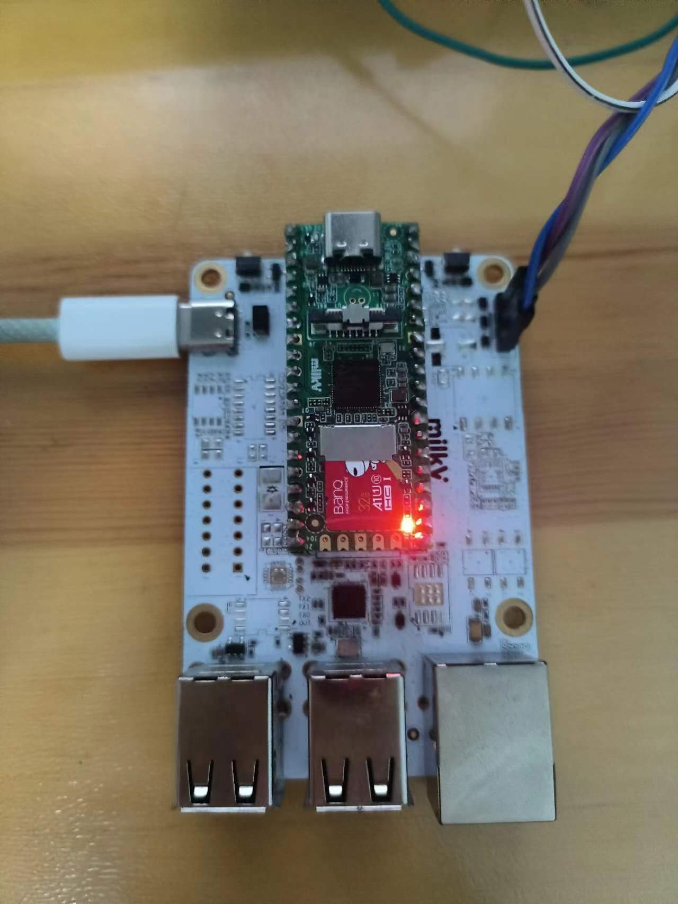

# Duo USB & Ethernet IO-Board

## 简介

Duo USB&Ethernet IO-Board 通过添加4个USB端口、1个RJ45网络端口、1个串口引脚和1个Type-C电源输入接口，扩展了Milk-V Duo的功能。

此扩展板可以提高Duo的开发效率，并方便开发人员访问常用的USB外设和以太网。

## 环境配置

### 安装固件

为 TF 卡刷写 [Release](https://github.com/milkv-duo/duo-buildroot-sdk/releases) 的固件。本实例使用 [Duo-V1.1.1](https://github.com/milkv-duo/duo-buildroot-sdk/releases/tag/Duo-V1.1.1) 版本。刷写可使用 [Rufus](https://rufus.ie/zh/).

见 [刷写录像](./shuaxie.mkv)

### 安装开发板

将开发板插入底板。插入底板后无法使用 RNDIS。连接到开发板可使用如下方式。

- UART (将 GND 相连，RX 和 TX 互相连接，板子背面有标识)
- 网线

如图所示。



### 关闭 LED 闪烁

Duo 的默认固件大核 Linux 系统会控制板载 LED 闪烁，这个是通过开机脚本实现的，我们现在要用小核 Arduino 来点亮 LED，需要将大核 Linux 中 LED 闪烁的脚本禁用，在 Duo 的终端中执行 `mv /mnt/system/blink.sh /mnt/system/blink.sh_backup && sync && reboot`。

[移除闪烁](./remove.mp4)

## 上电

上电后串口如 [录像](record.mkv) 所示。测试 U 盘功能正常。

```bash
ln -sf /mnt/system/usb-host.sh /mnt/system/usb.sh && sync && reboot
ls /dev/sda*
mkdir /mnt/udisk
mount /dev/sda2 /mnt/udisk
ls /mnt/udisk
umount /mnt/udisk
```