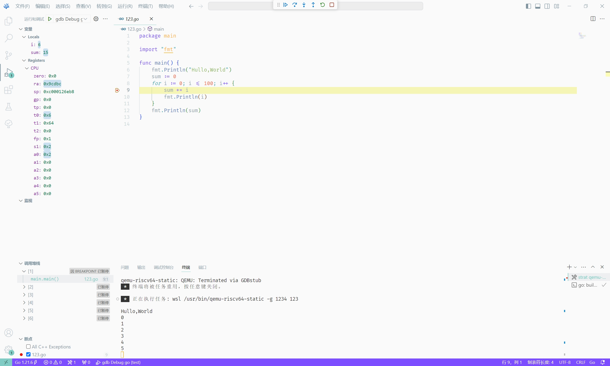

# 基于VS Code 实现Golang 的 RISC-V 开发

## 概述

[VS Code](https://code.visualstudio.com/) 是一个部分开源的、跨平台的、具有代码自动补全、语法高亮、调试等功能代码编辑器。

Go 是一个开源的、编译型、并发型、并具有垃圾回收功能的编程语言，目前支持 `RV64` 在 `linux` 系统的编译。

## VS Code 相关原理讲解

VS Code 主要通过task.json文件中配置的内容实现一些命令的自动化处理，其中比较广泛的应用便是C/C++的编译，运行，调试等，当然，Golang等语言的编译运行调试也是通过task.json文件的配置实现。在安装插件后便可较为容易的直接生成对应配置的task.json文件。提高开发效率。

VS Code 的调试配置主要通过launch.json文件实现，而Go插件中的调试工具使用的是dlv工具，这个经过尝试在官方仓库中进行编译时其不支持RISC-V架构，故需要使用gdb进行调试，使用交叉编译还需要使用gdb的远程调试功能。

## 环境搭建

### 测试环境

- 操作系统：Windows 10
- WSL 版本：Linux Ariel-PC 4.4.0-19041-Microsoft #3636-Microsoft Thu Oct 19 17:41:00 PST 2023 x86_64 x86_64 x86_64 GNU/Linux

### 准备工具

#### 安装 Go

按照 [Download and install](https://go.dev/doc/install) 安装。

#### 安装 gdb

使用 [cygwin](https://www.cygwin.com/install.html) 安装 gdb-multiarch 包即可。

#### 安装 qemu

> [!WARNING]
> 一个未经处理的问题：Qemu 8.2.0 无法运行，请安装 `qemu-user-static` 获得 6.2.0 版本 Qemu、

此处提供了一个在 WSL 中安装 qemu 的简单说明，供参考。

```bash
wget https://download.qemu.org/qemu-8.2.0.tar.xz
tar xvJf qemu-8.2.0.tar.xz
cd qemu-8.2.0
mkdir res
cd res
sudo apt install libspice-protocol-dev libepoxy-dev libgtk-3-dev libspice-server-dev build-essential autoconf automake autotools-dev pkg-config bc curl gawk git bison flex texinfo gperf libtool patchutils mingw-w64 libmpc-dev libmpfr-dev libgmp-dev libexpat-dev libfdt-dev zlib1g-dev libglib2.0-dev libpixman-1-dev libncurses5-dev libncursesw5-dev meson libvirglrenderer-dev libsdl2-dev -y
sudo ../configure --target-list=riscv64-softmmu,riscv64-linux-user --prefix=/usr/local/bin/qemu-riscv64
sudo make -j24
sudo make install -j24
```

### 安装VS Code 插件

- [Go插件](https://marketplace.visualstudio.com/items?itemName=golang.Go): 主要插件，实现交叉编译等功能
- [C/C++插件](https://marketplace.visualstudio.com/items?itemName=ms-vscode.cpptools): 使用gdb进行远程调试时需要

打开VS Code，在插件市场搜索并安装这两个插件。

### Go 配置

在 VS Code 中，打开“帮助 > 显示所有命令”。 或使用键盘快捷方式<key>Ctrl+Shift+P</key>，搜索 `Go: Install/Update tools` 然后运行该命令，选择所有可用的 Go 工具，然后单击“确定”并等待 Go 工具完成更新。

> [!NOTE]
> 如遇各类奇怪的网络问题，请考虑配置 `GOPROXY`` 环境变量，如 `go env -w  GOPROXY=https://goproxy.cn,direct`。

然后编辑工作区 `.vscode/settings.json` 文件，添加以下项，以设定正确的交叉编译参数。

```json
{
    "go.toolsEnvVars": {
        "GOARCH": "riscv64",
        "GOOS": "linux"
    },
    "terminal.integrated.env.windows": {
        "GOARCH": "riscv64",
        "GOOS": "linux"
    }
}
```

然后编辑工作区 `.vscode/launch.json` 文件，以设定启动调试的相关参数。

```json
{
    // Use IntelliSense to learn about possible attributes.
    // Hover to view descriptions of existing attributes.
    // For more information, visit: https://go.microsoft.com/fwlink/?linkid=830387
    "version": "0.2.0",
    "configurations": [
        {
            "name": "gdb Debug go",
            "type": "cppdbg",
            "request": "launch",
            "program": "${fileDirname}/${fileBasenameNoExtension}",
            "args": [],
            "stopAtEntry": false,
            "cwd": "${fileDirname}",
            "environment": [],
            "externalConsole": false,
            "MIMode": "gdb",
            "setupCommands": [
                {
                    "description": "Enable pretty-printing for gdb",
                    "text": "-enable-pretty-printing",
                    "ignoreFailures": true
                },
                {
                    "description": "Set Disassembly Flavor to Intel",
                    "text": "-gdb-set disassembly-flavor intel",
                    "ignoreFailures": true
                }
            ],
            "miDebuggerPath": "D:/cygwin64/bin/gdb-multiarch.exe",
            "miDebuggerServerAddress": "localhost:1234"
        }
    ]
}
```

其中 `program` 参数应和下文中的 `tasks.json` 中 `args` 参数中 `-o` 后面的参数保持一致。 `miDebuggerPath` 为 `gdb-multiarch.exe` 位置。`miDebuggerServerAddress` 中端口号应和下文中的 `tasks.json` 中 `command` 参数的端口号保持一致。

然后编辑工作区 `.vscode/tasks.json` 文件，以设定任务的相关参数。

```json
{
    "version": "2.0.0",
    "tasks": [
        {
            "type": "go",
            "label": "go: build file",
            "command": "build",
            "args": [
                "-o",
                "${fileDirname}/${fileBasenameNoExtension}",
                "-gcflags=all=-N -l",
                "${file}"
            ],
            "problemMatcher": [
                "$go"
            ],
            "group": {
                "kind": "build",
                "isDefault": true
            },
            "detail": "go build ${fileDirname}"
        },
        {
            "label": "strat qemu-static",
            "type": "shell",
            "isBackground": true,
            "command": "wsl /usr/bin/qemu-riscv64-static -g 1234 ${fileBasenameNoExtension}",
            "problemMatcher": []
        }
    ]
}
```

### 开始调试

在工作区新建 `123.go`，并输入以下内容。

```go
package main

import "fmt"

func main() {
	fmt.Println("Hullo,World")
	sum := 0
	for i := 0; i <= 100; i++ {
		sum += i
		fmt.Println(i)
	}
	fmt.Println(sum)
}
```

并在第九行中打断点。

点击 "终端 -> 运行生成任务” 以编译文件。部分设备需要 "终端 -> 配置默认生成任务” 中选择 `go: build file` 任务。

编译完成后，点击 “终端 -> 运行任务... -> strat qemu-static” 启动调试服务器。

最后，在左侧 ”运行和调试“ 中选择 `gdb Debug go` 并启动调试。

