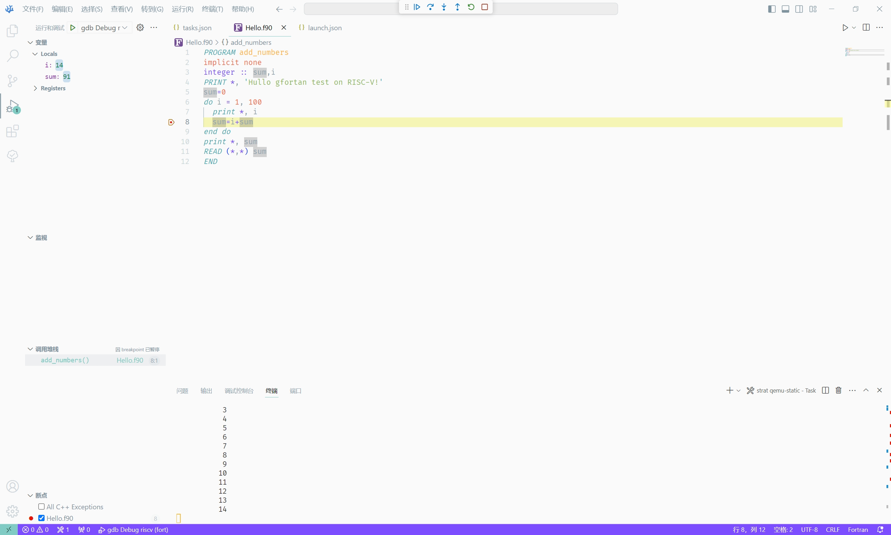

# 基于 VS Code 实现 Fortan 的 RISC-V 开发

## 概述

[VS Code](https://code.visualstudio.com/) 是一个部分开源的、跨平台的、具有代码自动补全、语法高亮、调试等功能代码编辑器。

[Fortran](https://zh.wikipedia.org/zh-cn/Fortran)，可音译为福传，源自于“公式翻译”的缩写，它是通用的编译型指令式编程语言，特别适用于数值计算和科学计算。它在1957年由IBM开发出来，是世界上第一个被正式采用并流传至今的高级编程语言。

## VS Code 相关原理讲解

VS Code 主要通过 `tasks.json` 文件中配置的内容实现一些命令的自动化处理，其中比较广泛的应用便是 C/C++ 的编译，运行，调试等，当然，Fortran等语言的编译运行调试也是通过`tasks.json` 文件的配置实现。在安装插件后便可较为容易的直接生成对应配置的 `tasks.json` 文件。提高开发效率。

VS Code 的调试配置主要通过 `launch.json` 文件实现，使用gdb进行调试，使用交叉编译还需要使用gdb的远程调试功能。

## 环境搭建

### 测试环境

- 操作系统：Windows 10
- WSL 版本：Linux Ariel-PC 4.4.0-19041-Microsoft #3636-Microsoft Thu Oct 19 17:41:00 PST 2023 x86_64 x86_64 x86_64 GNU/Linux

### 准备工具

#### 安装交叉编译工具

使用 [ruyi](https://github.com/ruyisdk/ruyi) 安装或直接下载 [RuyiSDK-20231026-HOST-riscv64-linux-gnu-riscv64-plct-linux-gnu.tar.xz](https://mirror.iscas.ac.cn/ruyisdk/dist/RuyiSDK-20231026-HOST-riscv64-linux-gnu-riscv64-plct-linux-gnu.tar.xz) 解压即可。

#### 安装 gdb

使用 [cygwin](https://www.cygwin.com/install.html) 安装 gdb-multiarch 包即可。考虑到有可能在本地编译运行的需求，建议同时安装 `gfortan` 相关包。

#### 安装 qemu

> [!WARNING]
> 一个未经处理的问题：Qemu 8.2.0 无法运行，请安装 `qemu-user-static` 获得 6.2.0 版本 Qemu、

此处提供了一个在 WSL 中安装 qemu 的简单说明，供参考。

```bash
wget https://download.qemu.org/qemu-8.2.0.tar.xz
tar xvJf qemu-8.2.0.tar.xz
cd qemu-8.2.0
mkdir res
cd res
sudo apt install libspice-protocol-dev libepoxy-dev libgtk-3-dev libspice-server-dev build-essential autoconf automake autotools-dev pkg-config bc curl gawk git bison flex texinfo gperf libtool patchutils mingw-w64 libmpc-dev libmpfr-dev libgmp-dev libexpat-dev libfdt-dev zlib1g-dev libglib2.0-dev libpixman-1-dev libncurses5-dev libncursesw5-dev meson libvirglrenderer-dev libsdl2-dev -y
sudo ../configure --target-list=riscv64-softmmu,riscv64-linux-user --prefix=/usr/local/bin/qemu-riscv64
sudo make -j24
sudo make install -j24
```

### 安装VS Code 插件

- [ms-vscode.cpptools](https://marketplace.visualstudio.com/items?itemName=ms-vscode.cpptools): 使用 gdb 进行远程调试
- [fortran-lang.linter-gfortran](https://marketplace.visualstudio.com/items?itemName=fortran-lang.linter-gfortran): 语言支持

打开VS Code，在插件市场搜索并安装这两个插件。

### 配置编译环境

然后编辑工作区 `.vscode/launch.json` 文件，以设定启动调试的相关参数。

```json
{
    "version": "0.0.1",
    "configurations": [
        {
            "name": "Fortran Launch (GDB) on x86",
            "type": "cppdbg",
            "request": "launch",
            "targetArchitecture": "x86",
            "program": "${workspaceRoot}\\${fileBasenameNoExtension}.exe",
            "miDebuggerPath": "gdb.exe",
            "args": [],
            "stopAtEntry": false,
            "cwd": "${workspaceRoot}",
            "externalConsole": true,
            "preLaunchTask": "fortan: build file"
        },
        {
            "name": "Fortran Launch (GDB) with RISC-V",
            "type": "cppdbg",
            "request": "launch",
            "program": "${fileDirname}/${fileBasenameNoExtension}",
            "args": [],
            "stopAtEntry": false,
            "cwd": "${fileDirname}",
            "environment": [],
            "externalConsole": false,
            "MIMode": "gdb",
            "setupCommands": [
                {
                    "description": "Enable pretty-printing for gdb",
                    "text": "-enable-pretty-printing",
                    "ignoreFailures": true
                },
                {
                    "description": "Set Disassembly Flavor to Intel",
                    "text": "-gdb-set disassembly-flavor intel",
                    "ignoreFailures": true
                }
            ],
            "miDebuggerPath": "D:/cygwin64/bin/gdb-multiarch.exe",
            "miDebuggerServerAddress": "localhost:30666"
        }
    ]
}
```

其中 `program` 参数应和下文中的 `tasks.json` 中 `args` 参数中 `-o` 后面的参数保持一致。 `miDebuggerPath` 为 `gdb-multiarch.exe` 位置。`miDebuggerServerAddress` 中端口号应和下文中的 `tasks.json` 中 `command` 参数的端口号保持一致。

然后编辑工作区 `.vscode/tasks.json` 文件，以设定任务的相关参数。

```json
{
    "version": "2.0.0",
    "tasks": [
        {
            "type": "shell",
            "label": "fortan: build file",
            "command": "gfortran",
            "args": [
                "-g",
                "${file}",
                "-o",
                "${workspaceRoot}\\${fileBasenameNoExtension}.exe"
            ],
            "group": {
                "kind": "build",
                "isDefault": true
            },
            "detail": "build ${fileDirname}"
        },
        {
            "type": "shell",
            "label": "fortan: build file riscv",
            "command": "wsl",
            "args": [
                "/home/ariel/RuyiSDK-20231026-riscv64-plct-linux-gnu/bin/riscv64-plct-linux-gnu-gfortran",
                "-g",
                "${fileBasename}",
                "-o",
                "${fileBasenameNoExtension}",
                "-static"
            ],
            "group": {
                "kind": "build"
            },
            "detail": "build riscv${fileDirname}"
        },
        {
            "label": "strat qemu-static",
            "type": "shell",
            "isBackground": true,
            "command": "wsl /usr/bin/qemu-riscv64-static -g 30666 ${fileBasenameNoExtension}",
            "problemMatcher": []
        }
    ]
}
```

### 开始调试

在工作区新建 `Hello.f90`，并输入以下内容。

```go
PROGRAM add_numbers
implicit none
integer :: sum,i
PRINT *, 'Hullo gfortan test on RISC-V!'
sum=0
do i = 1, 100
  print *, i
  sum=i+sum
end do
print *, sum
READ (*,*) sum
END
```

并在第 8 行中打断点。

点击 "终端 -> 运行生成任务” 以编译文件。部分设备需要 "终端 -> 配置默认生成任务” 中选择 `go: fortan: build file riscv` 任务。

编译完成后，点击 “终端 -> 运行任务... -> strat qemu-static” 启动调试服务器。

最后，在左侧 ”运行和调试“ 中选择 `Fortran Launch (GDB) with RISC-V` 并启动调试。



如需在本机调试，直接在左侧 ”运行和调试“ 中选择 `Fortran Launch (GDB) on x86` 并启动调试。